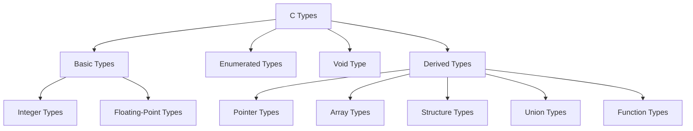

---
tags:
  - ProceduralProgramming
  - LectureNotes
---
◀️ *Back to:* [[00_Index_Programmazione_Procedurale]]

# 03 Types

## 1. Concept of Data Types
Programs process different kinds of data, such as integers and real numbers. To do this, the compiler must know what kind of data a given value represents.

*   **Object**: In C, this refers to a location in memory whose contents can represent values.
*   **Variable**: An object that has a name.

An object's **type** determines three things:
1.  How much space the object occupies in memory.
2.  The range of values the variable can hold.
3.  The operations that can be performed on the variable.

---

## 2. C Type Taxonomy
C provides a rich system of types divided into categories:



### Type Classifications
*   **Arithmetic Types**: Basic Types + Enumerated Types.
*   **Scalar Types**: Arithmetic Types + Pointer Types.
*   **Aggregate Types**: Array Types + Structure Types.
*   **Function Type**: Specifies the interface to a function (its return type and parameter types).

---

## 3. Integer Types
C offers five standard signed integer types. Each has an unsigned counterpart that occupies the same amount of memory.

### Signed Integer Synonyms
*   `signed char`
*   `int` (Synonyms: `signed`, `signed int`)
*   `short` (Synonyms: `short int`, `signed short`, `signed short int`)
*   `long` (Synonyms: `long int`, `signed long`, `signed long int`)
*   `long long` (C99) (Synonyms: `long long int`, `signed long long`, `signed long long int`)

### Memory Size Guarantees
C defines only the *minimum* sizes for these types:
*   `short` is at least **2 bytes** (16 bits).
*   `long` is at least **4 bytes** (32 bits), but is **8 bytes** (64 bits) on most modern architectures.
*   `long long` is at least **8 bytes** (64 bits).

The compiler must enforce the following ordering:
$$\text{sizeof(short)} \le \text{sizeof(int)} \le \text{sizeof(long)} \le \text{sizeof(long long)}$$

### The Character Type (`char`)
*   `char` is a standard integer type occupying exactly **1 byte**.
*   Depending on the compiler, the plain `char` keyword is synonymous with either `signed char` or `unsigned char`.
*   It maps numbers to characters using the **ASCII table** (e.g., `'A'` is `65`, `'B'` is `66`).
*   Arithmetic operations can be performed on characters:
    ```c
    char ch = 'A';
    printf("The character %c has the character code %d.\n", ch, ch);
    printf("%c", ch + 1); // Outputs: B (65 + 1 = 66, which is ASCII 'B')
    ```

---

## 4. Booleans in C

### Traditional C (Before C99)
*   There is no native boolean type.
*   `0` represents **false**.
*   **Any value other than 0 is true** (including negative numbers).
    ```c
    if (3) { printf("YES\n"); }    // Outputs YES
    if (0) { } else { printf("NO\n"); } // Outputs NO
    ```

### Modern C (C99 and later)
*   C99 introduced the unsigned integer type `_Bool` to represent truth values (`0` for false, `1` for true).
*   Including the header `<stdbool.h>` defines:
    *   `bool` as a macro synonym for `_Bool`.
    *   `true` as a symbolic constant equal to `1`.
    *   `false` as a symbolic constant equal to `0`.

---

## 5. Numeral Systems
Computers store numbers in binary, but programmers represent them in octal or hexadecimal for convenience.

### Base Systems
*   **Binary (Base 2)**: Uses `0` and `1`. Each digit represents a bit. Used internally by logic gates.
*   **Hexadecimal (Base 16)**: Positional system using `0-9` and `A-F` (or `a-f`). One hex digit represents exactly a **nibble** (4 bits, or half a byte).
*   **Octal (Base 8)**: Uses digits `0-7`.

### Conversions

#### Binary/Hexadecimal to Decimal
Calculated as the sum of digits multiplied by the base raised to their position:
$$\sum d_i \times \text{base}^i$$
*   *Binary Example:* `1001` in base 2:
    $$(1 \times 2^3) + (0 \times 2^2) + (0 \times 2^1) + (1 \times 2^0) = 8 + 0 + 0 + 1 = 9_{10}$$
*   *Hexadecimal Example:* `002B` in base 16:
    $$(2 \times 16^1) + (11 \times 16^0) = 32 + 11 = 43_{10}$$

#### Decimal to Binary (Repeated Division by 2)
Divide the decimal number by 2 repeatedly and track the remainders from bottom to top.
*   *Example: Convert $156_{10}$ to binary:*
    *   $156 \div 2 = 78$ remainder `0` (Least Significant Bit)
    *   $78 \div 2 = 39$ remainder `0`
    *   $39 \div 2 = 19$ remainder `1`
    *   $19 \div 2 = 9$ remainder `1`
    *   $9 \div 2 = 4$ remainder `1`
    *   $4 \div 2 = 2$ remainder `0`
    *   $2 \div 2 = 1$ remainder `0`
    *   $1 \div 2 = 0$ remainder `1` (Most Significant Bit)
    *   **Result:** `10011100`

#### Decimal to Hexadecimal (Repeated Division by 16)
Follows the same algorithm but divides by 16 instead of 2.
*   *Example: Convert $1565_{10}$ to hexadecimal:*
    *   $1565 \div 16 = 97$ remainder `13` (`d`)
    *   $97 \div 16 = 6$ remainder `1`
    *   $6 \div 16 = 0$ remainder `6`
    *   **Result:** `61d`

---

## 6. Integer Representations in Memory

### Unsigned Representation
*   Representable range for $N$ bits: $0$ to $2^N - 1$.
*   For 8 bits (1 byte): $0$ to $255$.

### Sign and Magnitude (Signed)
*   Uses the leftmost bit (Most Significant Bit) as a sign bit (`0` = positive, `1` = negative). The remaining bits determine the magnitude.
    *   *Example:* `1001 1000` is sign bit `1` (negative) and magnitude `001 1000` ($24_{10}$) $\rightarrow -24$.
    *   *Example:* If `1001 1000` were interpreted as an unsigned number, it would be $152_{10}$.
*   **Drawbacks**:
    *   Has two representations of zero: `0000 0000` ($+0$) and `1000 0000` ($-0$).
    *   Slightly more complex hardware logic.
    *   Range: $-(2^{N-1} - 1)$ to $+(2^{N-1} - 1)$.

### Two's Complement (Standard C Representation)
*   Used by almost all modern CPUs to store signed integers.
*   Eliminates double zero representations: `0000 0000` is the only representation for `0`.
*   Allows representing one extra negative value.
*   Range: $-2^{N-1}$ to $+(2^{N-1} - 1)$. For 8 bits: $-128$ to $+127$.

#### Negation in Two's Complement
To find the negative value of a two's complement binary representation:
1.  **Invert** all bits ($0 \rightarrow 1$ and $1 \rightarrow 0$).
2.  **Add 1** to the resulting value.

*   *Example: Convert $5_{10}$ (`0000 0101`) to $-5_{10}$:*
    *   Flip bits: `1111 1010`
    *   Add 1: `1111 1011` (equals $-5_{10}$)
*   *Example: Convert $-5_{10}$ (`1111 1011`) back to $5_{10}$:*
    *   Flip bits: `0000 0100`
    *   Add 1: `0000 0101` (equals $5_{10}$)

> [!WARNING]
> The standard bit inversion rule does not work for the minimum value of a signed type (e.g., $-128$ in an 8-bit space) because the positive counterpart ($+128$) is not representable within the $N$-bit two's complement constraints.

---

## 7. Endianness
Endianness refers to the sequential order used to store multi-byte data words in computer memory, or to transmit bytes over a digital link.

*   **Big-Endian**: The most significant byte (MSB) is stored at the lowest memory address (stores "left to right"). Used by IBM z/Architecture mainframes and Motorola 68000.
*   **Little-Endian**: The least significant byte (LSB) is stored at the lowest memory address (stores "right to left"). Used by Intel x86 processors.

### Storage Comparison (Example: Value 2 stored as a 4-byte integer)
Assuming starting memory address is `1500`:

| Address | Big-Endian Byte | Little-Endian Byte |
| :--- | :--- | :--- |
| **1500** | `0000 0000` | `0100 0000` (Reversed bits representation of `2`) |
| **1501** | `0000 0000` | `0000 0000` |
| **1502** | `0000 0000` | `0000 0000` |
| **1503** | `0000 0010` | `0000 0000` |

### Bit-Level Endianness Examples
*   Binary string `0010`:
    *   Big-Endian: `2`
    *   Little-Endian: `4` (since bits are reversed to `0100` internally)
*   Binary string `1010`:
    *   Big-Endian: `-6` (in two's complement)
    *   Little-Endian: `5` (since bits are reversed to `0101` internally)

---

## 8. C Data Ranges & Storage Sizes

| Type | Storage Size | Minimum Value | Maximum Value |
| :--- | :--- | :--- | :--- |
| `char` | 1 byte | (compiler dependent; same as signed or unsigned char) | |
| `unsigned char` | 1 byte | `0` | `255` |
| `signed char` | 1 byte | `-128` | `127` |
| `int` | 2 or 4 bytes | `-32,768` or `-2,147,483,648` | `32,767` or `2,147,483,647` |
| `unsigned int` | 2 or 4 bytes | `0` | `65,535` or `4,294,967,295` |
| `short` | 2 bytes | `-32,768` | `32,767` |
| `unsigned short`| 2 bytes | `0` | `65,535` |
| `long` | 8 bytes (historically 4) | `-9,223,372,036,854,775,808` | `9,223,372,036,854,775,807` |
| `unsigned long` | 8 bytes (historically 4) | `0` | `18,446,744,073,709,551,615` |
| `long long` | 8 bytes | `-9,223,372,036,854,775,808` | `9,223,372,036,854,775,807` |
| `unsigned long long`| 8 bytes | `0` | `18,446,744,073,709,551,615` |

---

## 9. The `sizeof` Operator
To obtain the exact storage size of a type or variable, C provides the unary `sizeof` operator.
*   **Syntax**: `sizeof(type)` or `sizeof expression` (yields size in bytes).
*   *Example:*
    ```c
    int iIndex;
    iIndex = 1000;
    // sizeof(int) and sizeof(iIndex) both return 4
    ```

### Limits Header (`<limits.h>`)
Value ranges of standard integer types are defined as macros in `<limits.h>` (e.g., `INT_MIN`, `INT_MAX`, `CHAR_MIN`, `CHAR_MAX`).
```c
#include <stdio.h>
#include <limits.h>

int main() {
    printf("char size: %zu, min: %d, max: %d\n", sizeof(char), CHAR_MIN, CHAR_MAX);
    printf("int size: %zu, min: %d, max: %d\n", sizeof(int), INT_MIN, INT_MAX);
    return 0;
}
```

---

## 10. Floating-Point Types
Used for non-integers representing fractional numbers with a decimal point in any position.

*   `float`: Single precision (4 bytes, range $\pm 3.4\text{E}+38$, precision 6 digits).
*   `double`: Double precision (8 bytes, range $\pm 1.7\text{E}+308$, precision 15 digits).
*   `long double`: Extended precision (10 bytes, range $\pm 1.1\text{E}+4932$, precision 19 digits).

> [!NOTE]
> Floating-point ranges and precision limits are defined in `<float.h>` using macros like `FLT_MIN`, `FLT_MAX`, and `FLT_DIG`.
> **E-notation** is the plain-text form of scientific notation: `1.234e+56` means $1.234 \times 10^{56}$.

### IEEE 754 Representation Format
Every finite real number is structured around three component integers:
1.  **Sign ($s$)**: `0` for positive, `1` for negative.
2.  **Significand / Mantissa ($c$)**.
3.  **Exponent ($q$)**.

$$\text{Value} = (-1)^s \times c \times b^q \quad (\text{where } b \text{ is the base/radix, usually } 2)$$

#### Single-Precision Layout (32 bits)
*   **Sign**: 1 bit (bit 31)
*   **Exponent**: 8 bits (bits 30-23)
*   **Fraction (Significand)**: 23 bits (bits 22-0)
*   **Formula**:
    $$\text{Value} = (-1)^{\text{sign}} \times \left( 1 + \sum_{i=1}^{23} b_{23-i} 2^{-i} \right) \times 2^{(e - 127)}$$

#### Double & Extended Layouts
*   `double` (64 bits): Sign (1 bit), Exponent (11 bits), Fraction (52 bits).
*   `long double` (80 bits): Sign (1 bit), Exponent (15 bits), Integer Part (1 bit), Fraction (63 bits).

### Precision & Rounding Errors
Floating-point calculations have inherent rounding errors due to limited precision representation.

```c
#include <stdio.h>

int main() { 
    int a = 16777217;
    float b = a;
    printf("%f\n", b); // Outputs: 16777216.000000 due to float's 6-digit limit
}
```

#### Avoid Accumulating Errors
In C, arithmetic operations with floating-point numbers are performed internally with `double` or greater precision. If assigned back to a `float`, the value is rounded.
*   *Wrong:* Using `float` variables for intermediate calculations.
*   *Correct:* Declare variables as `double` instead of `float`. On modern CPUs, there is little to no runtime penalty, though doubles consume twice as much memory space.
    ```c
    float height = 1.2345, width = 2.3456;
    double area = height * width; // Calculation performed with double precision
    ```

---

## 11. Enumerated Types (`enum`)
An **enumeration** is a user-defined integer type. The definition begins with the keyword `enum`, followed by the identifier, and a list of possible values with unique names:

$$\text{enum } [\text{identifier}] \{ \text{enumerator-list} \};$$

### Value Assignment Rules
*   By default, enumeration constants are assigned integer values starting at `0`, incrementing by 1.
*   Explicit values can be assigned. Unassigned constants following an explicit assignment continue incrementing from that value.
*   *Example:*
    ```c
    enum color { black, red, green, yellow, blue, white = 7, gray };
    // Values: black=0, red=1, green=2, yellow=3, blue=4, white=7, gray=8
    ```
*   Distinct enumerators can share duplicate integer values:
    ```c
    enum signals { OFF, ON, STOP = 0, GO = 1, CLOSED = 0, OPEN = 1 };
    ```

### Usage Example
```c
#include <stdio.h>

enum week { sunday, monday, tuesday, wednesday, thursday, friday, saturday };

int main() { 
    enum week today; 
    today = wednesday; 
    printf("Day %d", today + 1); // Outputs: Day 4 (wednesday is 3, 3 + 1 = 4)
    return 0;
}
```

> [!TIP]
> Use `enum` when a variable (especially function parameters) can only accept values from a small, defined set. It documents legal values, prevents passing invalid constants, and improves readability compared to raw integers.

---

## 12. The `void` Type
The `void` type specifier indicates that **no value is available**. You cannot declare variables or constants of type `void`.

### Common Contexts
1.  **Function Declarations**: Explicitly indicates a function does not return a value.
    `void error(int a) {}`
2.  **No Parameters**: Explicitly specifies that a function takes no input arguments.
    `void printMenu(void) {}`
    *Note:* The compiler will issue an error if you attempt to call this with arguments, e.g., `printMenu(3)`.
3.  **Void Expressions**: Expressions that produce no value.
4.  **Generic Pointers (`void*`)**: Used to represent the address of an object without specifying its type.

---

## 13. Book References
*   **Pages 423, 424, 635, 636**
*   **Section 7.7** (`sizeof`)
*   **Section 10.11** (`enum`)
*   **Binary System References** (additional online materials)
