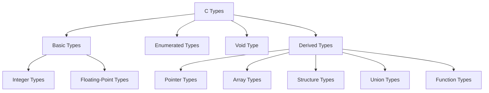

---
tags:
  - ProceduralProgramming
  - LectureNotes
---
◀️ *Back to:* [[00_Index_Programmazione_Procedurale]]

# PROGRAMMAZIONE PROCEDURALE — Note Complete

---

## 📑 Indice
- 01 Language Basics
- 02 C Basics
- 03 Types
- 04 Literals
- 05 Type Conversions
- 06 Expressions & Operators
- 07 Statements
- 08 Arrays
- 09 Function
- 10 Pointers
- 11 Dynamic Memory Management
- 12 Structures and Unions
- 13 Conditional Statements and Loops Examples
- 14 Call By Reference
- 15 Memory: Definitions, Duration, and Layout
- 16 Linked Lists
- 17 Memory: Storage Classes, Zones, and the Call Stack
- 18 Linked Lists: Globals and Implementations
- 19 Modularization and Linkage
- 20 GCC Compilation Steps and GDB Debugging
- 21 Data Representation & Computer Arithmetic (C Context)

---


# 01 Language Basics

## 1. Programming Languages & Paradigms
A **programming language** is a formal language that specifies a set of instructions used to produce various kinds of output, generally consisting of instructions for a computer to implement specific algorithms.

### Programming Paradigms
Paradigms are ways to classify programming languages based on their design features:
*   **Imperative**: The programmer explicitly instructs the machine on how to change its state.
    *   *Example:* `a = a + 1;`
*   **Procedural**: Derived from structured programming, based on the concept of the *procedure call*. Instructions are grouped into procedures (also known as routines, subroutines, or functions) that contain a series of computational steps.
*   *Other paradigms include:* Object-oriented (e.g., Java), Functional, etc.

> [!NOTE]
> C is both **imperative** and **procedural** because programmers instruct state changes and group these instructions into functions.

---

## 2. Language Levels & The Stack of Interpretation
Languages exist at different levels of abstraction relative to the hardware. As programs grew larger, moving up the stack became necessary to reduce error-prone notation and handle machine dependency.

### The Abstraction Stack (From Top to Bottom)
1.  **High-Level Languages (e.g., C, C++)**: Closer to human language, machine-independent, and abstracted from machine-specific details. Created in the mid-1950s (starting with Fortran, then Lisp and Algol) to avoid rewriting programs for every new machine architecture.
2.  **Assembly Language**: Replaces binary patterns with mnemonic abbreviations (e.g., `movl`, `pushl`, `subl`). Machine-specific.
3.  **Machine Language**: Binary patterns (`1`s and `0`s) directly understood by the hardware.
4.  **Processor**: The physical hardware executing instructions.

---

## 3. Compilation vs. Interpretation
High-level code must be translated so that a processor can run it. There are two primary translation models:

### Compilation (e.g., C, C++)
*   A system program known as a **compiler** translates the high-level source code into an equivalent target program (assembly/machine language) *before* execution.
*   **Hallmarks**: Thorough analysis of source code and nontrivial transformation (the output does not resemble the source).
*   **Flow**:
    $$\text{Source Program} \xrightarrow{\text{Compiler (gcc)}} \text{Target Program (Executable)}$$
    $$\text{Input} \xrightarrow{} \text{Target Program} \xrightarrow{} \text{Output}$$
*   **Error Checking**: Almost all semantic error checking is done at compile time.

### Interpretation (e.g., Python)
*   An **interpreter** remains present in memory during execution. It simulates a virtual machine that executes the high-level instructions directly.
*   **Flow**:
    $$\text{Source Program} + \text{Input} \xrightarrow{\text{Interpreter}} \text{Output}$$
*   **Error Checking**: Most error checking must be performed at run time.

---

## 4. The C Programming Language

### Overview
C is a high-level, general-purpose, procedural programming language developed in the 1970s by Dennis Ritchie at Bell Labs to implement the Unix operating system and utilities.

### Key Characteristics
*   **Source Code Portability**: Code can be recompiled on different hardware platforms with minimal changes.
*   **Close to the Machine**: Operates at a low level when needed, allowing direct access to memory addresses.
*   **Efficiency**: Extremely fast execution because it compiles directly to native machine code.

### Standard Library
The C language proper is small and contains very few hardware-dependent elements (e.g., it lacks built-in statements for file access, dynamic memory management, or input/output).
Instead, these functions are provided by the standard library via header files (e.g., `<stdio.h>`).

### Advantages (Virtues)
*   **Fast**: Compiled language operating close to the hardware.
*   **Portable**: Can run on virtually any platform with a C compiler.
*   **Small**: Simple core language without excess syntax (unlike C++).
*   **Mature**: Extensive documentation, library support, and experienced user base.
*   **Access**: Direct memory manipulation (pointers) and low-level system feature access.

### Challenges
*   **Unsafe**: Easy to cause segmentation faults or corruption via direct memory access and pointers.
*   **Manual Memory Management**: The programmer must allocate and deallocate memory explicitly.
*   **Verbose**: Requires more lines of code compared to scripting languages like Python.

---

## 5. The C++ Programming Language
*   Developed by Bjarne Stroustrup at Bell Labs, starting as "**C with Classes**" in 1983 and officially becoming C++ in 1985.
*   Standardized in 1998 (ISO/IEC 14882:1998).
*   Combines the speed and low-level features of C with support for **Object-Oriented Programming (OOP)** (inspired by Simula).
*   OOP support made C++ the dominant language for GUI-heavy applications in the 1990s.
*   Unlike C, C++ is a massive and highly complex language (with standards spanning hundreds of pages).

---

## 6. Language Standards
Standards prevent vendor fragmentation and ensure compiler compatibility:
*   **K&R C**: 1972 (Created) / 1978 (First informal specification).
*   **ANSI C / C89**: 1989 (First standardized version).
*   **ISO C / C90**: 1990 (Equivalent to C89).
*   **C95**: 1995 (Amendment 1).
*   **C99**: 1999 (Introduced new features).
*   **C11**: 2011 (Standard target). Compile with: `gcc file.c -std=c11`
*   **C18**: 2018 (Bug fixes over C11).

---

## 7. Structure of a C Program
The procedural building blocks of C are **functions**.
*   Functions **cannot** be nested inside each other.
*   Functions contain statements executed **sequentially**.
*   Statements can be grouped into **block statements** (enclosed in `{}`).
*   Every C program must define a `main()` function, which serves as the program's top level of control and entry point.

### Single-File Compilation Example (`mainfile.c`)
```c
#include <stdio.h>

void myPrintHello(); // Function prototype

int main() {
    myPrintHello();
    return(0);
}

void myPrintHello(void) {
    printf("Hello!\n");
    return;
}
```
*   **Compile to custom name:** `gcc -o mainfile mainfile.c` (runs with `./mainfile`)
*   **Default compile:** `gcc mainfile.c` (produces `./a.out`)

### Modular Programming Example
Modular programming is a design technique that separates program functionalities into independent, interchangeable files (modules).

*   `mainfile.c`:
    ```c
    void myPrintHello(void); // Prototype for function in other file

    int main() {
        myPrintHello();
        return(0);
    }
    ```
*   `hello.c`:
    ```c
    #include <stdio.h>

    void myPrintHello(void) {
        printf("Hello!\n");
        return;
    }
    ```
*   **Multi-file Compile:** `gcc -o executable mainfile.c hello.c`

---

## 8. Program Development & Errors
The general program development cycle is:
$$\text{Problem Definition} \rightarrow \text{Problem Analysis} \rightarrow \text{Algorithm Development} \rightarrow \text{Coding} \rightarrow \text{Testing/Debugging} \rightarrow \text{Maintenance}$$

In C, the cycle alternates between **Compile-time** and **Run-time**:
$$\text{Edit Code} \rightarrow \text{Compile (Compile-time)} \rightarrow \text{Test/Execute (Run-time)} \rightarrow \text{Edit Code}$$

### Compile-time Errors
Errors detected by the compiler. These are typically **Syntax Errors** (e.g., missing semicolons or using reserved keywords incorrectly).
*   *Example Code with Error:*
    ```c
    scanf("%d", &b) // Missing semicolon
    while(b != 0) { ... }
    ```
*   *Compiler Output:*
    ```text
    euclid.c:9:20: error: expected ';' after expression
    scanf("%d", &b)
                   ^
                   ;
    1 error generated.
    ```

### Run-time Errors
Errors that occur while the program is executing. These do not prevent compilation but lead to crashes or undefined behavior.
*   *Example (Dereferencing a Null Pointer):*
    ```c
    #include <stdio.h>
    int main() {
        int *a = NULL;
        printf("%d", *a); // Dereferencing NULL
        return 0;
    }
    ```
*   *Terminal Output:*
    ```text
    Segmentation fault: 11
    ```

> [!TIP]
> Debugging requires understanding compiler messages to resolve syntax errors at compile-time and testing the program with diverse inputs to discover logic/runtime errors.
> As Edsger Dijkstra noted: *"Testing shows the presence, not the absence of bugs."*

---

## 9. Full Example: Euclid's GCD Algorithm
This example demonstrates a complete program written in C, compiled to Assembly, and finally stored as Machine Language instructions.

### 1. High-Level C Code
```c
#include <stdio.h>

int main() { 
    int a, b; 
    printf("Enter first positive integer: \n"); 
    scanf("%d", &a); 
    printf("Enter second positive integer: \n"); 
    scanf("%d", &b); 
    
    while(b != 0) { 
        if(a > b) 
            a = a - b; 
        else 
            b = b - a; 
    } 
    
    printf("GCD = %d\n", a); 
    return 0;
}
```

### 2. Equivalent x86 Assembly Code
```assembly
pushl   %ebp
movl    %esp, %ebp
pushl   %ebx
subl    $4, %esp
andl    $-16, %esp
call    getint
movl    %eax, %ebx
call    getint
cmpl    %eax, %ebx
je      C
A:
cmpl    %eax, %ebx
jle     D
subl    %eax, %ebx
B:
cmpl    %eax, %ebx
jne     A
C:
movl    %ebx, (%esp)
call    putint
movl    -4(%ebp), %ebx
leave
ret
D:
subl    %ebx, %eax
jmp     B
```

### 3. Machine Language (Binary Representation)
```text
11001111 11111010 11101101 11111110 00000111 00000000
00000000 00000001 00000011 00000000 00000000 00000000
00000010 00000000 00000000 00000000 00010000 00000000
00000000 00000000 00010000 00000100 00000000 00000000
10000101 00000000 00100000 00000000 00000000 00000000 ...
```

---

## 10. Book References
*   **Section 1.9** (Concepts in 1.9.2–1.9.7 will be reviewed in detail at the end of the course).
*   **Section 2.1–2.3**.


---

# 02 C Basics

## 1. Comments in C
Comments are used to make programs readable by humans (ourselves now, team members, and future maintainers). They are ignored by the compiler.

### Types of Comments
*   **Block Comments**: Begin with `/*` and end with `*/`.
    *   Can span multiple lines.
    *   Can be placed within a line of code:
        `int x = 4; /* comment */ int y = 10;`
    *   **Nesting block comments is not allowed.** The first `*/` encountered will close the comment block, causing compilation errors for subsequent characters.
*   **Line Comments**: Begin with `//` and end at the next newline character.

### Rules & Pitfalls
*   **Comments inside literals:** Characters `/*` and `//` inside character constants or string literals do not start a comment.
    *   *Example:* `printf("Comments in C begin with /* or //.\n");` contains no comments.
*   **Commenting out code:** Block comments can enclose line comments, making them useful for temporarily disabling blocks of code during debugging.
*   **Pretty Comments:** Boxed comments (e.g., using columns of asterisks) look clean but are hard to maintain because editing the text requires manually realigning the borders.
*   **Bad Commenting:**
    *   *Redundant/Byte-wastage:* Comments that state the obvious (e.g., `i = i + 1; // increment i`).
    *   *Clarification comments:* Explaining overly complex code. Striking a balance is key; complex code should be simplified and made *self-documenting* rather than clarified by comments.
    *   *Code removal:* Leaving commented-out "old" code in the codebase confuses the reader. Commented-out code should only exist during local debugging.

---

## 2. Character Sets
C distinguishes between the characters used to write the program and those processed at runtime.

*   **Source Character Set**: The set of characters permitted in C source files.
*   **Execution Character Set**: The set of characters that can be interpreted and printed by the running program.
*   *Note:* In almost all modern implementations, these two sets are identical.

### Basic C Character Set
*   **Latin alphabet letters:** `A-Z` and `a-z`
*   **Decimal digits:** `0-9`
*   **29 Punctuation marks:** `! " # % & ' ( ) * + , - . / : ; < = > ? [ \ ] ^ _ { | } ~`
*   **Whitespace characters:**
    *   `' '` Space
    *   `'\t'` Horizontal tab
    *   `'\v'` Vertical tab
    *   `'\n'` Newline
    *   `'\f'` Form feed

---

## 3. Identifiers
An **identifier** is a user-defined name given to variables, functions, macros, structures, and other objects.

### Naming Rules
1.  Must only consist of **letters** (`a-z`, `A-Z`), **digits** (`0-9`), and the **underscore** (`_`).
2.  Must **not start with a digit**.
3.  Are **case-sensitive** (e.g., `while` is a keyword, but `While` is a valid identifier).
4.  Must not match any of C's reserved keywords.
5.  Standard library names (e.g., `printf`) should not be redefined as user functions or global variables.
6.  There is no limit on identifier length, but compilers typically only consider the first **31** (for external/linkage) or **63** (for internal/local) characters as significant.

### Reserved Keywords
There are currently **44 reserved keywords** in C (up from 32 in C89) that cannot be used as identifiers:

| C89 Keywords (32) | | | |
| :--- | :--- | :--- | :--- |
| `auto` | `extern` | `short` | `void` |
| `break` | `float` | `signed` | `volatile` |
| `case` | `for` | `sizeof` | `while` |
| `char` | `goto` | `static` | |
| `const` | `if` | `struct` | |
| `continue` | `int` | `switch` | |
| `default` | `long` | `typedef` | |
| `do` | `register` | `union` | |
| `double` | `return` | `unsigned` | |
| `else` | `enum` | | |

| Modern C Keywords (12 added since C99) | | | |
| :--- | :--- | :--- | :--- |
| `inline` | `_Alignas` | `_Complex` | `_Static_assert` |
| `restrict` | `_Alignof` | `_Generic` | `_Thread_local` |
| `_Atomic` | `_Bool` | `_Imaginary` | `_Noreturn` |

### Examples of Identifiers
*   **Valid:** `x`, `dollar`, `While`, `error_handler`, `scale64`
*   **Invalid:** `1st_rank` (starts with a digit), `switch` (reserved keyword), `y/n` (contains `/`), `x-ray` (contains `-`)

### Best Practices
*   Names should convey identity, behavior, and intended use.
*   Avoid unnecessarily long names or misnaming (e.g., use `weekly_pay = hours_worked * pay_rate;` instead of `a = b * c;`).

### Program Example using Identifiers
```c
#include <stdio.h>

int main() {
    int firstNumber, secondNumber, sumOfTwoNumbers;
    
    printf("Enter two integers: ");
    scanf("%d %d", &firstNumber, &secondNumber);
    
    sumOfTwoNumbers = firstNumber + secondNumber;
    printf("%d + %d = %d", firstNumber, secondNumber, sumOfTwoNumbers);
    
    return 0;
}
```

---

## 4. Scope & Shadowing
**Scope** refers to the textual region of a translation unit in which an identifier is visible and can be referenced.

### Types of Scope
*   **File Scope**: Declarations outside all function bodies and parameter blocks. These identifiers are visible anywhere from their point of declaration to the end of the file.
*   **Block Scope**: Declarations inside a block `{}` or function parameter list. Visible only from their point of declaration to the end of the smallest enclosing block.

### Shadowing (Hiding)
*   **Duplicate identifiers within the same scope are illegal** (e.g., declaring `int a;` and `float a;` in the same block causes a compiler error).
*   An identifier can be redefined in a nested/inner block. The inner declaration **shadows (hides)** the outer declaration, making the outer variable inaccessible within the inner block.

### Shadowing Example 1
```c
int main() {
    {
        int x = 10, y = 20;
        {
            printf("x = %d, y = %d\n", x, y); // Outputs: x = 10, y = 20
            {
                int y = 40; // Shadows outer y
                x++;
                y++;
                printf("x = %d, y = %d\n", x, y); // Outputs: x = 11, y = 41
            }
            printf("x = %d, y = %d\n", x, y); // Outputs: x = 11, y = 20 (outer y is restored)
        }
    }
    return 0;
}
```

### Shadowing Example 2
```c
int main() {
    int x = 1, y = 2, z = 3;
    printf("x = %d, y = %d, z = %d\n", x, y, z); // Outputs: x = 1, y = 2, z = 3
    {
        int x = 10;     // Shadows int x = 1
        float y = 20;   // Shadows int y = 2
        printf("x = %d, y = %f, z = %d\n", x, y, z); // Outputs: x = 10, y = 20.000000, z = 3
        {
            int z = 100; // Shadows int z = 3
            printf("x = %d, y = %f, z = %d\n", x, y, z); // Outputs: x = 10, y = 20.000000, z = 100
        }
    }
    return 0;
}
```

### Out-of-Scope Error Example
```c
int main() {
    {
        int x = 10;
    }
    {
        printf("%d", x); // Compiler Error: x is out of scope here
    }
    return 0;
}
```
*   *Compiler Error:* `error: 'x' undeclared (first use in this function)`

---

## 5. Bindings & Scoping Models
A **binding** is the association between an identifier (name) and the actual memory entity it represents.
*   **Binding Time**: The time at which a binding is created or an implementation decision is made.
*   **Static Binding (Static Scoping)**: The scope of a binding is determined statically at compile time based purely on the program text. **C uses static binding.**
*   **Dynamic Binding (Dynamic Scoping)**: The scope is resolved at run time based on the execution call stack. (e.g., Perl's `local` keyword creates dynamic scope, while `my` creates static scope).

### Perl Code: Static vs. Dynamic Scoping Tracing
```perl
$x = 10;

sub f {
    return $x;
}

sub g {
    local $x = 20; # Dynamically scoped binding
    return f();
}

print g()."\n"; # Output: 20
```
> [!NOTE]
> Under **Static Scoping** (like C), calling `f()` would return `10` because `f` cannot resolve the local `$x` inside `g()`.
> Under **Dynamic Scoping** (using Perl's `local`), calling `f()` returns `20` because it resolves `$x` dynamically from the calling context `g()`.

---

## 6. Scope Tracing Exercise
Analyze the following C program to trace how global variables, local variables, and function parameters shadow each other.

```c
#include <stdio.h>

int f1( void );
int f2( int x, int a );

int a; // Global variable (File Scope)

int main() {
    int a, b, c; // Local variables (Block Scope) shadow global a
    
    a = 7;           // Sets local a = 7
    b = f1();        // Sets global a = 12, returns 17. Prints: "12 "
    c = f2( a, b );  // Calls f2(7, 17). Prints: "17 ". Returns 7 * 17 = 119
    
    printf( "%d %d %d\n", a, b, c ); // Prints local values: "7 17 119"
}

int f1( void ) {
    a = 12;          // Refers to Global a (sets it to 12)
    printf( "%d ", a );
    return ( a + 5 ); // Returns 17
}

int f2( int x, int a ) {
    printf( "%d ", a ); // Refers to parameter a (which is 17)
    return ( x * a );   // Returns 7 * 17 = 119
}
```

### Execution Trace & Outputs
1.  `a = 7` sets local `a` to `7`.
2.  `f1()` sets global `a` to `12`, prints `12 `, and returns `17`. Local `b` in `main` is assigned `17`.
3.  `f2(a, b)` passes local `a` (`7`) and `b` (`17`) as arguments. In `f2`, parameter `a` shadowing `x` prints `17 `, and the function returns `7 * 17 = 119`. Local `c` in `main` is assigned `119`.
4.  `main` prints its local `a` (`7`), `b` (`17`), and `c` (`119`).
*   **Final Combined Output:** `12 17 7 17 119`

---

## 7. Book References
*   **Page 46**
*   **Section 5.13**
*   **Page 346**

---

# 03 Types

## 1. Concept of Data Types
Programs process different kinds of data, such as integers and real numbers. To do this, the compiler must know what kind of data a given value represents.

*   **Object**: In C, this refers to a location in memory whose contents can represent values.
*   **Variable**: An object that has a name.

An object's **type** determines three things:
1.  How much space the object occupies in memory.
2.  The range of values the variable can hold.
3.  The operations that can be performed on the variable.

---

## 2. C Type Taxonomy
C provides a rich system of types divided into categories:



### Type Classifications
*   **Arithmetic Types**: Basic Types + Enumerated Types.
*   **Scalar Types**: Arithmetic Types + Pointer Types.
*   **Aggregate Types**: Array Types + Structure Types.
*   **Function Type**: Specifies the interface to a function (its return type and parameter types).

---

## 3. Integer Types
C offers five standard signed integer types. Each has an unsigned counterpart that occupies the same amount of memory.

### Signed Integer Synonyms
*   `signed char`
*   `int` (Synonyms: `signed`, `signed int`)
*   `short` (Synonyms: `short int`, `signed short`, `signed short int`)
*   `long` (Synonyms: `long int`, `signed long`, `signed long int`)
*   `long long` (C99) (Synonyms: `long long int`, `signed long long`, `signed long long int`)

### Memory Size Guarantees
C defines only the *minimum* sizes for these types:
*   `short` is at least **2 bytes** (16 bits).
*   `long` is at least **4 bytes** (32 bits), but is **8 bytes** (64 bits) on most modern architectures.
*   `long long` is at least **8 bytes** (64 bits).

The compiler must enforce the following ordering:
$$\text{sizeof(short)} \le \text{sizeof(int)} \le \text{sizeof(long)} \le \text{sizeof(long long)}$$

### The Character Type (`char`)
*   `char` is a standard integer type occupying exactly **1 byte**.
*   Depending on the compiler, the plain `char` keyword is synonymous with either `signed char` or `unsigned char`.
*   It maps numbers to characters using the **ASCII table** (e.g., `'A'` is `65`, `'B'` is `66`).
*   Arithmetic operations can be performed on characters:
    ```c
    char ch = 'A';
    printf("The character %c has the character code %d.\n", ch, ch);
    printf("%c", ch + 1); // Outputs: B (65 + 1 = 66, which is ASCII 'B')
    ```

---

## 4. Booleans in C

### Traditional C (Before C99)
*   There is no native boolean type.
*   `0` represents **false**.
*   **Any value other than 0 is true** (including negative numbers).
    ```c
    if (3) { printf("YES\n"); }    // Outputs YES
    if (0) { } else { printf("NO\n"); } // Outputs NO
    ```

### Modern C (C99 and later)
*   C99 introduced the unsigned integer type `_Bool` to represent truth values (`0` for false, `1` for true).
*   Including the header `<stdbool.h>` defines:
    *   `bool` as a macro synonym for `_Bool`.
    *   `true` as a symbolic constant equal to `1`.
    *   `false` as a symbolic constant equal to `0`.

---

## 5. Numeral Systems
Computers store numbers in binary, but programmers represent them in octal or hexadecimal for convenience.

### Base Systems
*   **Binary (Base 2)**: Uses `0` and `1`. Each digit represents a bit. Used internally by logic gates.
*   **Hexadecimal (Base 16)**: Positional system using `0-9` and `A-F` (or `a-f`). One hex digit represents exactly a **nibble** (4 bits, or half a byte).
*   **Octal (Base 8)**: Uses digits `0-7`.

### Conversions

#### Binary/Hexadecimal to Decimal
Calculated as the sum of digits multiplied by the base raised to their position:
$$\sum d_i \times \text{base}^i$$
*   *Binary Example:* `1001` in base 2:
    $$(1 \times 2^3) + (0 \times 2^2) + (0 \times 2^1) + (1 \times 2^0) = 8 + 0 + 0 + 1 = 9_{10}$$
*   *Hexadecimal Example:* `002B` in base 16:
    $$(2 \times 16^1) + (11 \times 16^0) = 32 + 11 = 43_{10}$$

#### Decimal to Binary (Repeated Division by 2)
Divide the decimal number by 2 repeatedly and track the remainders from bottom to top.
*   *Example: Convert $156_{10}$ to binary:*
    *   $156 \div 2 = 78$ remainder `0` (Least Significant Bit)
    *   $78 \div 2 = 39$ remainder `0`
    *   $39 \div 2 = 19$ remainder `1`
    *   $19 \div 2 = 9$ remainder `1`
    *   $9 \div 2 = 4$ remainder `1`
    *   $4 \div 2 = 2$ remainder `0`
    *   $2 \div 2 = 1$ remainder `0`
    *   $1 \div 2 = 0$ remainder `1` (Most Significant Bit)
    *   **Result:** `10011100`

#### Decimal to Hexadecimal (Repeated Division by 16)
Follows the same algorithm but divides by 16 instead of 2.
*   *Example: Convert $1565_{10}$ to hexadecimal:*
    *   $1565 \div 16 = 97$ remainder `13` (`d`)
    *   $97 \div 16 = 6$ remainder `1`
    *   $6 \div 16 = 0$ remainder `6`
    *   **Result:** `61d`

---

## 6. Integer Representations in Memory

### Unsigned Representation
*   Representable range for $N$ bits: $0$ to $2^N - 1$.
*   For 8 bits (1 byte): $0$ to $255$.

### Sign and Magnitude (Signed)
*   Uses the leftmost bit (Most Significant Bit) as a sign bit (`0` = positive, `1` = negative). The remaining bits determine the magnitude.
    *   *Example:* `1001 1000` is sign bit `1` (negative) and magnitude `001 1000` ($24_{10}$) $\rightarrow -24$.
    *   *Example:* If `1001 1000` were interpreted as an unsigned number, it would be $152_{10}$.
*   **Drawbacks**:
    *   Has two representations of zero: `0000 0000` ($+0$) and `1000 0000` ($-0$).
    *   Slightly more complex hardware logic.
    *   Range: $-(2^{N-1} - 1)$ to $+(2^{N-1} - 1)$.

### Two's Complement (Standard C Representation)
*   Used by almost all modern CPUs to store signed integers.
*   Eliminates double zero representations: `0000 0000` is the only representation for `0`.
*   Allows representing one extra negative value.
*   Range: $-2^{N-1}$ to $+(2^{N-1} - 1)$. For 8 bits: $-128$ to $+127$.

#### Negation in Two's Complement
To find the negative value of a two's complement binary representation:
1.  **Invert** all bits ($0 \rightarrow 1$ and $1 \rightarrow 0$).
2.  **Add 1** to the resulting value.

*   *Example: Convert $5_{10}$ (`0000 0101`) to $-5_{10}$:*
    *   Flip bits: `1111 1010`
    *   Add 1: `1111 1011` (equals $-5_{10}$)
*   *Example: Convert $-5_{10}$ (`1111 1011`) back to $5_{10}$:*
    *   Flip bits: `0000 0100`
    *   Add 1: `0000 0101` (equals $5_{10}$)

> [!WARNING]
> The standard bit inversion rule does not work for the minimum value of a signed type (e.g., $-128$ in an 8-bit space) because the positive counterpart ($+128$) is not representable within the $N$-bit two's complement constraints.

---

## 7. Endianness
Endianness refers to the sequential order used to store multi-byte data words in computer memory, or to transmit bytes over a digital link.

*   **Big-Endian**: The most significant byte (MSB) is stored at the lowest memory address (stores "left to right"). Used by IBM z/Architecture mainframes and Motorola 68000.
*   **Little-Endian**: The least significant byte (LSB) is stored at the lowest memory address (stores "right to left"). Used by Intel x86 processors.

### Storage Comparison (Example: Value 2 stored as a 4-byte integer)
Assuming starting memory address is `1500`:

| Address | Big-Endian Byte | Little-Endian Byte |
| :--- | :--- | :--- |
| **1500** | `0000 0000` | `0100 0000` (Reversed bits representation of `2`) |
| **1501** | `0000 0000` | `0000 0000` |
| **1502** | `0000 0000` | `0000 0000` |
| **1503** | `0000 0010` | `0000 0000` |

### Bit-Level Endianness Examples
*   Binary string `0010`:
    *   Big-Endian: `2`
    *   Little-Endian: `4` (since bits are reversed to `0100` internally)
*   Binary string `1010`:
    *   Big-Endian: `-6` (in two's complement)
    *   Little-Endian: `5` (since bits are reversed to `0101` internally)

---

## 8. C Data Ranges & Storage Sizes

| Type | Storage Size | Minimum Value | Maximum Value |
| :--- | :--- | :--- | :--- |
| `char` | 1 byte | (compiler dependent; same as signed or unsigned char) | |
| `unsigned char` | 1 byte | `0` | `255` |
| `signed char` | 1 byte | `-128` | `127` |
| `int` | 2 or 4 bytes | `-32,768` or `-2,147,483,648` | `32,767` or `2,147,483,647` |
| `unsigned int` | 2 or 4 bytes | `0` | `65,535` or `4,294,967,295` |
| `short` | 2 bytes | `-32,768` | `32,767` |
| `unsigned short`| 2 bytes | `0` | `65,535` |
| `long` | 8 bytes (historically 4) | `-9,223,372,036,854,775,808` | `9,223,372,036,854,775,807` |
| `unsigned long` | 8 bytes (historically 4) | `0` | `18,446,744,073,709,551,615` |
| `long long` | 8 bytes | `-9,223,372,036,854,775,808` | `9,223,372,036,854,775,807` |
| `unsigned long long`| 8 bytes | `0` | `18,446,744,073,709,551,615` |

---

## 9. The `sizeof` Operator
To obtain the exact storage size of a type or variable, C provides the unary `sizeof` operator.
*   **Syntax**: `sizeof(type)` or `sizeof expression` (yields size in bytes).
*   *Example:*
    ```c
    int iIndex;
    iIndex = 1000;
    // sizeof(int) and sizeof(iIndex) both return 4
    ```

### Limits Header (`<limits.h>`)
Value ranges of standard integer types are defined as macros in `<limits.h>` (e.g., `INT_MIN`, `INT_MAX`, `CHAR_MIN`, `CHAR_MAX`).
```c
#include <stdio.h>
#include <limits.h>

int main() {
    printf("char size: %zu, min: %d, max: %d\n", sizeof(char), CHAR_MIN, CHAR_MAX);
    printf("int size: %zu, min: %d, max: %d\n", sizeof(int), INT_MIN, INT_MAX);
    return 0;
}
```

---

## 10. Floating-Point Types
Used for non-integers representing fractional numbers with a decimal point in any position.

*   `float`: Single precision (4 bytes, range $\pm 3.4\text{E}+38$, precision 6 digits).
*   `double`: Double precision (8 bytes, range $\pm 1.7\text{E}+308$, precision 15 digits).
*   `long double`: Extended precision (10 bytes, range $\pm 1.1\text{E}+4932$, precision 19 digits).

> [!NOTE]
> Floating-point ranges and precision limits are defined in `<float.h>` using macros like `FLT_MIN`, `FLT_MAX`, and `FLT_DIG`.
> **E-notation** is the plain-text form of scientific notation: `1.234e+56` means $1.234 \times 10^{56}$.

### IEEE 754 Representation Format
Every finite real number is structured around three component integers:
1.  **Sign ($s$)**: `0` for positive, `1` for negative.
2.  **Significand / Mantissa ($c$)**.
3.  **Exponent ($q$)**.

$$\text{Value} = (-1)^s \times c \times b^q \quad (\text{where } b \text{ is the base/radix, usually } 2)$$

#### Single-Precision Layout (32 bits)
*   **Sign**: 1 bit (bit 31)
*   **Exponent**: 8 bits (bits 30-23)
*   **Fraction (Significand)**: 23 bits (bits 22-0)
*   **Formula**:
    $$\text{Value} = (-1)^{\text{sign}} \times \left( 1 + \sum_{i=1}^{23} b_{23-i} 2^{-i} \right) \times 2^{(e - 127)}$$

#### Double & Extended Layouts
*   `double` (64 bits): Sign (1 bit), Exponent (11 bits), Fraction (52 bits).
*   `long double` (80 bits): Sign (1 bit), Exponent (15 bits), Integer Part (1 bit), Fraction (63 bits).

### Precision & Rounding Errors
Floating-point calculations have inherent rounding errors due to limited precision representation.

```c
#include <stdio.h>

int main() { 
    int a = 16777217;
    float b = a;
    printf("%f\n", b); // Outputs: 16777216.000000 due to float's 6-digit limit
}
```

#### Avoid Accumulating Errors
In C, arithmetic operations with floating-point numbers are performed internally with `double` or greater precision. If assigned back to a `float`, the value is rounded.
*   *Wrong:* Using `float` variables for intermediate calculations.
*   *Correct:* Declare variables as `double` instead of `float`. On modern CPUs, there is little to no runtime penalty, though doubles consume twice as much memory space.
    ```c
    float height = 1.2345, width = 2.3456;
    double area = height * width; // Calculation performed with double precision
    ```

---

## 11. Enumerated Types (`enum`)
An **enumeration** is a user-defined integer type. The definition begins with the keyword `enum`, followed by the identifier, and a list of possible values with unique names:

$$\text{enum } [\text{identifier}] \{ \text{enumerator-list} \};$$

### Value Assignment Rules
*   By default, enumeration constants are assigned integer values starting at `0`, incrementing by 1.
*   Explicit values can be assigned. Unassigned constants following an explicit assignment continue incrementing from that value.
*   *Example:*
    ```c
    enum color { black, red, green, yellow, blue, white = 7, gray };
    // Values: black=0, red=1, green=2, yellow=3, blue=4, white=7, gray=8
    ```
*   Distinct enumerators can share duplicate integer values:
    ```c
    enum signals { OFF, ON, STOP = 0, GO = 1, CLOSED = 0, OPEN = 1 };
    ```

### Usage Example
```c
#include <stdio.h>

enum week { sunday, monday, tuesday, wednesday, thursday, friday, saturday };

int main() { 
    enum week today; 
    today = wednesday; 
    printf("Day %d", today + 1); // Outputs: Day 4 (wednesday is 3, 3 + 1 = 4)
    return 0;
}
```

> [!TIP]
> Use `enum` when a variable (especially function parameters) can only accept values from a small, defined set. It documents legal values, prevents passing invalid constants, and improves readability compared to raw integers.

---

## 12. The `void` Type
The `void` type specifier indicates that **no value is available**. You cannot declare variables or constants of type `void`.

### Common Contexts
1.  **Function Declarations**: Explicitly indicates a function does not return a value.
    `void error(int a) {}`
2.  **No Parameters**: Explicitly specifies that a function takes no input arguments.
    `void printMenu(void) {}`
    *Note:* The compiler will issue an error if you attempt to call this with arguments, e.g., `printMenu(3)`.
3.  **Void Expressions**: Expressions that produce no value.
4.  **Generic Pointers (`void*`)**: Used to represent the address of an object without specifying its type.

---

## 13. Book References
*   **Pages 423, 424, 635, 636**
*   **Section 7.7** (`sizeof`)
*   **Section 10.11** (`enum`)
*   **Binary System References** (additional online materials)

---

# 04 Literals

## 1. Concept of Literals
A **literal** is a source code token that denotes a fixed value. C supports four primary kinds of literals:
1.  **Integer Constants**
2.  **Floating-Point Constants**
3.  **Character Constants**
4.  **String Literals**

A literal’s specific data type is determined implicitly by its value and its notation (prefixes, suffixes, and formats).

---

## 2. Integer Constants
Integer constants can be expressed in decimal, octal, or hexadecimal systems. The notation used is indicated by the prefix of the constant.

### Notation Types
*   **Decimal Constants**: Begin with a non-zero digit.
    *   *Example:* `512`
*   **Octal Constants (Base 8)**: Begin with a leading zero `0` and use digits `0–7`.
    *   *Example:* `047`
    *   *Conversion:* $$047_8 = (4 \times 8^1) + (7 \times 8^0) = 32 + 7 = 39_{10}$$
*   **Hexadecimal Constants (Base 16)**: Begin with the prefix `0x` or `0X` and use digits `0–9` and `a–f` / `A–F` (case-insensitive).
    *   *Example:* `0xff` (or `0Xff`, `0xFF`, `0XFF`)
    *   *Conversion:* $$0\text{xFF}_{16} = (15 \times 16^1) + (15 \times 16^0) = 240 + 15 = 255_{10}$$

### Type Assignment Rules
By default, the compiler assigns an integer constant the type `int`. If the value is too large to fit in an `int`, the compiler assigns it the first type in the following hierarchy that is large enough to represent it:
$$\text{int} \rightarrow \text{long} \rightarrow \text{long long}$$

*   *Example:* On systems where a `short` is 2 bytes (max: $32,767$), the decimal constant `50000` is implicitly given the type `int` because it exceeds the maximum value of a signed short.

### Explicit Type Suffixes
You can explicitly force the type of an integer constant by appending suffixes (case-insensitive, e.g., `l` or `L`):

| Suffix | Forced Type | Example |
| :--- | :--- | :--- |
| `U` / `u` | `unsigned int` | `512U` |
| `L` / `l` | `long` | `0Xf0fL` |
| `UL` / `ul` | `unsigned long` | `7UL` |
| `LL` / `ll` | `long long` | `0777ll` |
| `ULL` / `ull` | `unsigned long long` | `123uLL` |

```c
int a = 512U;   // unsigned int literal assigned to int
int b = 1LL;    // long long literal assigned to int
int c = 7UL;    // unsigned long literal assigned to int
```

---

## 3. Floating-Point Constants
Floating-point constants represent real numbers and can be written in decimal or hexadecimal formats.

### Decimal Formatting Rules
*   Must contain a decimal point.
*   The decimal point can be the first or last character (e.g., `10.` and `.234` are permissible).
*   **Scientific Notation (E-Notation)**: The value can be multiplied by a power of 10 using the exponent indicator `e` or `E`.
    *   `2.34E5` represents $2.34 \times 10^5$
    *   `67e-12` represents $67.0 \times 10^{-12}$
    *   `.234E6` represents $0.234 \times 10^6$

> [!WARNING]
> A number written without a decimal point or an exponent (e.g., `10`) is treated by the compiler as an **integer constant**, not a floating-point constant.

### Default & Explicit Floating-Point Types
*   **Default Type**: Floating-point constants are treated as **`double`** by default.
*   **Forcing `float`**: Append the suffix `F` or `f` (e.g., `1.23f`).
*   **Forcing `long double`**: Append the suffix `L` or `l` (e.g., `2.5L`).

---

## 4. Character Constants
A character constant consists of a single character enclosed in single quotation marks (e.g., `'a'`, `'0'`, `'*'`).

*   **Standard characters**: `'a'`, `'0'`, `'*'`
*   **Escape characters**: Special sequences are used to represent non-printable characters or characters with syntactic meaning (e.g., `'\''`, `'\\'`, `'\n'`).

> [!IMPORTANT]
> In C, character constants (e.g., `'a'`) have the type **`int`**, not `char`.

### Escape Sequences Table

| Escape Sequence | Character Value | Action on Output Device |
| :--- | :--- | :--- |
| `\'` | Single quotation mark (`'`) | Prints `'` |
| `\"` | Double quotation mark (`"`) | Prints `"` |
| `\?` | Question mark (`?`) | Prints `?` |
| `\\` | Backslash character (`\`) | Prints `\` |
| `\a` | Alert / Bell | Generates an audible beep or visual signal |
| `\b` | Backspace | Moves cursor back one character |
| `\f` | Form Feed | Moves cursor to the next page |
| `\n` | Newline / Line Feed | Moves cursor to the beginning of the next line |
| `\r` | Carriage Return | Moves cursor to the beginning of the current line |

---

## 5. String Literals
A string literal consists of a sequence of characters and escape sequences enclosed in double quotation marks.

*   *Example:* `"Hello world!\n"`
*   String literals can contain any characters from the source character set.

### Representation in Memory
*   A string literal is represented in memory as a **static array of `char`**.
*   It contains the ASCII character codes of the string followed by a terminating **null character (`\0`)** to mark the end of the string.
*   An **empty string literal (`""`)** occupies exactly **1 byte** in memory (holding only the `\0` terminator).

### Code Example
```c
#include <stdio.h>

int main() {
    char helloWorld[128] = "Hello World!\n"; // String stored in char array
    printf("Print the string: %s\n", helloWorld);
    return 0;
}
```

---

## 6. Book References
*   **Section 15.6**
*   **Page 339**
*   **Page 46, Section 9.10**

---

# 05 Type Conversions

## 1. Overview of Type Conversions
In C, operands of different types can be combined in a single operation. When types are mismatched, the compiler automatically attempts to convert them to a uniform type before performing the operation.

```c
double dVar = 2.5; 
dVar = dVar * 3;          // 3 (int) is implicitly converted to double
if (dVar < 10L) { ... }   // 10L (long) is implicitly converted to double
```

---

## 2. Implicit vs. Explicit Conversions

### Implicit Conversions
The compiler provides automatic conversions in three scenarios:
1.  When operands in an expression have mismatched types.
2.  When a function argument’s type does not match the parameter type in the function's prototype.
3.  During variable initializations or assignments.

If a necessary conversion is impossible, the compiler issues an **error message**. In cases of potential data loss, it may issue a **warning message**.

### Explicit Conversions (Casts)
You can force a value to convert to another type using the unary cast operator:

$$\text{(type\_name) expression}$$

```c
int sum = 10, count = 3;
double mean = (double) sum / count; // Output: 3.3333
```
*   *How it works*: `sum` is explicitly cast to `double`. The compiler then implicitly promotes the divisor `count` to `double` before executing the division.
*   *Best Practice*: Always use explicit casts when there is a risk of losing information. This makes the conversion intentional and suppresses compiler warnings.

---

## 3. Hierarchy of Types (Conversion Rank)
Implicit conversions are governed by the type's **conversion rank**.

### Integer Ranks
*   Every unsigned integer type has a different conversion rank.
*   A wider integer type has a higher rank than a narrower one.
*   Each signed type has the same rank as its corresponding unsigned type.
*   Standard integer ranks (lowest to highest):
    $$\text{\_Bool} < \text{char} < \text{short} < \text{int} < \text{long} < \text{long long}$$
*   **Enumerations (`enum`)** have the same rank as `int`.

### Floating-Point Ranks
*   Rank order (lowest to highest):
    $$\text{float} < \text{double} < \text{long double}$$
*   **Real vs. Integer**: The lowest-ranked floating-point type (`float`) has a **higher rank than any integer type**.

---

## 4. Integer Promotion
To optimize execution, CPU arithmetic operations are performed on at least **4 bytes (32 bits)**.
*   Any value whose type ranks lower than `int` (such as `char`, `_Bool`, `short`) can be used where an `int` or `unsigned int` is expected.
*   The compiler automatically applies **integer promotion**:
    *   The lower-ranked operand is promoted to `int` if `int` is capable of representing all values of its original type.
    *   If `int` is not sufficient, it is promoted to `unsigned int`.

### Preventing Overflow Example
```c
#include <stdio.h> 

int main() {
    char a = 30, b = 40, c = 10;
    char d = (a * b) / c;
    printf("%d ", d); // Outputs: 120
    return 0;
}
```
> [!NOTE]
> Signed `char` can only hold values from $-128$ to $127$. The multiplication $30 \times 40 = 1200$ would overflow a `char`. 
> However, because `a` and `b` are promoted to `int` before multiplication, the calculation succeeds without overflow. The result (`120`) is then safely cast back and assigned to the `char d`.

---

## 5. Usual Arithmetic Conversions
Usual arithmetic conversions are implicit conversions automatically applied to operands of different arithmetic types for most binary operators:
*   **Arithmetic operators with two operands:** `*`, `/`, `%`, `+`, `-`
*   **Relational and equality operators:** `<`, `<=`, `>`, `>=`, `==`, `!=`

### Rules of Application

#### 1. Floating-Point Rule
If either operand has a floating-point type, the operand with the lower conversion rank is converted to the type of the higher-rank operand. Real types are only converted to real types.

#### 2. Integer Rules
If both operands are integers, **integer promotion** is first performed on both. If their types still differ, the following rules apply:
*   **Rule 1 (Unsigned Dominance)**: If one operand has an `unsigned` type $T$ whose conversion rank is at least as high as that of the other operand's type, the other operand is converted to `unsigned T`.
*   **Rule 2 (Signed Dominance / Fallback)**: If the operand with the higher rank has a `signed` type $T$, the other operand is converted to `signed T` *only if* `signed T` can represent all values of the other operand's type.
    *   If `signed T` *cannot* represent all values, both operands are converted to the unsigned type corresponding to `signed T` (`unsigned T`).

---

## 6. Tracing Scenarios (Usual Arithmetic Conversions)

```c
int x = 0;
int i = -1; 
unsigned int limit = 200U; 
long n = 30L; 

if ( i < limit ) 
    x = limit * n;

printf("%d\n", x); // Outputs: 0
```

### Trace 1: `i < limit` (Governed by Rule 1)
1.  `i` is a signed `int` (value `-1`). `limit` is an `unsigned int` (value `200`).
2.  Both types have the same rank. Since `limit` is unsigned, **Rule 1** applies.
3.  The signed `int i` (`-1`) is converted to `unsigned int`.
4.  In 32-bit two's complement, `-1` is represented as `11111111 11111111 11111111 11111111`. Interpreted as unsigned, this represents `4,294,967,295`.
5.  The comparison becomes: `4,294,967,295 < 200`, which is **false**.
6.  The body of the `if` is skipped, and `x` remains `0`.

### Trace 2: `limit * n` (Governed by Rule 2)
1.  `limit` is `unsigned int` (32-bit). `n` is `long` (32-bit on 32-bit compilers).
2.  `long` (signed) has a higher rank than `unsigned int`.
3.  We test if signed `long` can represent the entire range of `unsigned int` ($0$ to $4,294,967,295$).
    *   A 32-bit signed `long` only goes up to $2,147,483,647$.
4.  Since it cannot represent all values of `unsigned int`, **Rule 2** dictates that *both* operands are converted to **`unsigned long`** (the unsigned equivalent of `long`).

---

## 7. Specific Conversion Behaviors

### Conversions to Unsigned Integer Types
*   If the value is within the range of the target unsigned type ($0$ to $U_{\text{type\_MAX}}$), the value is preserved.
*   If the value lies outside the range, the target type's modulo arithmetic is applied: $(U_{\text{type\_MAX}} + 1)$ is added or subtracted repeatedly until the value fits.
    *   *Example:*
        ```c
        unsigned short n = 1000;
        n = -1; // -1 is outside the range [0, USHRT_MAX]
        ```
        $$-1 + (\text{USHRT\_MAX} + 1) = \text{USHRT\_MAX}$$
        Thus, `n` is assigned the value `USHRT_MAX` (e.g., `65535`).

### Conversions between Float and Integer
*   **Floating-point to Integer**: The fractional part is discarded (truncated).
    *   If the remaining integer value exceeds the range of the target integer type, the behavior is **undefined**.
    *   *Example:*
        ```c
        double x = 2.9;
        unsigned long n = x; // n is assigned 2 (fractional part lost)
        ```
*   **Integer to Floating-point**: If the integer value cannot be represented exactly in the floating-point type's precision (e.g., converting a large `long` to `float` which has only 6 digits of precision), the value is rounded to the next lower or next higher representable value.
    *   *Example:*
        ```c
        float r_var = 16777217;
        double l_var = 16777217;
        // rounding error (l_var - r_var) is 1.00
        // r_var is 16777216.00
        ```

### Conversions between Floating-Point Types
*   **Lower to Higher Precision** (e.g., `float` $\rightarrow$ `double`): The value is exactly preserved.
*   **Higher to Lower Precision** (e.g., `double` $\rightarrow$ `float`):
    *   If the value exceeds the target range, the result is **undefined**.
    *   If the value is within range but cannot be represented exactly, it is rounded to the next smaller or next larger representable value.

---

## 8. Assignments & Functions Tracing
The compiler performs implicit conversion in assignments, function calls, and returns:

```c
#include <math.h> // Declares: double sqrt( double ); 

int i = 7; 
float x = 0.5f; 

i = x;          // x (0.5) is converted from float to int -> i becomes 0 (truncated)
x += 2.5;       // x is promoted to double for addition with 2.5 (double). 
                // The sum (2.5) is converted to float to be assigned back to x.

x = sqrt(i);    // i (0) is converted from int to double as argument. 
                // sqrt returns double, which is converted to float for assignment to x.

long my_func() { 
    return 0;   // The integer constant 0 is implicitly converted to long
} 
```

---

## 9. References
*   **Textbook**: Nothing directly covered in the textbook.
*   **W3Schools C Type Conversion**: [W3Schools](https://www.w3schools.com/c/c_type_conversion.php)
*   **Guru99 C Type Casting**: [Guru99](https://www.guru99.com/c-type-casting.html)
*   **O'Reilly C in a Nutshell Chapter 4**: [C in a Nutshell](https://www.oreilly.com/library/view/c-in-a/0596006977/ch04.html)

---

# 06 Expressions & Operators

## 1. Expressions & Side Effects

### Expressions
An **expression** consists of a sequence of constants (literals), identifiers, and operators that the program evaluates to obtain a value, produce side effects, or both.
*   A single constant, a string literal, or a variable identifier is in itself an expression.

### Side Effects
An expression is said to have a **side effect** if it modifies some state outside its local environment (i.e., it has an observable interaction with the memory or the outside world besides returning a value).

*   *Example (Value only)*:
    ```c
    if (a == 5) { /* ... */ } // Evaluates comparison, returns 0 or 1. No side effects.
    ```
*   *Example (Value + Side Effect)*:
    ```c
    if (a = 5) { /* ... */ }  // Assigns 5 to a (side effect), and evaluates to 5.
                              // WARNING: This is a common logic error when testing conditions.
    ```

### Type of an Expression
Every expression has an associated type determined by the resulting value of its evaluation. If the expression yields no value, its type is `void`.

*   *Examples (assuming `a` is of type `int`)*:

| Expression | Evaluated Type | Notes |
| :--- | :--- | :--- |
| `'\n'` | `int` | Character constants are typed as integers in C |
| `a + 1` | `int` | Standard integer addition |
| `a + 1.0` | `double` | Implicitly promoted via usual arithmetic conversions |
| `a < 77.7` | `int` | Comparative relations evaluate to `0` or `1` (`int`) |
| `"A string literal."`| `char *` | Array of characters decay to a pointer |
| `abort()` | `void` | Function returns no value |
| `sqrt(2.0)` | `double` | Function returns a double precision float |

---

## 2. Lvalues & Rvalues

### Lvalues (Left Values)
An **lvalue** is an expression that designates a specific object in memory. 
*   The simplest example is a variable name.
*   The "l" originally stood for "left" because an lvalue can appear on the **left side of an assignment operator** (but it can also appear on the right).
    $$\text{leftExpression (lvalue)} = \text{rightExpression (rvalue/lvalue)}$$
*   **Modifiable Lvalues**: Lvalues whose values can be changed in memory. Lvalues declared as `const` are **non-modifiable lvalues**. You cannot assign to them after definition.
    ```c
    int a = 1;
    const int b = 2; // b is a non-modifiable lvalue
    b = 20;          // Compiler Error: b is const-qualified
    ```
*   **Constant Initialization**: Const variables must be assigned a value immediately when defined.
    *   *Correct:* `const double pi = 3.14;`
    *   *Incorrect:* `const double pi; pi = 3.14; // Error`

### Rvalues (Right Values)
An **rvalue** represents a value without designating a specific memory object.
*   An rvalue can only appear on the **right side of an assignment operator**.
*   *Examples:* Constants, expressions like `a + 1`, character constants `'c'`.
    *   `7 = a;` or `a + 1 = 8;` are **compilation errors** because `7` and `a + 1` are rvalues.

### Variable Representation in Memory
Variables are modifiable lvalues. They act as named containers of values in memory.

*   *Example:* `int a = 7; int b = 256;` (assuming 4-byte integers on a little-endian system):

```text
Address     Memory Bytes (Reversed bit order representation)
0           [0000 0000]
...
2700 (a)    [1110 0000] [0000 0000] [0000 0000] [0000 0000] (recursively 7)
2704 (b)    [0000 0000] [1000 0000] [0000 0000] [0000 0000] (recursively 256)
```

---

## 3. Operator Precedence & Associativity
When an expression contains multiple operators, their evaluation is resolved using precedence and associativity rules.

*   **Precedence**: Determines which operator groups its operands first (e.g., `*` has higher precedence than `-`).
    *   `a - b * c` is parsed as `a - (b * c)`
    *   Parentheses override precedence: `(a - b) * c`
*   **Associativity**: Determines the grouping order (left-to-right or right-to-left) when consecutive operators share the same precedence.
    *   *Left-to-Right (e.g., division):* `a / b / c` $\rightarrow$ `(a / b) / c`
    *   *Right-to-Left (e.g., assignment):* `a = b = c` $\rightarrow$ `a = (b = c)`

### Precedence & Associativity Table

| Precedence | Operators | Associativity | Description |
| :--- | :--- | :--- | :--- |
| **1** | `[]` `()` `.` `->` `++` `--` `(type){list}` | Left to right | Postfix operators |
| **2** | `++` `--` `!` `~` `+` `-` `*` `&` `sizeof` | Right to left | Unary operators |
| **3** | `(type_name)` | Right to left | Explicit cast operator |
| **4** | `*` `/` `%` | Left to right | Multiplicative operators |
| **5** | `+` `-` | Left to right | Additive operators |
| **6** | `<<` `>>` | Left to right | Shift operators |
| **7** | `<` `<=` `>` `>=` | Left to right | Relational operators |
| **8** | `==` `!=` | Left to right | Equality operators |
| **9** | `&` | Left to right | Bitwise AND |
| **10** | `^` | Left to right | Bitwise XOR |
| **11** | `\|` | Left to right | Bitwise OR |
| **12** | `&&` | Left to right | Logical AND |
| **13** | `\|\|` | Left to right | Logical OR |
| **14** | `?:` | Right to left | Conditional ternary operator |
| **15** | `=` `+=` `-=` `*=` `/=` `%=` `&=` `^=` `\|=` `<<=` `>>=` | Right to left | Assignment operators |
| **16** | `,` | Left to right | Comma operator |

> [!NOTE]
> *   Postfix increment/decrement (`x++`) has higher precedence than prefix (`++x`).
> *   The tokens `+`, `-`, `*`, and `&` have dual meanings (unary vs binary). Unary versions have higher precedence.

---

## 4. Operator Categories

### Arithmetic Operators
*   **Binary**: `*`, `/`, `%`, `+`, `-`
*   **Unary**: `+` (sign), `-` (negation)
*   **Modulo (`%`)** requires **integer operands**.
*   **Integer Division**: Division between two integers truncates the fractional part (returns an integer).
    *   *Example with `short n = -5`*:
        *   `8 / n` $\rightarrow$ Evaluates to `8 / -5 = -1` (after integer promotion).
        *   `8.0 / n` $\rightarrow$ Evaluates to `8.0 / -5.0 = -1.6` (since `8.0` is `double`).
        *   `8.0 % n` $\rightarrow$ **Compiler Error** (modulo requires integers).
*   **Modulo Signs**: The sign of the modulo result matches the **left operand (numerator)**.
    *   `5 % 3 = 2`
    *   `-5 % 3 = -2`

### Assignment Operators
*   **Simple Assignment (`=`)**: Stores the right operand value in the left operand (must be a modifiable lvalue).
*   **Compound Assignment**: `x op= y` (e.g. `x += y`) is equivalent to `x = x op (y)`.
*   An assignment expression evaluates to the value assigned, but the expression itself is **not an lvalue**.
    *   `c = (b = a);` $\rightarrow$ Valid. Assigns `a` to `b`, then assigns the result (`6`) to `c`.
    *   `(c = b) = a;` $\rightarrow$ **Compiler Error**. The expression `c = b` is an rvalue and cannot be assigned to.

### Increment & Decrement Operators
*   **Postfix (`x++` / `x--`)**: Evaluates to the current value of `x`, then increments/decrements `x` as a side effect.
*   **Prefix (`++x` / `--x`)**: Increments/decrements `x` first, then evaluates to the new value.
    *   `int a = 3, b = 4; a = b++;` results in `a = 4` and `b = 5` (two side effects: one on `b`, one on `a`).

### Comparative Operators
*   **Relational**: `<`, `<=`, `>`, `>=`
*   **Equality**: `==`, `!=`
*   Always evaluate to type `int` (returning `1` for true, `0` for false).
*   Equality operators have **lower precedence** than relational operators.
    *   `a < b != b < c` is equivalent to `(a < b) != (b < c)`.

### Logical Operators
*   `&&` (AND), `||` (OR), `!` (NOT).
*   `0` is false; any other value is true. They return `int` (`1` or `0`).
*   **Short-Circuit Evaluation**: Evaluation is guaranteed left-to-right. Evaluation stops as soon as the result is determined.
    *   `&&` evaluates the right operand **only if** the left operand is non-zero (true).
    *   `||` evaluates the right operand **only if** the left operand is zero (false).
    ```c
    int a = 1, b = 0, c;
    c = a || ++b; // a is 1 (true), so ++b is skipped. b remains 0.
    c = b && ++a; // b is 0 (false), so ++a is skipped. a remains 1.
    ```

### Bitwise Operators
*   Used to manipulate individual bits:
    *   `&` (AND), `|` (OR), `^` (XOR), `~` (NOT / one's complement).
    *   *Example:* `a &= 0xFF;` clears all bits in `a` except the lowest 8 bits.
*   **Processor vs. Memory Endianness**:
    *   Values in memory are saved in little-endian.
    *   In the processor, they are translated to big-endian for calculations.
    *   The result is stored back to memory in little-endian.

### Shift Operators
*   `<<` (shift left), `>>` (shift right).
*   `x << y` is equivalent to $x \times 2^y$. `x >> y` is equivalent to $x / 2^y$.
*   Operands must be integers. The right operand (shift count) must **not be negative** and must be **less than the bit width** of the promoted left operand.

---

## 5. Sequence Points
A **sequence point** is a step in execution where it is guaranteed that all side effects of previous evaluations are complete, and no side effects of subsequent evaluations have occurred.

> [!CAUTION]
> **Variable Modification Rule**: You must not modify the same variable more than once between two consecutive sequence points. Doing so results in **undefined behavior**.
> *   *Undefined:* `i = i++;` (two unsequenced modifications of `i`)
> *   *Defined:* `int i = i++;` (permissible because it is an initialization, not an assignment).

### Location of Sequence Points
1.  At the end of a full statement (marked by a semicolon `;`).
2.  After evaluating all function arguments in a call, before entering the function.
3.  At the end of controlling expressions in `if`, `while`, `for`, and `return` statements.
4.  After the evaluation of the first operand of these operators: `&&`, `||`, `?:` (ternary), and `,` (comma).

### Sequence Point Examples
*   `++i < 100 ? f(i++) : (i = 0)` $\rightarrow$ **Permissible**: The ternary operator `?` introduces a sequence point after the condition, separating `++i` from `i++` or `i = 0`.
*   `a++ && a++` $\rightarrow$ **Permissible**: `&&` introduces a sequence point after the first operand.
*   `a++ + b++` $\rightarrow$ **Permissible**: Modifies different variables, so ordering does not cause collision.

---

## 6. Tracing Exercises

```c
#include <stdio.h>

int main() {
    int i = 0;
    int k = i++, j = i++;
    printf("%d %d %d\n", k, j, i); // Outputs: 0 1 2
    
    int l = 0;
    int m = ++l, n = ++l;
    printf("%d %d %d\n", m, n, l); // Outputs: 1 2 2
    
    int q;
    q = ++q; // WARNING: undefined behavior (unsequenced modification)
    printf("%d\n", q);
    
    return 0;
}
```

### Trace 1: `k = i++, j = i++`
1.  The comma operator `,` separates declarations and introduces a sequence point.
2.  `k = i++` assigns `0` (current `i`) to `k`, then increments `i` to `1`.
3.  The sequence point occurs.
4.  `j = i++` assigns `1` (current `i`) to `j`, then increments `i` to `2`.
5.  **Output:** `k = 0, j = 1, i = 2`.

### Trace 2: `m = ++l, n = ++l`
1.  `m = ++l` increments `l` to `1`, then assigns `1` to `m`.
2.  Sequence point occurs.
3.  `n = ++l` increments `l` to `2`, then assigns `2` to `n`.
4.  **Output:** `m = 1, n = 2, l = 2`.

### Trace 3: `q = ++q`
*   No sequence point separates the prefix increment `++q` and the assignment `=`.
*   The compiler issues a warning: `warning: multiple unsequenced modifications to 'q' [-Wunsequenced]`. The result is undefined.

---

## 7. Book & External References
*   **Textbook**: Sections 2.5, 2.6, 3.11, 3.12, 4.9, 4.10, 7.7, 10.9. Appendix A. Pages 77, 87, 135, 243.
*   **MSDN Side Effects**: [Microsoft](https://learn.microsoft.com/it-it/cpp/c-language/side-effects?view=msvc-170)
*   **MSDN Sequence Points**: [Microsoft](https://learn.microsoft.com/it-it/cpp/c-language/c-sequence-points?view=msvc-170)

---

# 07 Statements

## 1. Concept of Statements
A **statement** specifies one or more actions for the program to perform, such as assigning a value to a variable, passing control to a function, or jumping to another statement.
*   Statements are executed sequentially in the order they appear, except when flow control statements alter execution.
*   Syntactically, a statement is created by appending a semicolon to an expression:
    $$\text{[expression] ;}$$
*   *Examples*:
    *   `a + 3` is an expression.
    *   `a + 3;` is a statement.
    *   `if (a + 3;) { ... }` $\rightarrow$ **Compiler Error** (the semicolon inside parentheses is syntactically invalid because C expects an expression here, not a statement).
    *   `int a = 3; a = a + 2` $\rightarrow$ **Compiler Error** (missing semicolon at the end of the statement).

### Imperative vs. Declarative Programming
*   **Imperative Programming**: A paradigm where the programmer uses statements that explicitly change the program's state. C is an imperative and procedural language.
*   **Declarative Programming**: A paradigm that expresses the logic of a computation without describing its control flow. It aims to minimize or eliminate side effects by describing *what* the program must accomplish rather than *how* to accomplish it (e.g., Prolog-like logic rules).

---

## 2. Block Statements (Compound Statements)
A **block statement** groups multiple declarations and statements together inside braces `{}` to form a single statement:
$$\{\quad \text{[list of declarations and statements]} \quad\}$$

*   Block statements are **not** terminated by a semicolon.
*   A block is used wherever the language syntax expects a single statement but the program logic requires multiple.

### Block Statement Caveat Example
If braces are omitted, only the single statement immediately following the `if` condition is treated as conditional:

*   *Braces Omitted (Incorrect Logic)*:
    ```c
    int a = 4;
    if (a < 0)
        printf("%d is less than 0", a); // Conditional
        a = -a;                         // Unconditional (runs anyway)
        printf("a now is %d", a);       // Unconditional (runs anyway)
    // Result: prints "a now is -4"
    ```
*   *With Braces (Correct Logic)*:
    ```c
    int a = 4;
    if (a < 0) {
        printf("%d is less than 0", a); // Conditional block
        a = -a;
        printf("a now is %d", a);
    }
    // Result: prints nothing (correct)
    ```

### Block Scope & Shadows
*   Identifiers declared within a block have **block scope**. They are visible only from their point of declaration to the end of the containing block.
*   A variable declared inside a block hides (shadows) an outer variable of the same name.
```c
{ 
    double result = 0.0, x = 0.0; 
    long status = 0; 
    int limit; 
    ++x; 
    if (status == 0) { // Nested block
        int i = 0; 
        { int k = 3; } // k ceases to exist here
    } // i ceases to exist here
} // result, x, status, limit cease to exist here
```

---

## 3. Definition Statements
Definition statements are used to define variables (allocate them in memory).
*   Variables must have distinct names if they share the same scope:
    *   *Invalid:* `int a = 4; float a = 5;` (inside the same block).
*   Definition statements **cannot be used as expressions**:
    *   *Invalid:* `int a = int b = 3;` (variable declarations do not return values, so they cannot be chained like expressions).

---

## 4. Loops (Iteration Statements)
Loops execute a group of statements (the loop body) repeatedly. The execution is controlled by a **controlling expression** of scalar type (arithmetic or pointer).
*   If the controlling expression evaluates to a non-zero value, it is considered **true** and the loop continues.
*   If it evaluates to `0`, it is considered **false** and the loop terminates.

### 1. While Statement (Top-Driven)
Executes a statement repeatedly as long as the controlling expression is true:
$$\text{while ( expression ) statement}$$
The condition is evaluated *before* entering the loop body. If false initially, the body never runs.
```c
#include <stdio.h>

int main() {
    int a = 10;
    while (a < 20) {
        printf("value of a: %d\n", a);
        a++;
    }
    return 0;
}
```

### 2. For Statement (Top-Driven)
A top-driven loop containing initialization, testing, and updates in its header:
$$\text{for ( [expression1]; [expression2]; [expression3] ) statement}$$
*   `expression1` (Initialization): Evaluated once at the beginning to set up loop counters.
*   `expression2` (Controlling Expression): Evaluated before each iteration. If false, loop ends.
*   `expression3` (Adjustment): Evaluated at the end of each iteration (e.g. increments) before testing `expression2` again.

```c
int a = 0;
int i;
for (i = 0; i < 4; ++i) { // i runs: 0, 1, 2, 3 (exits at 4)
    a = a + 2;
    printf("%d ", a); // Outputs: 2 4 6 8
}
```

#### Omission of Expressions
*   Any of the three expressions in the `for` header can be omitted.
*   `for (;;)` creates an **infinite loop** (omitted conditions default to true).
*   `for (; expression; )` is equivalent to `while (expression)`.
*   All `for` loops can be rewritten as `while` loops and vice versa:
    ```c
    int a = 0, i = 0;
    while (i < 4) {
        a = a + 2;
        ++i;
    }
    ```

#### Scope of Loop Counter (C99)
Since C99, you can declare variables inside the initialization statement of a `for` loop. The counter variable's scope is restricted to the loop body:
```c
for (int i = 0; i < 4; ++i) {
    a = a + 2;
}
// i does not exist here
```

### 3. Do-While Statement (Bottom-Driven)
Executes the loop body first, then evaluates the controlling expression at the bottom:
$$\text{do statement while ( expression ) ;}$$
*   **Guarantees at least one iteration** of the loop body.
```c
#include <stdio.h>

int main() {
    double number, sum = 0;
    do {
        printf("Enter a number: ");
        scanf("%lf", &number);
        sum += number;
    } while (number != 0.0);
    printf("Sum = %.2lf\n", sum);
    return 0;
}
```

---

## 5. Selection Statements
Selection statements branch the program flow depending on the result of an evaluation.

### If Statement
$$\text{if ( expression ) statement1 [ else statement2 ]}$$
*   The `else` clause is optional.
*   The controlling `expression` must be a scalar type.

#### Dangling Else Resolution
In nested if-statements, an `else` clause is always associated with the **nearest preceding `if`** at the same block nesting level that does not have an `else`:
```c
if (n > 0)
    if (n % 2 == 0)
        puts("n is positive and even");
    else // Belongs to the nearest (inner) if
        puts("n is positive and odd");
```
To force an `else` to link to an outer `if`, enclose the inner `if` in braces:
```c
if (n > 0) {
    if (n % 2 == 0)
        puts("n is positive and even");
} else // Belongs to the first (outer) if
    puts("n is negative or zero");
```

---

## 6. Switch Statement
Jumps execution to one of several labels based on the value of an integer expression:
$$\text{switch ( expression ) statement}$$

*   The controlling `expression` must evaluate to an **integer type**.
*   **Fall-through Behavior**: Execution jumps to the matching `case` constant and continues cascading downward through all subsequent cases unless interrupted by a `break;` statement.
*   **Default Label**: executed if no case constants match. At most one `default` label is allowed.

```c
switch (menu()) {
    case 'A': 
        action1(); 
        break; // Exits switch
    case 'B': 
        action2(); 
        break; // Exits switch
    default: 
        putchar('\a'); // Runs if neither matches
}
```

### Fall-through Bug Example
```c
int Grade = 'A';
switch (Grade) {
    case 'A' : printf("Excellent\n"); // Missing break
    case 'B' : printf("Good\n");      // Missing break
    case 'C' : printf("OK\n");        // Missing break
    default  : printf("What is your grade?\n");
}
// Prints: Excellent, Good, OK, What is your grade?
```

### Case Intervals (GCC Extension)
GCC compilers support shorthand range selection inside `switch` cases.
*   *GCC Extension:* `case 1 ... 8:`
*   *Standard C Equivalent:* Stacking individual labels:
    `case 1: case 2: case 3: case 4: case 5: case 6: case 7: case 8:`

*If you need to handle multiple distinct intervals, an `else if` chain should be used instead.*

---

## 7. Unconditional Jumps
Jump statements interrupt sequential execution and continue running at another designated point. Jumps destroy local automatic variables if the jump target lies outside their scope.

C has four unconditional jump statements:
1.  **`break;`**: Exits the innermost enclosing loop or `switch` block.
2.  **`continue;`**: Skips the remaining statements in the current iteration of a loop and moves directly to the loop condition evaluation (or the update step in a `for` loop).
3.  **`return [expression];`**: Terminates the current function and returns the value of the expression to the caller.
4.  **`goto label_name;`**: Transposes execution to the line starting with `label_name:` in the same function.

```c
void calculate(int a) {
    if (a < 1 || a > 5)
        goto here; // Jump to label
    printf("a between 1 and 5!\n");
    return;
    
    here: // Label target
    printf("a is out of range!\n");
    return;
}
```
> [!CAUTION]
> Excessive use of `goto` makes code tangled and hard to read, creating **"Spaghetti Code"**. Avoid using `goto` unless it provides a clear benefit, such as a clean exit from deep, multi-level nested loops. Any program written with `goto` can be restructured to run without it.

---

## 8. Typedef Statements
The `typedef` statement is used to define shorter or more descriptive aliases (synonyms) for existing types.

*   **Syntax**: Except for the `typedef` keyword, the syntax is identical to declaring an object of that type.
```c
typedef unsigned int UINT;                  // UINT is an alias for unsigned int
typedef enum state { DEAD, ALIVE } State;   // State is an alias for the enum

UINT ui = 10;
State s = DEAD;
```

---

## 9. Textbook References
*   **Scope & Context**: Section 5.13
*   **Iteration & Jumps**: Sections 3.4–3.10, 4.1–4.8, 15.9
*   **Type Alias**: Section 10.6

---

# 08 Arrays

## 1. Overview of Arrays
An **array** is an aggregate data structure that contains a sequence of elements of the same type, stored consecutively in a continuous block of memory.

*   An array's type is defined by the **data type of its elements** and the **total number of elements** (e.g., "array of `int`").
*   An array type without a specified length is considered an **incomplete type**. Specifying the size completes the type (e.g., "array of 16 `int` elements").
*   Array elements can be of any object type.

---

## 2. Array Definition & Subscripting

### Definition Syntax
$$\text{type name[ number\_of\_elements ] ;}$$
The `number_of_elements` must be an integer expression with a value **greater than zero**.

*   *Example*: `char buffer[4 * 512];`
    Defines an array of $2048$ elements of type `char`.
*   *Size calculation*: `sizeof(buffer)` evaluates to $2048 \times \text{sizeof(char)} = 2048$ bytes.

### The Subscript Operator (`[]`)
Individual elements are accessed using square brackets:
$$\text{myArray[index]}$$
*   C arrays are **0-indexed**: The first element is at index `0`.
*   If the array contains `len` elements, the last element is located at index `len - 1`.
*   The index expression (right operand of `[]`) must be an **integer type**.

```c
const int a = 4;
long mArray[a];

for (int i = 0; i < a; ++i) {
    mArray[i] = 2 * i;
}
// Memory Layout:
// mArray[0] = 0
// mArray[1] = 2
// mArray[2] = 4
// mArray[3] = 6
```

---

## 3. Variable-Length Arrays (VLAs)
*   **C99**: Introduced the ability to define arrays whose sizes are determined at runtime using non-constant expressions.
*   **C11**: Made VLAs **optional**; some compliant compilers may choose not to support them.
```c
void func(int n) { 
    int vla1[2 * n]; // Variable length array
    int vla2[n];     // Variable length array
    /* ... */ 
}
```
> [!WARNING]
> VLAs cannot be initialized using an initialization list.

---

## 4. Array Initialization
Arrays can be initialized when defined using an **initialization list** (a comma-separated list of values enclosed in braces `{}`).
$$\text{int a[4] = \{ 1, 2, 4, 8 \};}$$
This is equivalent to: `a[0] = 1; a[1] = 2; a[2] = 4; a[3] = 8;`.

### Initialization Rules
1.  **Omitting Size**: If the size of the array is omitted, the compiler sizes the array automatically based on the number of elements in the initialization list:
    `int a[] = { 1, 2, 0, 0 }; // Array size is 4`
2.  **Implicit Zeroing**: If the size in `[]` is larger than the initialization list, C automatically initializes all remaining elements to `0`:
    `int a[4] = { 1, 2 }; // Equivalent to { 1, 2, 0, 0 }`
3.  **Superfluous Initializers**: If there are more initializers than the specified size, the compiler ignores the excess and generates a warning:
    `int a[4] = { 1, 2, 0, 0, 5 }; // Mismatch: 5 is ignored, warning generated`
4.  **Trailing Commas**: A trailing comma inside the braces is ignored by the compiler:
    `int a[] = { 1, 2, 0, 0, }; // Correct, array size remains 4`
5.  **Type Conversion**: If the types of the initializers do not match the element type, they are converted implicitly.

### Designated Initializers (Specific Elements)
You can initialize specific elements by placing the index in brackets `[constant_expression]`.
*   The index must be an **integer constant expression**.

*   *Invalid (non-constant expression)*:
    ```c
    int three = 2;
    int a[4] = { 1, [three] = 1 }; // Compiler Error
    ```
*   *Valid (const expression)*:
    ```c
    const int three = 2;
    int a[4] = { 1, [three] = 1 }; 
    // Elements: a[0] = 1, a[1] = 0, a[2] = 1, a[3] = 0
    ```
*   *Cascading Initializers*:
    `int a[6] = { 1, 2, [3] = 1, 2 };`
    Initializes elements: `a[0] = 1`, `a[1] = 2`, `a[2] = 0`, `a[3] = 1`, `a[4] = 2`, `a[5] = 0`.

### Out-of-Bounds Pitfall
C does not perform bounds checking at compile-time or run-time. Reading or writing past the array length results in undefined behavior or memory corruption.
```c
int a[10] = {1, 2, 3, 4, 5, 6, 7, 8, 9, 10};
for (int i = 0; i < 20; i++) {
    printf("Element[%d] = %d\n", i + 1, a[i]); // Elements 11 to 20 read garbage memory
}
```

---

## 5. Arrays as Function Arguments (Pointer Decay)
When an array is passed as an argument to a function, it **decays into a pointer** to its first element. 
*   A parameter declared as `type a[N]` is interpreted by the compiler as `type *a`.
*   Inside the function, the `sizeof` operator returns the size of the pointer (usually 8 bytes on 64-bit systems) rather than the array.

```c
#include <stdio.h>

void fun(int a[3]) { 
    printf("%lu\n", sizeof(a)); // Prints 8 (pointer size), warning generated
    for (int i = 0; i < 3; ++i) {
        a[i] = i; 
    }
}

int main() { 
    int a[3];
    printf("%lu\n", sizeof(a)); // Prints 12 (3 * sizeof(int))
    fun(a);
    return 0;
}
```
*   *Compiler Warning*: `warning: sizeof on array function parameter will return size of 'int *' instead of 'int [3]' [-Wsizeof-array-argument]`

---

## 6. Character Arrays & Strings
A **string** in C is stored as a continuous sequence of characters in a `char` array terminated by the **null character (`\0`)**.

*   **String Length**: The count of characters, excluding the terminating `\0`.
*   **Buffer Requirement**: An array storing a string must always be allocated at least **one character larger** than the string length to accommodate `\0`.

### Initialization
String arrays can be initialized with string literals or character lists:
```c
char str1[30] = "Let's go"; // Implicitly appends \0
char str1[30] = { 'L', 'e', 't', '\'', 's', ' ', 'g', 'o', '\0' }; // Equivalent
```
*   *Array length:* 30. *String length:* 8.
*   *Omitted Length:* If size is omitted, the array size is implicitly $1$ larger than the string length:
    `char str2[] = " to London!"; // String length: 11, Array size: 12`

### Buffer Overflow Warning
If the string literal exceeds the character array bounds, the null terminator is omitted, causing string operations to read past the buffer:
```c
char string[5] = "Jim Morrison"; // Warning: initializer-string too long
printf("%s\n", string);          // Outputs: "Jim M..." followed by garbage memory corruption
```
*   *Correction (null truncation example)*:
    ```c
    char string[14] = { 'J', 'i', 'm', ' ', 'M', '\0', 'o', 'r', 'r', 'i', 's', 'o', 'n', '\0' };
    printf("%s\n", string); // Outputs: "Jim M" (stops printing at the first \0)
    ```

---

## 7. Multidimensional Arrays (Matrices)
A multidimensional array in C is an array whose elements are themselves arrays.
*   Declaring an $n$-dimensional array requires $n$ sets of square brackets:
    `char screen[10][40][80]; // A 3D array consisting of 32,000 elements`
*   The C standard recommends compilers support at least **256** nesting dimensions.

### Matrices (2D Arrays)
Commonly represented as grids with rows and columns:
`float mat[3][5]; // 3 rows, 5 columns (15 total elements)`

```c
for (int row = 0; row < 3; ++row) {
    for (int col = 0; col < 5; ++col) {
        mat[row][col] = row + (float) col / 10.0;
    }
}
// mat[0] points to the first row (array of 5 floats)
```

### Multidimensional Initialization
Multidimensional arrays are stored in memory in **row-major order** (rightmost indices vary fastest).

*   *Fully Nested Braces (Explicit)*:
    ```c
    int a3d[2][2][3] = { 
        { { 1, 0, 0 }, { 4, 0, 0 } }, 
        { { 7, 8, 0 }, { 0, 0, 0 } } 
    };
    ```
*   *Implicit Outer Dimension*: The first dimension size can be omitted if an initialization list is provided:
    `int a3d[][2][3] = { { { 1 }, { 4 } }, { { 7, 8 } } }; // Size is resolved as 2`
*   *Omitted Inner Braces*: Braces can be omitted. The compiler associates initializers in storage sequence order:
    ```c
    int a3d[2][2][3] = { { 1, 0, 0, 4 }, { 7, 8 } }; 
    int a3d[2][2][3] = { 1, 0, 0, 4, 0, 0, 7, 8 }; // Equivalent to explicit layout above
    ```
*   *Designated Initializers*:
    `int a3d[2][2][3] = { 1, [0][1][0] = 4, [1][0][0] = 7, 8 };`

---

## 8. Textbook References
*   **One-Dimensional Arrays**: Sections 6.1–6.5, 6.11
*   **Strings & Character Arrays**: Chapters 8 & 9

---

# 09 Functions

## 1. Introduction to Functions
In C, all program instructions must be contained within functions. 
*   **Procedural Paradigm**: Each function is designed to perform a specific task.
*   **The `main()` Function**: This is a special function. It is the program's entry point; the first command executed is the first command in `main()`. Execution proceeds sequentially from top to bottom.
*   **Subroutines**: All other functions serve as subroutines to `main()`. They can have any valid identifier name.
*   Every function must be defined exactly once. However, a program can declare and call a function as many times as necessary.

---

## 2. Function Definition
A function definition provides the actual code that the function will execute. It consists of two parts:

1.  **Function Head (Declarator)**: Specifies the function's name, return type, and the types/names of its parameters.
2.  **Function Block**: A compound statement enclosed in `{}` that specifies what the function does.

$$\text{type function\_name (type parameter\_name1, type parameter\_name2, ...) \{ // statements \}}$$

---

## 3. Function Declaration (Prototype)
Before a function can be called, the compiler needs to know its interface. This is provided by the **function declaration** (or prototype).
*   It defines the function's return type and the number and types of its parameters.
*   **Parameter Names**: Identifiers in a prototype are optional. If included, they have *function prototype scope*, meaning they are ignored by the compiler outside the prototype and serve only as documentation/comments.

*   *Examples of Valid Declarations*:
    ```c
    int sum(int a, int b); // With parameter names
    int sum(int, int);     // Without parameter names
    ```

> [!IMPORTANT]
> If a function is defined *before* it is called in the same file, the definition acts as its declaration. Otherwise, you must explicitly declare the prototype at the top of the file before calling it. You cannot have two definitions of a function with the same identifier in the same file.

---

## 4. Returning Values
The return type must always be specified. (In older C standards, if omitted, it defaulted to `int`).

*   **The `return` Statement**: An unconditional jump that ends the execution of the current function, passing control and an evaluated expression back to the caller.
    $$\text{return [expression];}$$
*   The returned expression is converted to the function's specified return type if necessary.
*   A function can contain multiple `return` statements; the first one executed exits the function.
*   **Void Functions**: If the return type is `void`, the function returns no value. You can use `return;` with no expression to exit early, or omit it entirely.
*   **Falling off the end**: If execution reaches the closing brace `}` of a non-void function without encountering a `return` statement, the value returned to the caller is **undefined**. Always use a return statement for non-void functions.

---

## 5. Scope & Variable Allocation
*   **Block Scope**: Identifiers declared within a block (like function bodies) are visible only from their declaration to the end of the block.
    *   *Note*: Since C11, variable declarations do not have to be placed at the very top of a function block.
*   **Parameter Scope**: The parameter names in a function *definition* have block scope and act as local variables within the function body.

### Memory Allocation & Deallocation
*   **Memory Allocation**: Reserving a segment of memory for a variable.
*   **Automatic Variables**: Local variables (and parameters) are allocated automatically when the program flow enters their scope, and are deallocated automatically when the flow exits the scope.

---

## 6. Parameters & Arguments
*   **Actual Parameters (Arguments)**: The expressions/values passed in the function call.
*   **Formal Parameters**: The variables defined in the function head that receive the values.
*   **Pass by Value**: When a function is called, C allocates storage space for the formal parameters and copies the evaluated values of the actual parameters into them. Modifying the formal parameter inside the function does *not* affect the actual parameter in the caller.

---

## 7. The `main()` Function
The `main()` function communicates directly with the host environment (e.g., the OS shell). 
It can be defined in two ways:
1.  `int main(void)`
2.  `int main(int argc, char *argv[])`

### Return Value
*   `main()` returns an `int` passed to the parent process.
*   A return value of `0` generally indicates a **normal exit**.
*   A non-zero return value signals an **abnormal termination**.

### Command-Line Arguments
*   **`argc` (Argument Count)**: Represents the number of string tokens passed from the command line. It includes the program's invocation name itself.
*   **`argv` (Argument Vector)**: An array of pointers to `char` (strings) containing the command-line tokens.
    *   `argv[0]`: The name used to invoke the program.
    *   `argv[1]` to `argv[argc - 1]`: The actual arguments provided by the user.
    *   `argv[argc]`: Guaranteed to be a **null pointer**.

*   *Example Trace*:
    ```bash
    $ ./args one two "and three"
    ```
    *   `argc` = 4
    *   `argv[0]` = `"./args"`
    *   `argv[1]` = `"one"`
    *   `argv[2]` = `"two"`
    *   `argv[3]` = `"and three"`
    *   `argv[4]` = `NULL`

---

## 8. Function Overloading (Not Supported in C)
**Function overloading** is the ability to define multiple functions with the exact same name but different signatures (different number or types of parameters).
*   This is a common feature in Object-Oriented Languages like C++ and Java.
*   **C does NOT support function overloading.** Defining `int min(int x, int y)` and `float min(float x, float y)` in the same C program will result in a compiler error (`conflicting types for 'min'`).

---

## 9. Textbook References
*   **Sections 5.1–5.6**
*   **Section 15.3**
*   **Section 7.4**

---

# 10 Pointers

## 1. Concept of Pointers
A **pointer** is a variable whose value is the direct memory address of another variable or function.
*   A pointer represents both the **address** and the **type** of an object.
*   If an object has type `T`, a pointer to that object has the derived type **"pointer to `T`"** (written as `T*`).

### Declaration Syntax
$$\text{type * [type-qualifier-list] name [= initializer] ;}$$
*   *Example:* `float x, *ptr;` (declares a float `x` and a pointer to a float `ptr`).

---

## 2. Address & Indirection Operators

### The Address Operator (`&`)
Yields the memory address of its operand.
*   The operand must have an addressable location in memory (it must be an **lvalue** and not a bit-field).
*   *Example*:
    ```c
    float x, *ptr;
    ptr = &x;       // OK: ptr now holds the address of x
    ptr = &(x + 1); // ERROR: (x + 1) is an rvalue, it has no addressable location
    ```

### The Indirection (Dereferencing) Operator (`*`)
Accesses the actual object located at the address held by the pointer.
*   The operand must be of a pointer type.
*   If `ptr` is a pointer, `*ptr` acts as an lvalue representing the referenced object.
*   *Example*:
    ```c
    float x, *ptr = &x;
    *ptr = 1.7; // Modifies the value of x to 1.7
    ++(*ptr);   // Increments the value of x by 1
    ```
> [!NOTE]
> The unary indirection operator `*` has higher precedence than the binary multiplication operator `*`. The expression `*ptr1 * *ptr2` evaluates to `(*ptr1) * (*ptr2)`.

---

## 3. Lvalues and Pointers Quiz
Consider the code: `int a = 3; int *p = &a;`
*   Is `a` an lvalue? **Yes** (designates an object in memory).
*   Is `p` an lvalue? **Yes** (the pointer variable itself is an object).
*   Is `*p` an lvalue? **Yes** (dereferencing yields the object `a`).
*   Is `&a` an lvalue? **No** (it yields the address value itself, which is an rvalue).

---

## 4. Null Pointers and `void` Pointers

### Null Pointers
A null pointer constant is an integer constant expression with the value `0`.
*   The macro **`NULL`** is defined in `<stdlib.h>`.
*   A null pointer is guaranteed to be unequal to any valid pointer to an actual object or function.
*   *Dereferencing NULL:* Attempting to access memory via a null pointer (e.g., `int *p = NULL; *p = 6;`) causes a **Segmentation Fault** and crashes the program.

### Void Pointers (`void*`)
Used as an **all-purpose pointer type**.
*   A `void*` can store the address of *any* object type, but it forgets the type of the object.
*   Because the compiler does not know the type (or size) of the object being pointed to, **you cannot directly dereference a `void*`**.
*   You must **explicitly cast** the void pointer back to an appropriate object pointer before dereferencing:
    ```c
    void *pA = NULL;
    int p = 10;
    pA = &p;
    printf("%d", *((int*) pA)); // Cast to int* before dereferencing
    ```

---

## 5. Printing Pointers and Sizes
*   **Printing Addresses**: Use the `%p` format specifier in `printf()`.
    `printf("Address of p: %p\n", p);`
*   **Pointer Size**: The amount of memory occupied by a pointer variable itself is determined by the system architecture (e.g., 8 bytes on a 64-bit OS), **regardless of the type of object it points to**. `sizeof(int*)` and `sizeof(double*)` are the same.

---

## 6. Pointers to Pointers
Since a pointer is itself an object stored in memory, it has an address, meaning another pointer can point to it. This requires chaining asterisks:
```c
char c = 'A';
char *cPtr = &c;
char **cPtrPtr = &cPtr; // Pointer to a pointer to a char
```
*   `*cPtrPtr` yields the pointer `cPtr`.
*   `**cPtrPtr` yields the character `c` (`'A'`).

---

## 7. Pointer Arithmetic & Arrays
When adding or subtracting integers to/from a pointer, the compiler **automatically scales** the operation by the size of the referenced object (`sizeof(type)`).

### Allowable Operations
1.  **Addition/Subtraction of an Integer**: `p1 + n` points to the memory location $n$ elements away (e.g., `a[i+n]`).
    *   If `dPtr` points to an `int` array, `dPtr + 1` advances the memory address by `sizeof(int)` (usually 4 bytes).
2.  **Pointer Subtraction**: `p2 - p1` yields the **number of array elements** between the two pointers.
    *   The result is of type `ptrdiff_t` (defined in `<stddef.h>`), usually an `int`.
3.  **Pointer Comparison**: Relational operators (`<`, `>`, `==`) can compare pointers. `p1 < p2` is true if `p2` points to a higher memory address (a subsequent array element).

### Arrays and Pointers Equivalence
In C, the name of an array is implicitly converted into a pointer to its first element. "Arrays do not exist in C: they are just pointers."
*   `a + i` is equivalent to the address `&a[i]`.
*   `*(a + i)` is exactly equivalent to accessing `a[i]`.

---

## 8. Const Pointers vs. Pointers to Const
The `const` qualifier's placement dictates whether the pointer address itself is locked, or if the underlying object is locked.

### Constant Pointers
The pointer's stored address cannot be changed, but the object it points to *can* be modified.
*   **Declaration**: `type *const name;`
    ```c
    int var = 1, var2 = 2;
    int *const c_ptr = &var; 
    *c_ptr = 123;    // OK: the object var is modified
    c_ptr = &var2;   // ERROR: the pointer address cannot be changed
    ```

### Pointers to Const (Read-Only Pointers)
The pointer can change its address to point to other objects, but you *cannot modify* the object through this pointer.
*   **Declaration**: `const type *name;`
    ```c
    int var = 1;
    const int *ptr_to_const;
    ptr_to_const = &var;    // OK: pointer address can be reassigned
    *ptr_to_const = 77;     // ERROR: cannot modify the object through a read-only pointer
    ```
> [!TIP]
> **Implicit Conversions**: You can safely assign a standard pointer to a `pointer-to-const` (upgrading safety).
> **Explicit Conversions**: Converting a `pointer-to-const` back into a standard pointer requires an explicit cast `(int*)`. This is dangerous if the underlying variable was originally declared as a true `const`, as modifying it will cause undefined behavior.

---

## 9. Textbook References
*   **Sections**: 7.1-7.3, 7.5, 7.8, 7.9, 7.10

---

# 11 Dynamic Memory Management

## 1. Why Dynamic Memory?
When writing a program, you often cannot predict how much data it will need to process, or the amount of data may vary widely. 
*   **Static/Automatic Allocation**: Fixed at compile-time (or function-entry time), which can waste memory if the allocated space is too large, or crash if it is too small.
*   **Dynamic Memory (The Heap)**: Allows the programmer to manually decide when to allocate memory, exactly how much to allocate at runtime, and when to destroy it.
    *   This ensures efficient resource use.
    *   The program doesn't need to be rewritten to handle larger datasets on systems with more available memory.

---

## 2. Standard Memory Functions (`<stdlib.h>`)
The C standard library provides four primary functions for dynamic memory management. They all operate on bytes and use `size_t` (an unsigned integer type representing sizes in bytes, usually returned by `sizeof`).

### Allocating Memory
1.  **`malloc( size_t size )`**
    *   Reserves a contiguous memory block of at least `size` bytes.
    *   The contents of the newly allocated memory are **undetermined** (they contain garbage values).
    *   *Example:* `int *p = (int*) malloc(sizeof(int) * 10);`
2.  **`calloc( size_t count, size_t size )`**
    *   Reserves a block of memory large enough to hold an array of `count` elements, each of `size` bytes.
    *   **Initializes every byte of the memory to `0`.**
    *   *Example:* `int *q = (int*) calloc(3, sizeof(int));`

**Characteristics of Allocation:**
*   Both functions return a `void *` (a typeless pointer) to the lowest byte address of the block.
*   The compiler implicitly (or explicitly via a cast) converts the `void *` to the target pointer type, determining how the memory contents are interpreted.
*   **Memory Exhaustion**: If the requested memory is not available, these functions return a **null pointer (`NULL`)**. *Always check for `NULL` before using the pointer!*
*   The physical arrangement of blocks in the heap from successive calls is unspecified.

### Resizing and Releasing Memory
1.  **`free( void *ptr )`**
    *   Releases a dynamically allocated memory block back to the OS.
    *   You only pass the starting address (`ptr`). The memory management system internally tracks the size of each allocated block.
    *   Passing a `NULL` pointer has no effect.
    *   It has no return value, so there is no way to test if a call to `free()` was successful.
2.  **`realloc( void *ptr, size_t size )`**
    *   Releases the old block addressed by `ptr` and allocates a new block of `size` bytes, returning its new address.
    *   It preserves the contents of the original memory block up to the size of whichever block is smaller.
    *   If the new block is larger, the values of the additional bytes are unspecified.
    *   If `ptr` is `NULL`, it behaves exactly like `malloc(size)`.
    *   **Failure Handling**: If it fails to allocate the new size, it returns `NULL` and **does not** release the original memory block or alter its contents.

---

## 3. Common Errors and Pitfalls
Because C relies on manual memory management (unlike Java which uses an automatic Garbage Collector), it is highly error-prone.

### Memory Leaks
Occur when a dynamically allocated block is not freed, and the pointer to it is overwritten or goes out of scope.
*   The object becomes unreachable and cannot be deallocated.
*   If repeated, the heap is eventually fully consumed, causing allocation failures or crashes. This is especially critical for long-running programs (e.g., servers).
    ```c
    int* p = (int*) malloc(sizeof(int));
    p = NULL; // Memory leak! The allocated block is now unreachable.
    ```

### Dangling Pointers
Arise during object destruction when memory is freed, but the pointer variable still holds the memory address. The pointer now points to deallocated memory.
*   *Solution*: Always assign `NULL` to the pointer immediately after freeing it.
    ```c
    free(message);
    message = NULL; // Prevents dangling pointer usage
    ```

### Segmentation Faults & Undefined Behavior
Your program is only allowed to touch memory that belongs to it. Touching restricted memory causes a crash (Segmentation Fault). Common causes include:
*   **Double Free**: Calling `free()` twice on the same pointer (`free(str1); free(str1);`).
*   **Dereferencing NULL**: Trying to read or write to a null pointer.
    ```c
    int* p = NULL;
    int c = 3 + *p; // Segmentation fault!
    ```
*   **Freeing Non-Heap Memory**: Calling `free()` on an address that was not obtained from `malloc/calloc/realloc` (e.g., a local variable on the stack).
    ```c
    int m = 100;
    int *p1 = &m;
    free(p1); // ERROR: free can only be called on memory allocated in the heap
    ```
*   **Uninitialized Pointers**: Dereferencing a pointer that hasn't been assigned an address.
    ```c
    int *p1;
    int n = *p1; // ERROR: p1 is uninitialized garbage, points anywhere
    ```

### Postfix `++` Precedence
Be careful when applying pointer arithmetic and dereferencing together:
*   `*p1++` is parsed as `*(p1++)` because postfix `++` has higher precedence than the dereference operator `*`. It yields the value pointed to by `p1`, and then increments the pointer.

---

## 4. Textbook References
*   **Section 12.3**

---

# 12 Structures and Unions

## 1. Structures (`struct`)
While arrays group data items of the same type, **structures** are user-defined data types that allow you to combine data items of *different* kinds into a single record.
*   For instance, a `Book` record might combine a string `Title`, a string `Author`, and an integer `Book ID`.

### Definition & Syntax
To define a structure, use the `struct` keyword. This creates a new data type.
$$\text{struct [tag\_name] \{ member\_declaration\_list \};}$$
```c
struct Song {
    char title[64];
    char artist[32];
    char composer[32];
    short duration;
    struct Date published;
};
```
*   **Name Spaces**: Structure tags (like `Song`) exist in a distinct namespace, meaning the compiler distinguishes them from variables or functions with the exact same name. Additionally, the member names of each structure form a separate namespace.
*   **Members**: Structure members can be of any complete type, including previously defined structures. They cannot be variable-length arrays.

### Self-Referential Structures
A structure type **cannot** contain an instance of itself as a member (because its definition is incomplete until the closing brace). However, it **can contain a pointer** to its own type. This is commonly used in implementing linked lists:
```c
struct Cell {
    struct Song song;       // Data
    struct Cell *pNext;     // Pointer to the next record (self-referential)
};
```

---

## 2. Structure Objects and `typedef`
Once a structure is defined, you can declare objects of that type.
*   **Direct Declaration**: You must include the `struct` keyword:
    `struct Song song1, song2, *pSong = &song1;`
*   **Using `typedef`**: You can define a one-word alias for the structure type to avoid typing `struct` repeatedly:
    ```c
    typedef struct Song Song_t;
    Song_t song1, song2; // 'Song_t' is synonymous with 'struct Song'
    ```
    *Combined definition and typedef:*
    ```c
    typedef struct S {
        int x;
    } T;
    ```

---

## 3. Operations on Structures

### Accessing Members
There are two operators used to access the fields of a structure. Both have the highest precedence (Level 1) and evaluate left-to-right.
1.  **Dot Operator (`.`)**: Used when working directly with a structure object.
    `song1.duration = 180;`
2.  **Arrow Operator (`->`)**: Used when working with a **pointer** to a structure object. It is a syntactical shortcut.
    `pSong->duration = 180;` is exactly equivalent to `(*pSong).duration = 180;`

### Copying Structures
You can use the assignment operator `=` to copy the entire contents of a structure object to another object of the same type:
```c
struct Books book1, book2;
book2 = book1; // All member values of book1 are copied into book2
```

### Initializing Structures
Structures are initialized using an **initialization list** (comma-separated list of initial values in braces).
*   **Sequential Initialization**: Values associate with members in the order of declaration.
    ```c
    struct Song mySong = { "What It Is", "Aubrey Haynie", "Mark Knopfler", 297, { 26, 9, 2000 } };
    ```
*   **Specific Member Initialization (Designated Initializers)**: You can explicitly target members using a dot `.member` prefix.
    ```c
    Song_t aSong = { .title = "I've Just Seen a Face", .composer = "John Lennon", 127 };
    ```
    *(Note: The `127` automatically initializes the field immediately following `composer`, which is `duration`).*

### Arrays of Structs & Size
*   **Array of Structs**: Handled just like standard arrays: `struct Song library[100];`
*   **Memory Size**: You can evaluate the byte size of a structure object using `sizeof(songVar)`.

---

## 4. Unions (`union`)
A **union** is formally defined similarly to a structure, but it behaves completely differently in memory.
*   While structure members each have their own distinct memory location, **all members of a union share the exact same memory location**.
*   All members start at the same base address.
*   Because they overlap, a union can define many members, but **only one member can contain a valid value at any given time**.

### Definition & Size
$$\text{union [tag\_name] \{ member\_declaration\_list \};}$$
```c
union Data { 
    int i; 
    double x; 
    char str[16]; 
};
```
*   **Size Allocation**: A union is only as big as its **largest member**. In the `Data` example above, `sizeof(union Data)` yields `16` bytes (the size of `char str[16]`).

### Initializing Unions
Like structures, unions use an initialization list. However, **the list can contain only ONE initializer**.
*   By default, a non-designated initializer is associated with the **first member** of the union.
*   You can use designated initializers to initialize a different member:
    ```c
    union Data var1 = { 77 };             // Initializes the integer 'i'
    union Data var2 = { .str = "Mary" };  // Initializes the string 'str'
    ```

### Overwriting Behavior (Data Corruption)
Because members share memory, assigning a value to one member permanently overwrites any value previously assigned to a different member.
```c
union Data data;
data.i = 10;
data.f = 220.5;                          // Overwrites 'i'
strcpy(data.str, "C Programming");       // Overwrites 'f'

printf("data.i : %d\n", data.i);         // Prints garbage (e.g., 1917853763)
printf("data.f : %f\n", data.f);         // Prints garbage (e.g., 41223605...0)
printf("data.str : %s\n", data.str);     // Prints "C Programming"
```

---

## 5. Textbook References
*   **Sections**: 10.1 - 10.8

---

# 13 Conditional Statements and Loops Examples

## 1. Why Loops are Important
Loops are one of the basic logical structures of computer programming. They allow computers to perform the same task repeatedly. 
*   **When to use them**: Every time you might use the words "each" and "every" in the natural language description of your program's specification, you want a loop.
*   **Infinite Loops**: You can loop forever using `while(1)`.

---

## 2. Common Errors in Logic Conditions

### Assignment vs. Equality
A very common mistake in C is confusing the assignment operator `=` with the equality operator `==`.

*   **Incorrect (Assignment)**:
    ```c
    int x = 1;
    while (x = 1) { // Assigns 1 to x. The result of the expression is 1 (true).
        printf("Insert 1 to continue");
        scanf("%d", &x);
    }
    // This is an infinite loop because (x = 1) is always true.
    ```
*   **Correct (Equality)**:
    ```c
    int x = 1;
    while (x == 1) { // Checks if x is equal to 1.
        printf("Insert 1 to continue");
        scanf("%d", &x);
    }
    ```

Similarly for `if` statements:
*   `if (age = 18)` sets `age` to 18 and evaluates to true (since 18 is non-zero). It will always execute the conditional block.
*   `if (age == 18)` correctly checks if `age` is exactly 18.

### Chaining Relational Operators
In mathematics, you can write $10 < x < 20$. In C, this does not work as expected because relational operators are evaluated left-to-right.

*   **Incorrect**:
    ```c
    int x = 15;
    if (20 > x > 10) { ... }
    ```
    *How C evaluates this:*
    1.  `20 > x` evaluates to `1` (true).
    2.  Then it evaluates `1 > 10`, which is `0` (false).
    The condition fails.

*   **Correct**:
    Use logical operators to combine conditions.
    ```c
    if (x > 10 && x < 20) { ... }
    ```

### Other Common Errors
1.  **Semicolon after `if`**:
    ```c
    if (age >= 18);
        printf("You can drink!\n");
    ```
    The semicolon terminates the `if` statement prematurely. The `printf` is no longer part of the conditional block and will *always* execute.
2.  **`else` with a condition**:
    ```c
    else (a == b) { ... } // ERROR: 'else' cannot have a condition
    ```
    Use `else if (a == b)` instead.
3.  **Missing Block Braces**:
    ```c
    if (age >= 18)
        printf("You can drink!\n");
        printf("Age greater than 18\n"); // This is always printed!
    ```

---

## 3. Pay Attention to Nesting (Dangling Else)
When nesting `if` statements without braces, an `else` is always paired with the closest preceding `if`.
```c
if (x > 10)
    if (x < 20) 
         printf("x is between 10 and 20");
    else
         printf("x is greater than 20");
```
In this case, the `else` is paired with `if (x < 20)`. If you want the `else` to belong to `if (x > 10)`, you **must** use block braces `{}`.

---

## 4. Transforming Loops
Any loop can be transformed into another type of loop.

*   **For Loop**:
    ```c
    int n = 4;
    for (int i = 0; i < n; i++) {
        printf("OK\n");
    }
    ```
*   **While Loop**:
    ```c
    int n = 4;
    int i = 0;
    while (i < n) {
        printf("OK\n");
        i++;
    }
    ```
*   **Do-While Loop**:
    ```c
    int n = 4;
    int i = 0;
    do {
        printf("OK\n");
        i++;
    } while (i < n);
    ```

---

## 5. Arrays and Matrices

### Scanning an Array
```c
int foo[] = {16, 2, 77, 40, 12071}; 
int result = 0; 
for (int n = 0; n < 5; ++n) { 
    result += foo[n]; 
} 
printf("%d", result); // Outputs: 12206
```

### Scanning a Matrix (Nested Loops)
```c
const int width = 5;
const int height = 3; 
int mat[height][width]; 

for (int n = 0; n < height; n++) {
    for (int m = 0; m < width; m++) {
        mat[n][m] = (n + 1) * (m + 1); 
    }
}
```

### Arrays as Arguments of Functions
When the name of an array appears as a function argument, the compiler implicitly converts it into a pointer to the array’s first element.
*   `int name[]` or `int *name` is the same in a function parameter list.
*   **C does not have array variables**. It is really just working with pointers using an alternative syntax.

```c
// Both functions are exactly equivalent
void fun1(int a[], int n) { ... }
void fun2(int *a, int n) { ... }
```

---

## 6. Integer Overflow in Infinite Loops
Consider the following infinite loop:
```c
int i = 1;
while (1) {
    i++;
    if (i < 0) {
        printf("%d\n", i);
        break;
    }
}
```
**Output:** `-2147483648`

**Why? Integer Overflow.**
An `int` in two's complement (32-bit) can hold values up to `2,147,483,647` (`01111111 11111111 11111111 11111111` in binary).
If you add `1` to the maximum positive value, it overflows to the most negative value `-2,147,483,648` (`10000000 00000000 00000000 00000000` in binary). At this point, the condition `i < 0` becomes true, and the loop breaks.

---

# 14 Call By Reference

## 1. Why Pointers?
A **pointer** is a reference to a data object or a function. Pointers are essential in C for several reasons:
*   Defining "call-by-reference" functions to allow functions to modify caller variables.
*   Implementing dynamic data structures such as linked lists and trees.
*   Managing large volumes of data efficiently. Instead of copying massive datasets back and forth, you can simply pass around pointers to the data.
*   Passing large arrays to functions. It is much more economical to pass a pointer to the array's first element than to copy the entire array into the function's scope, even if the data is read-only.

---

## 2. Call by Value vs. Call by Reference

### Call by Value
By default, C passes arguments to functions **by value**. This means the function receives a *copy* of the variable. Any modifications made to the parameter inside the function do not affect the original variable in the calling function.

*   *Example (Call by value)*:
    ```c
    int fun(int b) {        
        return (b + 1); // b is a local copy
    }
    int main() {  
        int a = 3;
        a = fun(a); // a is explicitly updated by the return value
    }
    ```

### Call by Reference
Call by reference is a technique to work on the exact same memory segment from different functions. In C, this is achieved by passing the **memory addresses** (pointers) of the variables instead of their values.

*   *Example (Swapping two variables correctly)*:
    ```c
    #include <stdio.h>

    void swap(int *p, int *q) {
        int tmp = 0; 
        tmp = *p;   // Store the value pointed to by p
        *p = *q;    // Overwrite the value at p with the value at q
        *q = tmp;   // Overwrite the value at q with tmp
    }

    int main(void) {
        int i = 3, j = 5; 
        swap(&i, &j); // Pass memory addresses!
        printf("%d %d\n", i, j); // Outputs: 5 3
        return 0;
    }
    ```
*   *What goes wrong without pointers?*
    If we defined `void swap(int p, int q)`, the function would just swap its own local copies (`p` and `q`). When the function returns, `i` and `j` in `main()` would remain unchanged (`3` and `5`).

---

## 3. Arrays are Passed by Reference
When you pass an array to a function, C automatically passes a pointer to the first element of the array. Therefore, arrays are effectively passed by reference.
*   This is highly efficient. For example, passing a `int a[1000000]` array passes only an 8-byte pointer rather than copying 4,000,000 bytes.
*   Modifying array elements inside the function modifies the original array directly.

```c
void fun(int a[], long int n) {        
    for (int i = 0; i < n; ++i) 
        a[i] = i; // Modifies the original array directly!
}
```

---

## 4. The Problem with Global Variables
Instead of using call-by-reference, one might be tempted to use global variables to share state between functions (e.g., swapping `i` and `j` by declaring them globally).
**This is bad practice.**

### Why you should avoid global variables:
*   **Unmanageable Scope**: Globals force you to keep track of how they are being used throughout the *entire* system.
*   **Team Coordination**: In a collaborative environment, you must coordinate who is creating which global variables to avoid naming conflicts.
*   **Unexpected Behavior**: Localizing algorithm effects (using local variables) reduces bugs and makes the program easier to read and understand.

### When is it reasonable to use global variables?
Only when the entire program is built around a central, large data structure, and access to that data is needed in nearly *every* function.

---

## 5. Pointers to Functions
Functions themselves reside in memory and have addresses. The name of a function acts as a **constant pointer** to the function.

You can declare a pointer variable that points to a function and invoke the function through it:
```c
#include <stdio.h>

int main() {
    // Declare pfunc as a pointer to a function taking a const char* and returning an int
    int (*pfunc)(const char*) = puts; 
    
    // Call the function through the pointer
    (*pfunc)("Any Question?"); 
    return 0;
}
```

---

## 6. Textbook References
*   **Section 7.4**
*   **Section 7.12**

---

# 15 Memory: Definitions, Duration, and Layout

## 1. Definition vs. Declaration

### Declaration
A **declaration** provides the basic attributes of a symbol (its type and its name) without allocating memory. It simply tells the compiler: *"Dear Compiler, there is a variable/function with the following name and type somewhere in the program."*
*   Often, the compiler only needs a declaration to compile a file, expecting the linker to find the actual definition later.
*   If a symbol is declared but never defined, you will get an "undefined symbol" error at link time.
*   You can have **many** declarations of the same symbol.

### Definition
A **definition** provides all the details of that symbol. 
*   For a function, it provides the actual code block (the function body).
*   For a variable, it tells the compiler: *"Please **allocate memory** for a variable with this name and type now."*
*   **Every definition is also a declaration.**
*   There can be only **one** definition of the same variable or function across the entire program.

```c
int func(); // Declaration only

int main() {
    int x = func(); // x is defined (memory allocated). func() is called.
}

int func() { // Definition (memory for function block allocated)
    int y = 3; // y is defined
    return y;
}
```

---

## 2. Storage Duration and Specifiers
A storage class specifier in a declaration modifies the **storage duration** (lifetime) of an object. The duration can be:
1.  **Automatic**: Created and destroyed automatically based on scope.
2.  **Static**: Created once at program start, destroyed at program termination.
3.  **Dynamic**: Controlled manually by the programmer (Heap).

### The `auto` Specifier
Objects declared with `auto` have automatic storage duration.
*   In ANSI C, local variables within a function have automatic storage duration by default. The `auto` keyword is considered **archaic** and is rarely used.

### The `register` Specifier
A hint to the compiler that the object should be made as quickly accessible as possible, ideally by storing it directly in a **CPU register** rather than in RAM.
*   The compiler may ignore this hint.
*   **Restriction**: You **must not** use the address operator (`&`) on objects declared with the `register` specifier, because registers do not have memory addresses.

### The `static` Specifier
Variables defined with the `static` specifier have **static storage duration**.
*   **Lifetime**: Created as soon as the program starts, and destroyed only when the program ends.
*   **Initialization**: All objects with static storage duration are **automatically initialized to 0** if no explicit initializer is provided (unlike automatic variables, which contain undefined garbage).
*   Global variables automatically have static storage duration.

---

## 3. Scope vs. Storage Duration
These are two distinct concepts:
*   **Scope**: Determines *where* a name can be accessed (visibility).
*   **Storage Duration**: Determines *when* a variable is created and destroyed (lifetime).

### Local Static Variables
A local variable declared as `static` has *block scope* but *static duration*.
*   It is only accessible within the function it was declared in.
*   However, its value **persists** between function calls because it remains in memory forever.

```c
#include <stdio.h>

void f() {
    static int n = 0; // Created once, initialized to 0
    printf("%d ", ++n);
}

int main() {
    for (int i = 0; i < 5; ++i) f(); 
    // Output: 1 2 3 4 5 (value persists)
    // printf("%d", n); -> ERROR: n is out of scope here!
}
```

---

## 4. Memory Layout (RAM Zones)
A running program divides its memory into distinct zones:

1.  **Permanent Area (Data/BSS & Text Segments)**:
    *   Contains instructions, global variables, and `static` variables.
    *   Lifetime: Entire duration of the program.
2.  **The Stack**:
    *   Contains local variables (automatic storage duration) and function call information.
    *   Lifetime: Begins when the definition is encountered, ends at the end of their scope.
3.  **The Heap**:
    *   Dynamic memory (`malloc()`, `free()`).
    *   Lifetime: Fully under the programmer's control.

---

## 5. The Call Stack
The **call stack** (or execution stack/machine stack) is a LIFO (Last In, First Out) data structure that stores information about active subroutines.

*   **Push & Pop**: When a function is called, a new stack frame is *pushed* onto the stack containing its local variables, parameters, and the return address. When the function finishes, the frame is *popped* off.
*   **Memory Addresses**: Parameters and local variables are placed sequentially in the stack memory.

### Stack Overflow
Like the heap, the stack has a limited size. It cannot grow infinitely.
*   **Infinite Recursion**: If functions call each other in an infinite loop (e.g., `f1()` calls `f2()`, which calls `f1()`), new frames are continuously pushed onto the stack.
*   Eventually, the stack grows past its allocated memory limit, resulting in a crash known as a **Segmentation Fault** (specifically, a Stack Overflow).

---

## 6. Textbook & External References
*   **Sections**: 5.12, 5.7
*   **Additional Links**:
    *   [Memoria RAM: Stack vs Heap](https://profrizzo.altervista.org/memoria-ram-stack-vs-heap-memoria-statica-vs-memoria-dinamica/)

---

# 16 Linked Lists

## 1. Why Linked Lists?
To understand linked lists, we must first look at the limitations of arrays:
*   **Fixed Size**: Array dimensions must be known in advance (or allocated to a fixed size dynamically).
*   **Contiguous Memory**: Arrays require a single, unbroken block of memory, which can be hard to find for very large datasets.
*   **Complex Insertions/Deletions**: Inserting or deleting an element in the middle of an array requires shifting all subsequent elements, which is computationally expensive.

**Advantages of Linked Lists:**
*   **Dynamic Size**: The list can grow or shrink exactly as needed during runtime.
*   **Scattered Memory**: Nodes can be allocated anywhere in the heap; they do not need to be contiguous.
*   **Fast Insertions/Deletions**: Adding or removing a node only requires updating a few pointers, without shifting other elements.

---

## 2. What is a Linked List?
A linked list is a collection of **nodes**. Each node is an independent structure that contains:
1.  **Data fields**: To store the actual information (e.g., an `int`, `char`, or another `struct`).
2.  **Link fields**: Pointers that hold the memory address of the next node(s) in the sequence.

### Representation of a Node
Using a self-referential structure, we can define a node for a singly linked list:
```c
typedef struct Node Node;

struct Node {
    int info;       // Data field
    Node *pNext;    // Link field (pointer to the next Node)
};
```

---

## 3. Allocation and Initialization
Nodes are created dynamically in the **heap** using `malloc()`.

```c
#include <stdlib.h>

int main() {
    // 1. Allocate memory in the heap
    Node *p = (Node*) malloc(sizeof(Node));
    
    // 2. Initialize the node
    p->info = 3;
    p->pNext = NULL; // NULL indicates the end of the list
    
    return 0;
}
```

### Side Structures (List Pointers)
To manage a linked list, you typically maintain:
*   `Node *pFirst;` (or `head`): A pointer to the very first element of the list.
*   `Node *pLast;` (or `tail`): An optional pointer to the last element. Keeping track of the tail makes adding nodes to the end of the list much faster.

---

## 4. Common Operations (Singly Linked List)

### 1. Print (List Scan)
To traverse a list, we use a temporary scanning pointer. We follow the `pNext` links until we reach `NULL`.
```c
void print_list(Node *pFirst) {
    if (pFirst == NULL) {
        printf("No node in the list!\n");
        return;
    }
    
    Node *pScan = pFirst;
    do {
        printf("Info: %d\n", pScan->info);
        pScan = pScan->pNext; // Move to the next node
    } while (pScan != NULL);
}
```

### 2. Head Insertion
Adding a new node at the very beginning of the list.
```c
void head_insertion(Node **pFirst) {
    Node *pNew = (Node*) malloc(sizeof(Node));
    scanf("%d", &(pNew->info));
    pNew->pNext = NULL;
    
    if (*pFirst == NULL) {
        *pFirst = pNew; // The list was empty
    } else {
        pNew->pNext = *pFirst; // The old first node becomes the second
        *pFirst = pNew;        // The new node becomes the first
    }
}
```

### 3. Head Deletion
Removing the first node from the list and freeing its memory.
```c
void head_deletion(Node **pFirst) {
    if (*pFirst == NULL) {
        printf("No node in the list!\n");
        return;
    }
    // Remember the second node
    Node *temp = (*pFirst)->pNext; 
    
    // Free the old first node
    free(*pFirst); 
    
    // The second node is now the first
    *pFirst = temp; 
}
```

### 4. Tail Insertion
If you maintain a `pLast` pointer, tail insertion is highly efficient.
```c
void tail_insertion(Node **pFirst, Node **pLast) {
    Node *pNew = (Node*) malloc(sizeof(Node));
    scanf("%d", &(pNew->info));
    pNew->pNext = NULL;
    
    if (*pFirst == NULL) {
        *pFirst = pNew;
        *pLast = pNew;
    } else {
        (*pLast)->pNext = pNew; // The old last node points to the new one
        *pLast = pNew;          // The new node becomes the last
    }
}
```

### 5. Tail Deletion
To delete the last node in a singly linked list, you must scan the entire list to find the **second-to-last** node (`pPrev`), so you can update its `pNext` to `NULL`.
*   If the list has only 1 element, you simply free it and set `pFirst = NULL`.
*   Otherwise, iterate until `pScan->pNext == pLast`. Then:
    ```c
    free(pLast);
    pPrev->pNext = NULL;
    pLast = pPrev;
    ```

### 6. Deletion at a Given Position
To delete a node in the middle (e.g., the one containing value `key`):
1.  Scan the list to find the node *before* the target (`pScan`).
2.  `temp = pScan->pNext->pNext;` (the node *after* the target).
3.  `free(pScan->pNext);` (delete the target).
4.  `pScan->pNext = temp;` (bridge the gap).

---

## 5. Different Kinds of Lists
1.  **Singly Linked List**: Each node points to the next. The last node points to `NULL`.
2.  **Circular Singly Linked List**: The last node points back to the first node instead of `NULL`.
3.  **Doubly Linked List**: Each node contains *two* pointers: one pointing to the `next` node, and one pointing to the `previous` node. This makes reverse traversal and targeted deletions much easier.
4.  **Circular Doubly Linked List**: A doubly linked list where the tail links forward to the head, and the head links backward to the tail.

---

## 6. Textbook References
*   **Sections**: 12.2, 12.4

---

# 17 Memory: Storage Classes, Zones, and the Call Stack

## 1. Definition vs. Declaration

* **Declaration**: Tells the compiler that a symbol (variable or function) exists, along with its name and type. You can have multiple declarations.
  * *Variable declaration*: *"There is a variable with the following name and type in the program."*
  * *Function declaration*: A prototype (e.g. `int func();`) without a body.
* **Definition**: Allocates memory for a variable or provides the actual body for a function. Since every definition is also a declaration, it declares the symbol as well. There can only be one definition per symbol.
  * *Variable definition*: Tells the compiler to allocate memory for the variable now.
  * *Function definition*: Provides the function body.

### Examples

**Example 1 — Function declaration vs variable definition:**
```c
int func(); // func is declared
int main() {
    int x = func(); // x is defined
}
```

**Example 2 — Global variable definition:**
```c
int x; // x is defined (memory allocated)
int main() {
    x = 3;
}
```

**Example 3 — Local variable definition:**
```c
int func() {
    int x = 3; // x is defined
}
```
*Note: Since a definition is also a declaration, the symbols are also declared at their definition.*

---

## 2. Storage Classes and Specifiers

A **storage class specifier** modifies the **storage duration** (lifetime) of an object. There are three possible durations:

1. **Automatic**: Created and destroyed automatically based on scope.
2. **Static**: Created once at program start, destroyed at program termination.
3. **Dynamic**: Controlled manually by the programmer (heap).

### The `auto` Specifier
Objects declared with `auto` have automatic storage duration. In ANSI C, local variables within a function have automatic storage duration by default — the `auto` keyword is considered **archaic** and rarely used.

```c
int main(void) {
    int a;
    {
        int count;
        auto int month; // Archaic: local auto storage class specifier
    }
    a++;
}
```

### The `register` Specifier
A hint to the compiler that the object should be stored in a **CPU register** for fast access.
*   The compiler may ignore this hint.
*   **Restriction**: You **must not** use the address operator (`&`) on `register` variables, since registers have no memory address.

```c
{
    register int miles;       // OK: hint to use a register
}

{
    register int miles;
    int *p = &miles;          // ERROR: cannot take address of a register variable
}
```

### The `static` Specifier
Variables defined with `static` have **static storage duration**.
*   **Lifetime**: Created when the program starts, destroyed only when the program ends.
*   **Initialization**: Automatically initialized to `0` if no explicit initializer is provided (unlike automatic variables, which contain garbage).
*   Global variables automatically have static storage duration.

```c
int x = 0;          // Global: static storage duration by default
int main() { x = 3; }

int main() {
    static int x = 3;   // Local, but with static storage duration
}
```

---

## 3. Scope vs. Storage Duration

These are two **distinct** concepts:
*   **Scope**: Determines *where* a name can be accessed (visibility).
*   **Storage Duration**: Determines *when* a variable is created and destroyed (lifetime).

| | Scope | Storage Duration |
|---|---|---|
| Local variable | Block (function/loop/...) | Automatic (destroyed at end of scope) |
| `static` local variable | Block | Static (persists for the whole program) |
| Global variable | File (from declaration onward) | Static |

### Key Rules
*   A variable being **forever in memory** does not mean it is always accessible — it is only accessible **within its scope**.
*   Automatic variables are **re-created** every time execution enters their scope.
*   Static local variables **retain their value** between function calls.

### Examples

**Example 1 — Scope of local vs. global variables:**
```c
// Local variable: block scope, automatic storage duration
void f() { int i; i = 1; }   // OK: in scope
void g() { i = 2; }           // ERROR: i not in scope

// Global variable: file scope, static storage duration
int i;
void f() { i = 1; }           // OK
void g() { i = 2; }           // OK: still in scope
```

**Example 2 — Automatic vs. static in a loop:**
```c
for (int i = 0; i < 5; ++i) {
    int n = 0;
    printf("%d ", ++n);
}
// prints: 1 1 1 1 1  (automatic: re-created each iteration)

for (int i = 0; i < 5; ++i) {
    static int n = 0;
    printf("%d ", ++n);
}
// prints: 1 2 3 4 5  (static: value persists)
```

**Example 3 — Static local is out of scope outside its block:**
```c
for (int i = 0; i < 5; ++i) {
    static int n = 0;
    printf("%d ", ++n);
}
printf("%d ", n);   // ERROR: n is out of scope here
```

**Example 4 — Static local inside a function:**
```c
#include <stdio.h>
void func(void);
int count = 10;   // global: static storage

int main() {
    while (count--) func();
}

void func(void) {
    static int i = 5;   // initialized only once
    i++;
    printf("i is %d and count is %d\n", i, count);
}
// Output:
// i is 6 and count is 9
// i is 7 and count is 8
// ...
// i is 15 and count is 0
```

**Example 5 — Local static is not visible outside its block:**
```c
#include <stdio.h>
void func(void);
int count = 10;

int main() {
    while (count--) func();
    i++; // ERROR: i is static but not visible in main
}

void func(void) {
    static int i = 5;
    i++;
    printf("i is %d and count is %d\n", i, count);
}
// Compilation fails: error: use of undeclared identifier 'i'
```

**Example 6 — Global variable must be declared before use:**
```c
#include <stdio.h>
void func(void);

int main() {
    while (count--) func(); // ERROR: count is not declared yet
}

int count = 10; // Declared too late for main
void func(void) {
    static int i = 5;
    i++;
    printf("i is %d and count is %d\n", i, count);
}
// Compilation fails: error: use of undeclared identifier 'count'
```

---

## 4. Static Storage: Initialization

All objects with **static storage duration** are **initialized to 0 automatically**.  
Objects with **automatic storage duration** are **not** initialized — their value is undefined.

```c
int main() {
    static int a;   // initialized to 0
}

int main() {
    int a;          // NOT initialized — value is undefined (garbage)
}
```

> **Best practice**: Always initialize variables explicitly, especially those with automatic storage duration.

---

## 5. Different Memory Zones (RAM Layout)

A running program divides its RAM into distinct zones:

| Zone | Contents | Lifetime |
|---|---|---|
| **Permanent Area** (Data/BSS & Text) | Global variables, `static` variables, instructions | Entire program |
| **Stack** | Local variables, function parameters, return addresses | Scope-based (automatic) |
| **Heap** | Dynamically allocated memory (`malloc`/`free`) | Programmer-controlled |

### Characteristics
*   **Permanent Area**: Variables with static storage duration — created at program start, destroyed at program end.
*   **Stack**: Variables with automatic storage duration — created when their definition is encountered, destroyed at the end of their scope.
*   **Heap**: Allocation begins with `malloc()`, deallocation with `free()`.

### Example — Stack vs. Heap allocation:
```c
int main() {
    int a1[3];                              // Stack: local array
    int *a2 = (int*) malloc(3 * sizeof(int)); // Heap: dynamic array
}
// a2 is a pointer on the stack; the array data lives in the heap
```

### Example — Mixing static, stack, and heap:
```c
#include <stdio.h>
int size = 5;  // global (static storage)

void fun(int *b, int n) {
    for (int i = 0; i < n; ++i) {
        static int c = 0;   // static: persists across calls
        b[i] = ++c;
    }
}

int main() {
    int *a = (int*) malloc(sizeof(int) * size);
    fun(a, size);   // a = {1, 2, 3, 4, 5}
    fun(a, size);   // a = {6, 7, 8, 9, 10}  (c continues from 5)
    free(a);        // Always free heap memory!
}
```

---

## 6. The Call Stack

The **call stack** (also known as execution stack, program stack, run-time stack, or machine stack) is a **LIFO** (Last In, First Out) data structure that stores information about active subroutines.

### Stack Operations
*   **Push**: When a function is called, a new **stack frame** is pushed onto the stack, containing:
    *   Local variables
    *   Function parameters
    *   The return address
*   **Pop**: When the function returns, its frame is popped off the stack.

### Memory Address Layout
Parameters and local variables are placed sequentially in stack memory:

```c
int fun(int p1, int p2, int p3) {
    int res = 0;
    res = p1 + p2 + p3;
    return res;
}
int main() {
    int a = 4, b = 5, c = 7;
    a = fun(a, b, c);
}
// Stack layout (bottom to top): a, b, c | p1, p2, p3, return address, res
```

### Example — Function calls and the stack:
```c
#include <stdio.h>
void f2() { int c; puts("bye f2"); }
void f1() { int b = 0; f2(); puts("bye f1"); }
int main() { int a = 0; f1(); puts("bye main"); }
// Output:
// bye f2
// bye f1
// bye main
// Stack frames: a → b → c (pushed), then c → b → a (popped)
```

---

## 7. Stack Overflow

Like the heap, the stack has a **limited size** and cannot grow infinitely.

*   If functions call each other recursively without a base case (e.g., `f1()` calls `f2()` which calls `f1()` …), new frames are continuously pushed.
*   Eventually the stack exceeds its memory limit → **Segmentation Fault** (Stack Overflow).

```c
void f2() { int c; f1(); puts("bye f2"); }
void f1() { int b = 0; f2(); puts("bye f1"); }
int main() { int a = 0; f1(); puts("bye main"); }
// Result: Segmentation fault: 11  (infinite mutual recursion)
```

---

## 8. Textbook & External References
*   **Sections**: 5.12, 5.7
*   **Additional Links**:
    *   [Memoria RAM: Stack vs Heap](https://profrizzo.altervista.org/memoria-ram-stack-vs-heap-memoria-statica-vs-memoria-dinamica/)
    *   [Allocazione dinamica della memoria](https://www.riochierego.it/docs/10Allocazione_dinamica_della_memoria.pdf)
    *   [shorturl.at/fknPY](https://shorturl.at/fknPY)

---

# 18 Linked Lists: Globals and Implementations

This lecture covers the implementation details of singly linked lists using global tracking pointers, common list operations, and various types of linked list architectures (circular, doubly linked, etc.).

---

## 1. Why Linked Lists?
To understand linked lists, we must first look at the limitations of arrays:
*   **Fixed Size**: Array dimensions must be known in advance (either statically defined or dynamically allocated to a set size).
*   **Contiguous Memory**: Arrays require a single, unbroken block of memory, which can fail if memory is heavily fragmented.
*   **Complex Insertions/Deletions**: Inserting or deleting an element in the middle of an array requires shifting all subsequent elements, which is computationally expensive ($O(n)$).

**Advantages of Linked Lists:**
*   **Dynamic Size**: The list can grow or shrink exactly as needed during runtime.
*   **Scattered Memory**: Nodes can be allocated anywhere in the heap; they do not need to be contiguous.
*   **Fast Insertions/Deletions**: Adding or removing a node only requires updating a few pointers, without shifting other elements ($O(1)$ once the position is found).

---

## 2. Representation of a Node
A linked list is a collection of independent structures called **nodes**. Each node contains:
1.  **Data fields**: The actual information being stored.
2.  **Link fields**: Pointers that hold the memory address of the next node(s) in the sequence.

### Struct Definition
A node can hold multiple data fields of different types:
```c
struct Node {
    int info1;
    char info2;
    struct data info3;
    struct Node* pNext; // Pointer to the next node
};
```

For simplicity, a node with a single integer value is defined as:
```c
typedef struct Node Node;

struct Node {
    int info;
    Node* pNext;
};
```

### Allocation and Initialization in the Heap
Nodes are dynamically allocated in the **heap** using `malloc()`.

```c
#include <stdlib.h>

int main() {
    // 1. Allocate memory in the heap
    Node *p = (Node*) malloc(sizeof(Node));
    
    // 2. Initialize the node
    p->info = 3;
    p->pNext = NULL; // NULL indicates the end of the list
    
    return 0;
}
```

*Note: The pointer variable `p` resides in the **stack**, pointing to the actual node allocated in the **heap**.*

---

## 3. Side Tracking Structures
To manage the list, we maintain pointers to keep track of its boundaries:
*   `Node* pFirst` (or `head`): Points to the very first node.
*   `Node* pLast` (or `tail`): Points to the last node. (Optional, but highly useful for optimizing tail operations to $O(1)$).

### Example Memory Layout
If we have a list of elements containing the values `10`, `30`, and `5`:

```
Stack:
┌──────────────┐
│ pFirst: 7000 │ ──────┐
└──────────────┘       │
┌──────────────┐       │
│ pLast:  4000 │ ──┐   │
└──────────────┘   │   │
                   │   │
Heap:              ▼   ▼
Address 7000      Address 1000      Address 4000
┌────┬────┐       ┌────┬────┐       ┌────┬────┐
│ 10 │1000│ ────> │ 30 │4000│ ────> │  5 │NULL│
└────┴────┘       └────┴────┘       └────┴────┘
```

---

## 4. Common Operations (Using Global Pointers)
The following implementations assume `pFirst` and `pLast` are global pointers:
```c
Node* pFirst = NULL;
Node* pLast = NULL;
```

### 1. Print (List Scan)
Traverses the list starting from `pFirst` using a scanning pointer `pScan` and prints each node's content until `pScan` becomes `NULL`.
```c
void print_list(Node* pFirst) {
    if (pFirst == NULL) {
        printf("No node in the list!\n");
        return;
    }
    
    Node* pScan = pFirst;
    do {
        printf("Info: %d\n", pScan->info);
        pScan = pScan->pNext; // Move to the next node
    } while (pScan != NULL);
}
```

### 2. Head Insertion
Creates a new node and inserts it at the very beginning of the list.
```c
void head_insertion(void) {
    // 1. Allocate and initialize new node
    Node* pNew = (Node*) malloc(sizeof(Node));
    scanf("%d", &(pNew->info));
    pNew->pNext = NULL;
    
    // 2. Adjust pointers
    if (pFirst == NULL) {
        pFirst = pNew; // If empty, it is the first node
    } else {
        pNew->pNext = pFirst; // Points to the old first node
        pFirst = pNew;        // The new node becomes the first
    }
}
```

### 3. Head Deletion
Deletes the first node and deallocates its memory in the heap.
```c
void head_deletion(void) {
    if (pFirst == NULL) {
        printf("No node in the list!\n");
        return;
    }
    
    // 1. Save pointer to the second node
    Node* temp = pFirst->pNext;
    
    // 2. Free the first node
    free(pFirst);
    
    // 3. Update pFirst
    pFirst = temp;
}
```

### 4. Tail Insertion
Inserts a new node at the end of the list using `pLast`.
```c
void tail_insertion(void) {
    // 1. Create the new node
    Node* pNew = (Node*) malloc(sizeof(Node));
    scanf("%d", &(pNew->info));
    pNew->pNext = NULL;
    
    // 2. Adjust pointers
    if (pFirst == NULL) {
        pFirst = pNew;
        pLast = pNew;
    } else {
        pLast->pNext = pNew; // Old last node points to the new node
        pLast = pNew;        // Update the last pointer
    }
}
```

### 5. Tail Deletion
To delete the last node in a singly linked list, we must scan the entire list to locate the second-to-last node (`pPrev`), so we can set its `pNext` to `NULL` and update `pLast`.
```c
void tail_deletion(void) {
    if (pFirst == NULL) {
        printf("No node in the list!\n");
        return;
    }
    
    Node* pPrev = NULL;
    Node* pScan = pFirst;
    
    if (pScan->pNext == NULL) {
        // List only contains one node
        free(pScan);
        pFirst = NULL;
        pLast = NULL;
    } else {
        // Scan to find the second-to-last node (the one pointing to pLast)
        do {
            if (pScan->pNext == pLast) {
                pPrev = pScan;
                break;
            }
            pScan = pScan->pNext;
        } while (pScan->pNext != NULL);
        
        free(pPrev->pNext); // Free the last node
        pPrev->pNext = NULL;
        pLast = pPrev;      // Update pLast to point to the new last node
    }
}
```

### 6. Deletion at a Given Position (Value Match)
Deletes a node containing a specific `key` value.
```c
void delete_if_equal(int key) {
    if (pFirst == NULL) {
        printf("No node in the list!\n");
        return;
    }
    
    // Case 1: Key is in the first node
    if (pFirst->info == key) {
        Node* temp = pFirst;
        pFirst = pFirst->pNext;
        if (pFirst == NULL) {
            pLast = NULL; // List is now empty
        }
        free(temp);
        return;
    }
    
    // Case 2: Iterate to find node BEFORE the target node
    Node* pScan = pFirst;
    while (pScan->pNext != NULL && pScan->pNext->info != key) {
        pScan = pScan->pNext;
    }
    
    // Node found
    if (pScan->pNext != NULL) {
        Node* temp = pScan->pNext;
        pScan->pNext = temp->pNext; // Bridge the gap
        
        // If we deleted the tail, update pLast
        if (temp == pLast) {
            pLast = pScan;
        }
        free(temp);
    } else {
        printf("Key not found!\n");
    }
}
```

### 7. Homework: Insertion at a Given Position
**Goal**: Insert a new node with value `new_info` after a node containing a specific `key`.
```c
void insert_after(int key, int new_info) {
    Node* pScan = pFirst;
    
    // 1. Scan to locate the node with the key
    while (pScan != NULL && pScan->info != key) {
        pScan = pScan->pNext;
    }
    
    // 2. If node found, insert new node
    if (pScan != NULL) {
        Node* pNew = (Node*) malloc(sizeof(Node));
        pNew->info = new_info;
        pNew->pNext = pScan->pNext; // Connect new node to the rest of the list
        pScan->pNext = pNew;        // Link previous node to new node
        
        // If inserted after the last element, update pLast
        if (pScan == pLast) {
            pLast = pNew;
        }
    } else {
        printf("Node containing key %d not found!\n", key);
    }
}
```

---

## 5. Different Kinds of Lists

### Singly Linked List
Each node contains a pointer to the next node. The last node points to `NULL`.
```
pFirst -> [10 | *] -> [30 | *] -> [5 | NULL]
```

### Circular Singly Linked List
The last node points back to the first node instead of pointing to `NULL`.
```
┌─────────────────────────────────┐
▼                                 │
pFirst -> [10 | *] -> [30 | *] -> [5 | *]
```

### Doubly Linked List
Each node contains **two** pointers: one pointing forward to the next node, and one pointing backward to the previous node. This allows traversal in both directions.
```
         ┌───┐             ┌───┐             ┌───┐
NULL <── │10 │ <─────────> │30 │ <─────────> │ 5 │ ──> NULL
         └───┘             └───┘             └───┘
```

### Circular Doubly Linked List
A doubly linked list where the last node's forward pointer links to the first node, and the first node's backward pointer links to the last node.

---

## 6. Textbook References
*   **Sections**: 12.2, 12.4

---

# 19 Modularization and Linkage

This lecture covers the principles of modular programming in C, compilation and linking processes, storage class specifiers, identifier linkage (internal, external, none), and variable declarations vs. definitions (including tentative definitions).

---

## 1. Modular Programming
**Modularization** is a method used to organize large programs into smaller, manageable parts called **modules**. 
Each module has a well-defined **interface** (header file `.h`) that specifies what "services" it provides to other modules (client files), and an **implementation** (source file `.c`) containing the actual code.

### Benefits of Modular Programming
*   **Reusability**: Modules can be reused across different projects.
*   **Encapsulation**: Changing internal implementation details doesn't affect client modules, provided the interface remains unchanged.
*   **Faster Recompilation**: Only modified modules need to be recompiled, saving build time.
*   **Self-Documenting**: Header files act as documentation for how to use the module.
*   **Easier Debugging**: Dependencies are explicit, and modules can be unit-tested in isolation.

---

## 2. Compilation and Linking Processes

A C compiler translates source code into machine code in distinct phases:
1.  **Preprocessor**: Processes `#include` directives, macros, and conditional compilation.
2.  **Compiler**: Translates C code into assembly.
3.  **Assembler**: Generates an **object file** (suffix `.o` or `.obj`) containing machine code for each **translation unit** (a `.c` file and all headers it includes).
4.  **Linker**: Combines separate object files and library functions (e.g., standard library) into a single **executable file**.

```
Source Code                Object Code               Executable
┌────────────┐             ┌────────────┐
│ mainfile.c │ ──[gcc -c]─>│ mainfile.o │ ──────┐
└────────────┘             └────────────┘       │
                                                ├──[Linker]──> [Executable: main]
┌────────────┐             ┌────────────┐       │
│ hellolib.c │ ──[gcc -c]─>│ hellolib.o │ ──────┘
└────────────┘             └────────────┘
```

### Compiling Separately vs. Together
*   **Compiling Together**:
    ```bash
    gcc -o mainfile mainfile.c hellolib.c
    ```
*   **Compiling Separately**:
    ```bash
    gcc -c mainfile.c   # Produces mainfile.o
    ```
    ```bash
    gcc -c hellolib.c   # Produces hellolib.o
    ```
    ```bash
    gcc -o main mainfile.o hellolib.o  # Links them
    ```
    Separate compilation allows writing and compiling one module independently of the other.

---

## 3. Structure of a Module: Headers & Implementations
To share declarations, macros, constants, and types across multiple files, we use header files.

*   **Header File (`.h`)**: Contains only macro definitions, type definitions, and function declarations (prototypes) that client programs are allowed to see and use.
*   **Code File (`.c`)**: Contains function definitions and private variables. 

> [!IMPORTANT]
> A module's `.c` file should always `#include` its own `.h` file. This allows the compiler to verify that the function definitions match the prototypes declared in the header, catching mismatch errors early.

### Example: Hello Library
**`hellolib.h` (Interface)**
```c
#ifndef HELLOLIB_H
#define HELLOLIB_H

void myPrintHello(void);

#endif
```

**`hellolib.c` (Implementation)**
```c
#include <stdio.h>
#include "hellolib.h"

void myPrintHello(void) {
    printf("Hello!\n");
}
```

**`mainfile.c` (Client)**
```c
#include "hellolib.h"

int main() {
    myPrintHello();
    return 0;
}
```

---

## 4. Storage Duration vs. Linkage

A common source of confusion is that storage class specifiers (`auto`, `register`, `static`, `extern`) affect both:
1.  **Storage Duration** (Lifetime of the object - Stack, Heap, or Static zone).
2.  **Linkage** (Scope of the identifier across different files).

> [!NOTE]
> *   **Objects** have storage duration, not linkage.
> *   **Identifiers** (names) have linkage, not storage duration.

### Rules for Specifiers
*   No more than one storage class specifier may appear in a single declaration (e.g., `static extern int a;` is invalid).
*   **Function identifiers** can only use `extern` or `static`.
*   **Function parameters** can only use `register`.
*   **Variable identifiers** can use `auto`, `register`, `static`, or `extern`.

---

## 5. Linkage Types
Linkage determines whether an identifier can be referenced in other translation units.

| Linkage Type | Scope | Applied To |
| :--- | :--- | :--- |
| **External** | Entire program (all files) | Global variables (default) and functions (default or `extern`) |
| **Internal** | Only within the current translation unit | Global variables and functions declared with `static` |
| **No Linkage** | Only within the local block scope | Local variables (default or `static`) and function parameters |

### Example 1: Identifier Linkage
```c
static int c; // Internal linkage (visible only in this file)

int fun(int a, int b) { // fun has external linkage; a and b have no linkage
    int res = a + b;    // res has no linkage
    extern int c;       // refers to the global 'c' (internal linkage)
    
    // Note: In standard C, static local variables must be initialized with constant expressions.
    // The line below is for illustration of 'd' having no linkage (but static storage duration).
    static int d; 
    d = res + c;
    
    return res;
}
```

### Example 2: Detailed Linkage Tracing
```c
int func1(void);          // func1: external linkage
int a;                    // a: external linkage
extern int b;             // b: external linkage
static int c;             // c: internal linkage

static void func2(int d)  // func2: internal linkage; d: no linkage
{
    extern int a;         // a: external linkage (refers to the global 'a')
    int b = 2;            // b: no linkage (local variable, shadows global 'b')
    static int e;         // e: no linkage (local static variable)
    extern int c;         // c: internal linkage (refers to the file-scope static 'c')
}

void func3(void) {        // func3: external linkage
    /* ... */
}
```

---

## 6. Variable Declarations vs. Definitions
*   **Declaration**: Introduces the identifier's name and type to the compiler. You can declare a symbol multiple times.
*   **Definition**: Allocates memory (for variables) or provides the body (for functions). You can define a symbol only once.

```c
extern int a = 10; // Definition: Includes an initializer, allocating storage.
extern double b;   // Declaration: Tells the compiler b exists; defined elsewhere.

void func(int a) {
    extern char c; // Declaration of c (no storage allocated here).
    static short d;// Definition of d.
    float e;       // Definition of e.
}
```

### Tentative Definitions
If a global variable is declared without an initializer and without `extern`, it is a **tentative definition**.
*   If another definition for the same variable exists in the translation unit, the tentative definition behaves as a simple declaration.
*   If no other definition exists, the compiler treats it as a definition initialized to `0`.

```c
#include <stdio.h>

int count;     // Tentative definition (treated as declaration because count = 4 exists)
int count = 4; // Definition

int main(void) {
    printf("count is %i\n", count); // Prints 4
}
```
*Note: Having multiple definitions with initializers (e.g. `int count = 3; int count = 4;`) causes a **redefinition error**.*

---

## 7. Linkage Case Studies (Linker Errors)

### Case 1: Internal Linkage Variable Reference
*   **`main.c`**:
    ```c
    static int count = 5; // Internal linkage
    void write_extern(void);
    int main() { write_extern(); }
    ```
*   **`write.c`**:
    ```c
    #include <stdio.h>
    extern int count; // Expects count with external linkage
    void write_extern(void) { printf("count is %i\n", count); }
    ```
*   **Result**: Linker error! `count` in `main.c` is private to `main.c` due to `static`. The linker cannot resolve `count` in `write.c`.

### Case 2: Internal Linkage Function Reference
*   **`main.c`**:
    ```c
    int count = 5;
    void write_extern(void); // Expects external linkage
    int main() { write_extern(); }
    ```
*   **`write.c`**:
    ```c
    #include <stdio.h>
    extern int count;
    static void write_extern(void) { printf("count is %i\n", count); } // Internal linkage
    ```
*   **Result**: Linker error! `write_extern` is declared `static` in `write.c`, making it invisible to `main.c`.

### Case 3: Proper Linkage Execution
*   **`main.c`**:
    ```c
    int count = 5; // External linkage definition
    void write_extern(void);
    int main() { write_extern(); }
    ```
*   **`write.c`**:
    ```c
    #include <stdio.h>
    extern int count;
    void write_extern(void) { printf("count is %i\n", count); } // External linkage
    ```
*   **Result**: Compilation and linking succeed. Outputs `count is 5`.

---

## 8. Textbook & Slide References
*   **Textbook Sections**: 1.9.2, 5.2, 15.4
*   [Declare vs Define (CProgramming)](https://www.cprogramming.com/declare_vs_define.html)
*   [Linkage in C (GeeksForGeeks)](https://www.geeksforgeeks.org/internal-linkage-external-linkage-c/)

---

# 20 GCC Compilation Steps and GDB Debugging

This lecture details the internal steps performed by the GCC compiler chain (preprocessing, compilation, assembly, and linking) and provides an introduction to debugging C programs with GDB.

---

## 1. The Four Steps of GCC Compilation
When you run `gcc -o program file.c`, GCC coordinates four distinct tools behind the scenes:

```
Source (.c) ──► [ Preprocessor ] ──► Preprocessed (.i)
                                            │
                                            ▼
               Assembly (.s)   ◄─── [ Compiler ]
                     │
                     ▼
                [ Assembler ]  ──► Object Code (.o)
                                         │
                                         ▼
Executable ◄──── [ Linker ]    ◄── Other .o files & Libraries
```

---

## 2. Preprocessing (`cpp`)
The C preprocessor is a **macro processor** that transforms the source code before actual compilation.

### Key Facilities
1.  **Header File Inclusion**: Replaces `#include` directives with the literal content of the referenced files.
2.  **Macro Expansion**: Replaces macro names with their defined text fragments (e.g., `#define ARRAY_SIZE 100`).
3.  **Conditional Compilation**: Includes or excludes blocks of code using directives like `#if`, `#ifdef`, `#ifndef`, `#else`, and `#endif`.

### Header File Search Paths
*   **Angle Brackets (`#include <filename.h>`)**: Used for C standard library headers. The preprocessor searches in system include directories (e.g., `/usr/include` or `/usr/local/include` on Unix systems).
*   **Double Quotes (`#include "filename.h"`)**: Used for program-specific headers. The preprocessor searches the current directory containing the source files first. If not found, it falls back to the system include directories.
*   **Explicit Path**: If the filename contains a path (e.g., `"../headers/myproject.h"`), the preprocessor looks *only* in that directory.

### Macro Rules
*   **Constant Definitions**: `#define PI 3.141593`
*   **No Recursion**: Macro expansion cannot be recursive. For example:
    ```c
    #define A (A / 8) // The inner A will not be expanded again, avoiding infinite loops.
    ```

### Saving Preprocessor Output
By default, preprocessor output is temporary. You can inspect it by running GCC with the `-E` option, which halts compilation after preprocessing:
```bash
gcc -E -o mylibrary.i mylibrary.c
```

---

## 3. Compilation (`cc1`)
The compiler translates preprocessed C code (`.i`) into **assembly language** (`.s`), which matches the target CPU architecture.

### Saving Assembly Output
Use the `-S` option to stop GCC after generating the assembly files:
```bash
gcc -S file.c   # Produces file.s
```

### Assembly Example
For a simple program:
```c
int main() {
   int a = 5;
   a++;
}
```

The generated x86_64 assembly (macOS version shown below) looks like:
```assembly
.section        __TEXT,__text,regular,pure_instructions
.macosx_version_min 10, 11
.globl   _main
.align   4, 0x90
_main:
        .cfi_startproc
        pushq   %rbp
        movq    %rsp, %rbp
        xorl    %eax, %eax
        movl    $5, -4(%rbp)       # int a = 5; (stores 5 in stack memory)
        movl    -4(%rbp), %ecx     # Load a into register %ecx
        addl    $1, %ecx           # Increment %ecx
        movl    %ecx, -4(%rbp)     # Store result back into a
        popq    %rbp
        retq
        .cfi_endproc
```

---

## 4. Assembly (`as`)
The assembler translates assembly language (`.s`) into binary **machine code** (also known as instruction codes).

### Output: Object Files (`.o` or `.obj`)
An object file contains:
*   Machine code instructions.
*   A **symbol table** listing functions and global variables defined in the file that have external linkage, allowing the linker to find them.

### Compiling Without Linking
To produce an object file without linking, compile with the `-c` flag:
```bash
gcc -c mylibrary.c   # Produces mylibrary.o
```

---

## 5. Linking (`ld`)
The linker joins multiple binary object files (`.o`) and library files into a single **executable file**.

### Tasks of the Linker
1.  **Resolve Symbolic References**: Replaces references to external symbols (functions and variables) with their final memory locations.
2.  **Include Library Code**: Integrates the binary code for standard library functions (like `printf` or `sqrt`) referenced in the program.

---

## 6. Debugging with GDB (GNU Debugger)
GDB is a symbolic, command-line debugger that lets you inspect what is happening inside a C program during execution.

### Compiling with Debug Symbols
To use GDB, you must instruct the compiler to include debugging information and the symbol table in the executable by using the `-g` option:
```bash
gcc -g -o test test.c
```

### Essential GDB Commands
| Command | Short | Description |
| :--- | :--- | :--- |
| `list` | `l` | Lists 10 lines of source code (type `l` again to list the next 10). |
| `break [line/func]` | `b` | Sets a breakpoint at a specific line or function (e.g., `b 7` or `b main`). |
| `run` | `r` | Starts program execution. |
| `next` | `n` | Executes the next statement. If it contains a function call, it **steps over** it. |
| `step` | `s` | Executes the next statement. If it contains a function call, it **steps into** it. |
| `print [expr]` | `p` | Prints the value of a variable or expression (e.g., `p i` or `p a[i]`). |
| `continue` | `c` | Continues execution until the next breakpoint or program end. |
| `info breakpoints` | | Lists all active breakpoints and how many times they have been hit. |
| `delete [num]` | `d` | Deletes breakpoint number `num`. |
| `quit` | `q` | Exits GDB. |

---

## 7. GDB Debugging Case Study: Array Out-of-Bounds
Consider the following program with a bug:

```c
#include <stdio.h>

int main() {
    int a[] = {6, 5, 4, 3, 2};
    // Bug: The condition checks elements up to a[5] (out of bounds)
    for (int i = 0; i < sizeof(a) / sizeof(int); i++) {
        if (a[i] > a[i+1]) 
            continue;
        puts("Errore");
        break;
    }
    return 0;
}
```

### Identifying the Bug using GDB
1.  **Compile and Run GDB**:
    ```bash
    gcc -g -o test test.c
    gdb test
    ```
2.  **Set Breakpoint and Run**:
    ```gdb
    (gdb) b 7
    Breakpoint 1 at 0x100000ecc: file test.c, line 7.
    (gdb) r
    Starting program: /path/to/test
    Breakpoint 1, main () at test.c:7
    7		for (int i = 0; i < sizeof(a) / sizeof(int); i++) {
    ```
3.  **Step and Print**:
    Use `n` to step through the loop iterations. 
    At iteration `i = 4` (the 5th element of `a` which contains `2`):
    ```gdb
    (gdb) p a[i]
    $2 = 2
    (gdb) p a[i+1]
    $3 = 32767   <-- Out of bounds access! Contains garbage from stack memory.
    (gdb) p i
    $4 = 4
    ```
    Because `a[4] > a[5]` (i.e. `2 > 32767`) evaluates to false, the loop does not hit the `continue` statement. Instead, it reaches line 10, executes `puts("Errore")`, and breaks.

---

## 8. Textbook & References
*   **Sections**: 1.2, 1.4, 1.9.2–1.9.7
*   **Chapter**: 14
*   **Appendix**: G

---

# 21 Data Representation & Computer Arithmetic (C Context)

This note serves as a general guide and cheatsheet for numerical base conversions, integer representations (Sign-Magnitude and Two's Complement), endianness, representability ranges, binary arithmetic, and floating-point systems in the C language.

---

## 1. Numeral Systems & C Literals

### C Integer Literal Prefixes
In C, the base of an integer literal is determined by its prefix:
*   **Decimal (Base 10)**: No prefix (e.g., `156`). Uses digits `0-9`.
*   **Octal (Base 8)**: Prefix `0` (e.g., `0234`). Uses digits `0-7`.
*   **Hexadecimal (Base 16)**: Prefix `0x` or `0X` (e.g., `0x9C`). Uses digits `0-9` and `A-F` (case-insensitive).
*   **Binary (Base 2)**: Prefix `0b` or `0B` (C23 standard, common compiler extension). Uses `0-1`.

> [!CAUTION]
> **Octal Literal Trap:** Any integer literal starting with a leading `0` is interpreted as octal. Therefore, literals like `0128` or `079` are **invalid** and cause compile-time syntax errors because `8` and `9` are not valid octal digits.

---

### Conversion Methods

#### 1. Decimal to Base $B$ (Repeated Division)
Divide the decimal integer by $B$ repeatedly, recording the remainders from bottom to top (Least Significant Digit to Most Significant Digit).
*   *Example: Convert $156_{10}$ to Hexadecimal (Base 16):*
    *   $156 \div 16 = 9$ remainder **`12`** (`C`)
    *   $9 \div 16 = 0$ remainder **`9`**
    *   **Result:** `0x9C`
*   *Example: Convert $156_{10}$ to Octal (Base 8):*
    *   $156 \div 8 = 19$ remainder **`4`**
    *   $19 \div 8 = 2$ remainder **`3`**
    *   $2 \div 8 = 0$ remainder **`2`**
    *   **Result:** `0234`

#### 2. Base $B$ to Decimal (Positional Sum)
Sum the digits multiplied by their positional weight $B^i$:
$$\text{Value} = \sum d_i \times B^i$$
*   *Example: Convert hex literal `0x2F3` to decimal:*
    *   $d_2 = 2$, $d_1 = 15$, $d_0 = 3$
    *   $\text{Value} = (2 \times 16^2) + (15 \times 16^1) + (3 \times 16^0) = 512 + 240 + 3 = 755_{10}$

#### 3. Power-of-2 Shortcuts (Binary $\leftrightarrow$ Hex / Octal)
Group bits starting from the right (pad with leading zeros if necessary):
*   **Binary to Hexadecimal**: Group in chunks of **4 bits** ($16 = 2^4$).
    *   `0b11010111` $\rightarrow$ `1101 0111` $\rightarrow$ `D` `7` $\rightarrow$ `0xD7`
*   **Binary to Octal**: Group in chunks of **3 bits** ($8 = 2^3$).
    *   `0b11010111` $\rightarrow$ `011 010 111` $\rightarrow$ `3` `2` `7` $\rightarrow$ `0327`

---

## 2. Sign-Magnitude Representation (Modulo e Segno)
A signed representation where the sign and the value are strictly separated.

### Layout for $N$ Bits
*   **Most Significant Bit (MSB)**: Sign bit (`0` = positive, `1` = negative).
*   **Remaining $N-1$ bits**: Magnitude (absolute value in standard binary).

```
MSB (Sign)                    Magnitude
[ 0 / 1 ]  [ b_{N-2} ] ... [ b_1 ] [ b_0 ]
```

### Key Operations & Rules
*   **Negation ($-x$):** Flip/toggle only the sign bit (MSB).
*   **Representable Range:** $[-(2^{N-1} - 1), \ +(2^{N-1} - 1)]$
    *   For 8 bits ($N=8$): $[-127, \ 127]$
*   **Zero Representation:** Double zero exists: $+0$ (`0000 0000`) and $-0$ (`1000 0000`).

*   *Example (8-bit):*
    *   $+42_{10} \rightarrow$ Sign `0`, Magnitude $42$ (`0101010`) $\rightarrow$ `0010 1010`
    *   $-42_{10} \rightarrow$ Sign `1`, Magnitude $42$ (`0101010`) $\rightarrow$ `1010 1010`
    *   Negation of `1010 1010` ($-42$) is `0010 1010` ($+42$).

---

## 3. Two's Complement Representation (Complemento a Due)
The standard signed integer representation in modern systems (mandated in C23).

### Layout & Concept
The MSB has a negative weight:
$$\text{Value} = -d_{N-1} 2^{N-1} + \sum_{i=0}^{N-2} d_i 2^i$$

### Key Operations & Rules
*   **Representable Range:** $[-2^{N-1}, \ +(2^{N-1} - 1)]$
    *   For 8 bits ($N=8$): $[-128, \ 127]$
*   **Zero Representation:** Single zero: `0000 0000`.
*   **Negation ($-x$):** Flip all bits (One's Complement) and add $1$.
    *   *Example: Negate $+42_{10}$ (`0010 1010`):*
        1.  Invert bits: `1101 0101`
        2.  Add 1: `1101 0110` (represents $-42_{10}$)

> [!WARNING]
> **Negation Limit:** The minimum negative value (e.g., `1000 0000` = $-128$ in 8-bit) cannot be negated because its positive counterpart ($+128$) is out of range. Applying the inversion rule wraps it back to itself.

### Decoding Binary to Decimal

#### Method A: Direct Weight Expansion (Fastest)
Add the positional weights directly, treating the MSB weight as negative:
*   *Example: Convert `1101 0110` to decimal:*
    $$\text{Value} = -2^7 + 2^6 + 2^4 + 2^2 + 2^1 = -128 + 64 + 16 + 4 + 2 = -42_{10}$$

#### Method B: Negate-and-Convert
If the MSB is `1` (negative):
1.  Apply the negation rule (invert bits, add 1) to find its positive magnitude.
2.  Convert that magnitude to decimal.
3.  Prepend a minus sign.

---

## 4. Endianness (Byte-Level vs. Bit-Level)

### Byte-Level Endianness
Defines the storage order of multi-byte variables in memory addresses:
*   **Big-Endian**: Most Significant Byte (MSB) stored at the lowest address.
*   **Little-Endian**: Least Significant Byte (LSB) stored at the lowest address.

*   *Visual Example:* Storing `0x12345678` (4 bytes: `12`, `34`, `56`, `78`) at address `0x1000`:

| Address | Big-Endian Byte | Little-Endian Byte |
| :--- | :--- | :--- |
| `0x1000` | `0x12` (MSB) | `0x78` (LSB) |
| `0x1001` | `0x34` | `0x56` |
| `0x1002` | `0x56` | `0x34` |
| `0x1003` | `0x78` (LSB) | `0x12` (MSB) |

---

### Bit-Level Endianness (Bit Reversal)
In some networking protocols, serial hardware, or academic exercises, "Little Endian" is used to describe reversing the **entire bit sequence** of a word.
*   **Big Endian (Standard/MSB first)**: Bit order is $b_{N-1} \dots b_0$ (read left-to-right).
*   **Little Endian (Bit-Reversed/LSB first)**: Bit order is $b_0 \dots b_{N-1}$ (read right-to-left).

*   *Example: Write $-10_{10}$ in 6-bit two's complement in both formats:*
    1.  $+10_{10} = 001010_2$
    2.  Negate: Invert $\rightarrow$ `110101` $\xrightarrow{+1}$ `110110`
    3.  **Big-Endian (Standard)**: `110110` (MSB leftmost)
    4.  **Little-Endian (Bit-Reversed)**: `011011` (LSB leftmost)

---

## 5. Summary of Representability Ranges
To find the representable limits for a word size of $N$ bits:

| System | Minimum Value | Maximum Value | Example (8-bit) |
| :--- | :--- | :--- | :--- |
| **Unsigned** | $0$ | $2^N - 1$ | $0$ to $255$ |
| **Sign-Magnitude** | $-(2^{N-1} - 1)$ | $+(2^{N-1} - 1)$ | $-127$ to $+127$ |
| **Two's Complement** | $-2^{N-1}$ | $+(2^{N-1} - 1)$ | $-128$ to $+127$ |

---

## 6. Binary Arithmetic & Signed Overflow

### Addition Rules
Addition is done column-by-column, carrying over values:
*   $0 + 0 = 0$
*   $0 + 1 = 1$
*   $1 + 1 = 0 \text{ (carry 1)}$
*   $1 + 1 + 1 = 1 \text{ (carry 1)}$

### Subtraction Rule
In C, subtraction `A - B` is executed at hardware level as addition of the negation: `A + (-B)`. Discard any carry-out bit beyond the word size in Two's Complement.

---

### Signed Overflow Detection
Signed overflow occurs when the mathematical result of an operation exceeds the range limits of the representation. 

*   **Logic Rule:** If you add two numbers of the **same sign** and get a result with the **opposite sign**, an overflow occurred.
    *   $\text{Positive} + \text{Positive} = \text{Negative}$ $\rightarrow$ **Overflow**
    *   $\text{Negative} + \text{Negative} = \text{Positive}$ $\rightarrow$ **Overflow**
*   **Hardware Rule:** Overflow occurs if the **carry-in** to the MSB is different from the **carry-out** of the MSB.

#### Walkthrough: Overflow vs. Normal Addition (8-bit Signed)

*   **Case A (Normal - No Overflow):** `45 + 12`
    ```
      0010 1101 (45)
    + 0000 1100 (12)
    -----------
      0011 1001 (57) -> Both inputs positive, result positive. Correct.
    ```

*   **Case B (Positive Overflow):** `120 + 10`
    ```
      0111 1000 (120)
    + 0000 1010 (10)
    -----------
      1000 0010 (-126 in Two's Complement)
    ```
    *   *Analysis:* Added two positive numbers, got a negative result (MSB is `1`). The true value ($130$) exceeds the max limit $+127$.

*   **Case C (Negative Overflow):** `-100 + (-40)`
    *   $-100 = 10011100_2$, \ $-40 = 11011000_2$
    ```
      1001 1100 (-100)
    + 1101 1000 (-40)
    -----------
    1 0111 0100 (+116 in Two's Complement)
    ```
    *   *Analysis:* Discarding the carry-out, the 8-bit result is positive (MSB is `0`). Added two negative numbers, got a positive result. The true value ($-140$) is below the min limit $-128$.

---

## 7. Floating-Point Representations

### IEEE 754 Standard Formats
Real numbers are formatted in scientific notation:
$$\text{Value} = (-1)^{\text{Sign}} \times (1.\text{Fraction}) \times 2^{\text{Exponent} - \text{Bias}}$$

*   **Single Precision (32-bit)**: 1 sign bit, 8 exponent bits, 23 fraction bits. $\text{Bias} = 127$.
*   **Double Precision (64-bit)**: 1 sign bit, 11 exponent bits, 52 fraction bits. $\text{Bias} = 1023$.

---

### Hexadecimal Floating-Point Literals (C99)
C99 allows exact binary float specification:
*   **Syntax:** `0x` + hex significand + `p`/`P` + base-2 exponent in decimal.
*   *Example:* `0x1.8p2` $\rightarrow (1 + 8/16) \times 2^2 = 1.5 \times 4 = 6.0_{10}$
*   *Example:* `0x1.0p-1` $\rightarrow 1.0 \times 2^{-1} = 0.5_{10}$

---

### Recipe for Decoding Custom / Simplified Floating-Point Formats
In academic exercises, you may encounter simplified floating-point formats. They are typically calculated using:
$$\text{Value} = (-1)^s \times c \times 2^q$$
Where $s$ is the sign bit, $c$ is the mantissa, and $q$ is the exponent.

To decode these formats, follow this checklist:

#### Step 1: Identify Field Boundaries
Read the formatting instructions to identify the size and position of:
*   Sign bit ($s$)
*   Exponent bits ($q$)
*   Mantissa bits ($c$)

#### Step 2: Handle Endianness (Bit Reversal)
If the format specifications state that a field is **Little Endian** at the bit level, **reverse the bit sequence** of that field before decoding it.
*   *Example:* If exponent bits are `1000` and specified as Little Endian, reverse them to `0001`.

#### Step 3: Decode Fields Based on their Encoding
Translate the exponent ($q$) and mantissa ($c$) based on their encoding system (e.g., Two's Complement, Sign-Magnitude, or Biased Exponent).
*   *Example:* If `0001` is encoded in Sign-Magnitude: MSB is `0` (positive), magnitude is `001` ($1$), so value is $+1$.
*   *Example:* If `1001` is encoded in Sign-Magnitude: MSB is `1` (negative), magnitude is `001` ($1$), so value is $-1$.

#### Step 4: Calculate the Decimal Value
Plug the decoded values into the formula $(-1)^s \times c \times 2^q$.
*   *Example:* If $s=1$, $c=12$, $q=1$:
    $$\text{Value} = (-1)^1 \times 12 \times 2^1 = -24$$

---

◀️ *Back to:* [[00_Index_Programmazione_Procedurale]]
