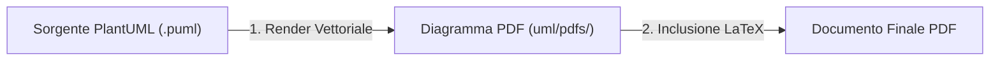
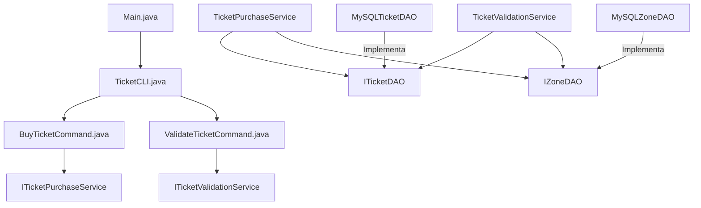

---
tags:
  - IngegneriaSoftware
---
# Guida Completa per la Discussione del Progetto (Architettura, SOLID, UML e Docker)

Questa guida raccoglie tutte le informazioni chiave sulla struttura del progetto, utile per rispondere in modo esaustivo a qualsiasi domanda del professore durante l'esame.

---

## 1. Come sono stati inseriti gli UML nel file LaTeX?

L'integrazione segue un flusso di lavoro moderno e professionale, basato sulla separazione tra sorgenti testuali, artefatti vettoriali compilati e documento finale.

### Il Flusso in 3 Step:



1. **Definizione in formato testuale (`.puml`)**: 
   I diagrammi sono scritti usando la sintassi testuale di **PlantUML** nella cartella `uml/src/` (es. `architectural_model.puml`). Questo approccio permette di tracciare le modifiche dei diagrammi su Git riga per riga.
   
2. **Esportazione in PDF vettoriale**:
   I sorgenti `.puml` vengono esportati in formato **PDF vettoriale** (salvati in `uml/pdfs/`). Il formato PDF vettoriale mantiene una definizione infinita (non sgrana o pixela effettuando lo zoom nel documento finale).
   
3. **Inclusione nativa in LaTeX**:
   All'interno di [documentazione.tex](file:///home/davide/Coding/repos/ingsw_25-26_group-13/docs/design/src/documentazione.tex), i diagrammi sono inclusi semplicemente richiamando il loro nome senza estensione (grazie al pacchetto `graphicx` e a `\graphicspath` puntato su `uml/pdfs/`).

---

## 2. Architettura Generale e Struttura delle Directory

Il sistema segue un'**Architettura Layered (a livelli)** combinata con il rispetto dei principi **SOLID**. Di seguito è riportata la struttura delle directory del progetto e il diagramma delle dipendenze dei componenti principali:

```text
ingsw_25-26_group-13/
├── .gitignore
├── pom.xml
├── Dockerfile
├── docker-compose.yml
├── Guida-Progetto.md
├── README.md
├── sql/
│   └── init.sql
├── docs/
│   ├── CHANGELOG.md
│   ├── decisions.md
│   └── design/
│       ├── pdfs/
│       │   └── documentazione.pdf
│       └── src/
│           └── documentazione.tex
├── uml/
│   ├── src/
│   │   ├── architectural_model.puml
│   │   ├── domain_model.puml
│   │   ├── sequence_purchase.puml
│   │   ├── sequence_validation.puml
│   │   └── use_case.puml
│   └── pdfs/
│       ├── architectural_model.pdf
│       ├── domain_model.pdf
│       ├── sequence_purchase.pdf
│       ├── sequence_validation.pdf
│       └── use_case.pdf
└── src/
    ├── main/java/it/transport/manager/
    │   ├── Main.java
    │   ├── entity/
    │   │   ├── Ticket.java
    │   │   ├── TicketStatus.java
    │   │   ├── Wallet.java
    │   │   └── Zone.java
    │   ├── exception/
    │   │   ├── IllegalTicketStateException.java
    │   │   ├── InsufficientFundsException.java
    │   │   └── TicketNotFoundException.java
    │   ├── dao/
    │   │   ├── DBConnection.java
    │   │   ├── ITicketDAO.java
    │   │   ├── IZoneDAO.java
    │   │   ├── MySQLTicketDAO.java
    │   │   └── MySQLZoneDAO.java
    │   ├── service/
    │   │   ├── ITicketPurchaseService.java
    │   │   ├── ITicketValidationService.java
    │   │   ├── TicketPurchaseService.java
    │   │   └── TicketValidationService.java
    │   └── presentation/
    │       ├── BuyTicketCommand.java
    │       ├── CLICommand.java
    │       ├── TicketCLI.java
    │       └── ValidateTicketCommand.java
    └── test/java/it/transport/manager/
        ├── presentation/
        │   └── TicketCLITest.java
        └── service/
            ├── TicketPurchaseServiceTest.java
            └── TicketValidationServiceTest.java
```



---

## 3. Descrizione Dettagliata dei Componenti e delle Classi

L'applicazione è suddivisa nei seguenti moduli principali all'interno di `src/main/java/it/transport/manager/`:

### A. Modello di Dominio (`entity`)
Contiene le classi che rappresentano i dati di business dell'applicazione. Sono oggetti "puri" (POJO) privi di logica di persistenza:
- **`Ticket`**: Rappresenta il titolo di viaggio. Ha come attributi un ID unico (codice alfanumerico casuale di 8 caratteri), la zona associata (String), lo stato del biglietto (`TicketStatus`), la data di emissione (`issueDate` come `LocalDateTime`) e la data di convalida (`validationDate`).
- **`TicketStatus`**: Un semplice `enum` che definisce i due stati possibili del ciclo di vita di un biglietto:
  - `TO_VALIDATE`: Biglietto acquistato ma non ancora utilizzato/validato.
  - `VALIDATED`: Biglietto convalidato a bordo ed attivo per il viaggio.
- **`Zone`**: Rappresenta una zona geografica o stazione coperta dal sistema di trasporti (ID numerico univoco, nome descrittivo e prezzo del biglietto associato).
- **`Wallet`**: Rappresenta il portafoglio dell'utente a runtime per memorizzare e aggiornare il credito disponibile.

### B. Livello dei Dati / Persistenza (`dao`)
Astrae l'accesso ai dati, disaccoppiando il business logic dalla tecnologia di persistenza.
- **`DBConnection`**: Gestisce la connessione fisica al database MySQL tramite JDBC usando il pattern Singleton. Rileva le credenziali direttamente dalle variabili d'ambiente (es. `DB_HOST`, `DB_PORT`, `DB_NAME`, `DB_USER`, `DB_PASSWORD` ideali per configurazioni Docker) con fallback locale su localhost.
- **Interfacce (`ITicketDAO`, `IZoneDAO`)**: Dichiarano le operazioni di lettura/scrittura per i biglietti e le zone.
- **Implementazioni MySQL (`MySQLTicketDAO`, `MySQLZoneDAO`)**: Tradicono i metodi Java in query SQL tramite JDBC. Conformi al principio DIP, ricevono un `DataSource` (o equivalente astrazione) nel costruttore per prelevare le connessioni. 
  - *Prevenzione Memory/Connection Leaks:* Tutte le risorse JDBC sono racchiuse in blocchi `try-with-resources` per garantire la chiusura automatica.
  - *Mappatura Relazionale:* In `MySQLTicketDAO`, per memorizzare un biglietto si trova prima l'ID della zona dal nome via SQL, e le letture sfruttano una `JOIN` per ricostruire l'oggetto:
    `SELECT t.*, z.name AS zone_name FROM tickets t JOIN zones z ON t.zone_id = z.id WHERE t.id = ?`

### C. Livello dei Servizi / Business Logic (`service`)
Contiene le regole di business e coordina le transazioni:
- **`TicketPurchaseService` (implementa `ITicketPurchaseService`)**:
  - Verifica l'esistenza della zona richiesta tramite `zoneDAO`.
  - Verifica se il saldo del portafoglio è sufficiente (`wallet.getBalance() >= price`). Se non lo è, lancia `InsufficientFundsException`.
  - Detrae il costo dal portafoglio, genera un ID univoco casuale di 8 caratteri e salva il biglietto con stato `TO_VALIDATE` nel database tramite `ticketDAO`.
- **`TicketValidationService` (implementa `ITicketValidationService`)**:
  - Recupera il biglietto tramite ID. Se inesistente, lancia `TicketNotFoundException`.
  - Controlla se il biglietto è già stato convalidato. Se lo stato è già `VALIDATED`, lancia `IllegalTicketStateException` (prevenzione doppia convalida).
  - Imposta lo stato a `VALIDATED`, registra il timestamp corrente di convalida e aggiorna il record nel database tramite `ticketDAO`.

### D. Interfaccia Utente / CLI (`presentation`)
Gestisce l'interazione interattiva testuale e l'input/output.
- **`TicketCLI`**: Gestisce il loop interattivo del menu di scelta (`while`). Mantiene una mappa/lista polimorfica di comandi registrati e li esegue dinamicamente in base alla scelta dell'utente.
- **`CLICommand`**: Interfaccia comune per tutte le azioni del menu (metodi `execute()` e `getDescription()`).
- **`BuyTicketCommand` e `ValidateTicketCommand`**: Implementano le singole voci del menu per guidare l'utente nell'inserimento dati (saldo iniziale, selezione zona, ID biglietto), validando l'input per evitare crash (intercettando `NumberFormatException` in caso di input non numerici) e delegando l'esecuzione ai rispettivi servizi.

### E. Gestione Errori Custom (`exception`)
Contiene le eccezioni personalizzate che ereditano da `RuntimeException`:
- `InsufficientFundsException`: Credito insufficiente.
- `TicketNotFoundException`: Biglietto inesistente.
- `IllegalTicketStateException`: Transizione di stato del biglietto non consentita.

### F. Composition Root (`Main.java`)
È il punto d'ingresso del programma. Svolge il ruolo fondamentale di **Composition Root**:
1. Tenta di stabilire una connessione con il database MySQL.
2. **Dynamic Fallback:** Se la connessione al database fallisce (es. DB offline), l'applicazione non crasha all'avvio, ma istanzia dinamicamente dei **Fake DAO in memoria** (tramite collezioni Java) garantendo il funzionamento temporaneo offline dell'app.
3. Istanzia le implementazioni corrette dei DAO, i servizi e i comandi CLI iniettando le dipendenze richieste via costruttore (Dependency Injection manuale).
4. Registra i comandi in `TicketCLI` e avvia il loop principale del programma.

---

## 4. Struttura dei Test

I test sono scritti usando **JUnit 5** e sono localizzati in `src/test/`:

1. **Test dei Servizi (Unit Test)**:
   - `TicketPurchaseServiceTest` e `TicketValidationServiceTest` validano in totale isolamento la logica di business pura.
   - Non richiedono un database reale attivo: sfruttano implementazioni "Fake" in memoria delle interfacce `ITicketDAO` e `IZoneDAO`. Questo garantisce test deterministici ed estremamente veloci.

2. **Test della CLI (Integration/System Test)**:
   - `TicketCLITest` simula l'interazione dell'utente con la console.
   - Redirige l'input standard (`System.in`) e l'output standard (`System.out`) usando rispettivamente `ByteArrayInputStream` e `ByteArrayOutputStream`, verificando che la CLI provveda alle risposte corrette ed eviti crash.

| Suite di Test | Casi Coperti |
|---|---|
| `TicketPurchaseServiceTest` | TC1.1 (acquisto positivo), TC1.2 (fondi insufficienti) |
| `TicketValidationServiceTest` | TC2.1 (convalida positiva), TC2.2 (ID inesistente), TC2.3 (biglietto già convalidato) |
| `TicketCLITest` | Flussi di interazione CLI (acquisto e convalida) |

Esecuzione manuale via Maven:
```bash
mvn clean test
```

---

## 5. Struttura di Docker e Docker Compose

Il progetto include il supporto a Docker per garantire la massima portabilità e facilità d'uso:

### Dockerfile
Definisce l'immagine per lo sviluppo (`dev`). Utilizza una build multi-stage o un'immagine di base con Maven e OpenJDK 17:
```dockerfile
FROM maven:3.8.8-eclipse-temurin-17 AS dev
WORKDIR /app
COPY pom.xml .
RUN mvn dependency:go-offline -B
COPY src ./src
CMD ["mvn", "clean", "test"]
```
- **Caching delle Dipendenze:** `COPY pom.xml` seguito da `mvn dependency:go-offline` permette di fare il caching delle dipendenze Maven all'interno dei layer di Docker, riducendo drasticamente il tempo di build successivo.
- **CMD:** Di default avvia i test unitari all'esecuzione del container.

### Docker Compose (`docker-compose.yml`)
Configura un ambiente multi-container composto da due servizi:
1. **`db` (MySQL 8.0)**:
   - Inizializza il database caricando lo schema SQL all'avvio (tramite il volume montato `./sql:/docker-entrypoint-initdb.d`).
   - Configura le credenziali di root e dell'applicazione tramite variabili d'ambiente.
2. **`app` (Java App)**:
   - Esegue la build locale a partire dal Dockerfile.
   - Monta la cartella corrente in `/app` per consentire modifiche in tempo reale.
   - Condivide la cache Maven tramite il volume `~/.m2:/root/.m2` per velocizzare le build.
   - Dipende dal servizio `db` (`depends_on`).

### Comandi Utili per la CLI di Docker:
*   `docker compose run --rm app`: Avvia l'applicazione in modalità completamente interattiva, abilitando il corretto indirizzamento dello standard input (grazie alle configurazioni `tty: true` e `stdin_open: true` definite per il servizio `app` nel file compose).
*   `docker compose down`: Ferma ed elimina i container e le reti create.
*   `docker compose down -v`: Ferma ed elimina anche i volumi di persistenza dei dati del DB (ideale per reinizializzare lo schema da zero tramite `sql/init.sql`).
*   `docker compose logs -f <service_name>`: Mostra i log in tempo reale per un servizio specifico.

---

## 6. Tipo di Architettura e Rispetto di SOLID

### Tipo di Architettura
Il progetto implementa un'**Architettura Layered (a 3 strati)** disaccoppiata tramite astrazioni:
$$\text{Presentation (CLI)} \longrightarrow \text{Business Logic (Service)} \longrightarrow \text{Data Access (DAO)}$$

Grazie all'utilizzo delle interfacce tra ciascun layer, l'architettura si avvicina ai principi di **Clean Architecture**: i dettagli tecnologici (como il DB relazionale o la console CLI) si trovano nei cerchi più esterni e dipendono dal nucleo interno del business logic, che rimane puro e facilmente testabile.

### Rispetto dei Principi SOLID

- **Single Responsibility Principle (SRP)**:
  Ogni classe ha una sola ed unica responsabilità. Ad esempio, `Ticket` contiene solo i dati del biglietto; `TicketPurchaseService` si occupa esclusivamente della logica di validazione saldo e acquisto; `TicketCLI` coordina solo l'interazione dell'utente senza conoscere SQL o logiche di business complesse.
- **Open/Closed Principle (OCP)**:
  La CLI è estendibile senza dover modificare il codice esistente. Se si volesse aggiungere una nuova funzionalità alla CLI, è sufficiente creare una nuova classe che implementa l'interfaccia `CLICommand` e registrarla all'avvio in `Main.java` tramite il metodo `addCommand()`, senza modificare la classe `TicketCLI`.
- **Liskov Substitution Principle (LSP)**:
  Qualsiasi comando che implementa `CLICommand` può essere eseguito da `TicketCLI` indistintamente. In modo analogo, il sistema può scambiare in modo trasparente l'implementazione del DAO da reale (`MySQLTicketDAO`) a fittizio (`Fake DAO` in memoria) senza che i servizi se ne accorgano o smettano di funzionare.
- **Interface Segregation Principle (ISP)**:
  Le interfacce create sono minimali e focalizzate su compiti specifici (es. `CLICommand` ha solo i metodi necessari alla CLI; le interfacce DAO contengono solo le operazioni minime di persistenza richieste).
- **Dependency Inversion Principle (DIP)**:
  I moduli di alto livello non dipendono da moduli di basso livello, ma entrambi dipendono da astrazioni. I servizi (`TicketPurchaseService`) dipendono dalle interfacce `ITicketDAO` e `IZoneDAO` anziché dalle classi concrete MySQL. Le classi concrete a loro volta dipendono da astrazioni per la connessione (ricevendo un `DataSource` nel costruttore).

---

## 7. Presenza di Code Smell e Refactoring Effettuati

A seguito dei recenti refactoring, il progetto si presenta pulito e privo dei principali code smell:

- **Risolto - Violazione di SRP (Large Class / Divergent Change)**:
  Inizialmente, `TicketCLI` conteneva internamente tutta la logica di business e di rendering delle informazioni. Se cambiava la modalità di acquisto o la gestione dei menu, bisognava modificare la stessa classe. Questo code smell è stato eliminato estraendo i comandi e delegando la logica ai servizi dedicati.
- **Risolto - Accoppiamento Stretto (Tight Coupling / Hardcoding)**:
  Inizialmente i DAO dipendevano direttamente in modo statico dalla classe `DBConnection`. Ora la dipendenza viene iniettata come `DataSource` nel costruttore, garantendo la possibilità di testare le classi in isolamento.
- **Stato attuale**: Non vi sono code smell critici. Il codice rispetta le convenzioni di nomenclatura Java standard, le classi hanno dimensioni ridotte e le responsabilità sono ben delineate.

---

## 8. Registro delle Decisioni Architetturali (ADR)

Il progetto tiene traccia di tutte le decisioni significative in [decisions.md](file:///home/davide/Coding/repos/ingsw_25-26_group-13/docs/decisions.md). Di seguito sono riassunti gli 8 ADR approvati:

1. **ADR-001: Stack Tecnologico e Persistenza** (13 Maggio 2026): Adozione di Java 17+, MySQL per la persistenza reale dei biglietti, Docker Compose per la riproducibilità, e architettura a livelli basata su interfacce e pattern DAO.
2. **ADR-002: Unificazione della Documentazione** (15 Maggio 2026): Consolidamento degli ADR in un unico file `docs/decisions.md` e della documentazione LaTeX in `documentazione.tex` per centralizzare le informazioni.
3. **ADR-003: Progettazione Architetturale e Standard di Naming** (18 Maggio 2026): Scelta di definire tutti i componenti del codice e del database in lingua inglese (es. `Ticket`, `Wallet`, `TO_VALIDATE`), mantenendo descrizioni e requisiti formali in italiano.
4. **ADR-004: Separazione dei Servizi per SRP e DIP** (26 Maggio 2026): Suddivisione di `TicketService` in due classi distinte (`TicketPurchaseService` e `TicketValidationService`) per slegare completamente la convalida da logiche e dipendenze estranee (come portafogli e tariffe).
5. **ADR-005: Presentation Layer tramite CLI Nativa** (28 Maggio 2026): Scelta di implementare una CLI pura basata su `Scanner` di Java, gestendo il wallet localmente a runtime ed evitando librerie esterne.
6. **ADR-006: Fallback In-Memory per il Repository MySQL** (28 Maggio 2026): Implementazione in `Main.java` di un fallback automatico a DAO in memoria fittizi in caso di mancato collegamento a MySQL, garantendo il boot dell'app anche offline.
7. **ADR-007: Rifattorizzazione SOLID (OCP e DIP)** (2 Giugno 2026): Introduzione del Command Pattern per disaccoppiare il loop principale della CLI e iniezione dell'interfaccia `DataSource` nei costruttori DAO MySQL.
8. **ADR-008: Decomposizione del Presentation Layer** (2 Giugno 2026): Scorporo delle logiche di workflow da `TicketCLI` a due comandi dedicati ed esterni, `BuyTicketCommand` e `ValidateTicketCommand`, garantendo il rispetto di SRP.

---

## 9. Cronologia delle Release (Changelog)

Lo storico delle modifiche del progetto è tracciato in [CHANGELOG.md](file:///home/davide/Coding/repos/ingsw_25-26_group-13/docs/CHANGELOG.md):

*   **v1.5.0** (2026-06-02): Rimozione del clipboard service (`IClipboardService` / `SystemClipboardService`), semplificazione dei comandi di presentation, e pulizia della documentazione.
*   **v1.4.0** (2026-06-02): Estrazione di `BuyTicketCommand` e `ValidateTicketCommand` (SRP), aggiunta di Javadoc esaustivo e stesura dell'ADR-008.
*   **v1.3.0** (2026-06-02): Riprogettazione della CLI tramite Command Pattern (OCP) e disaccoppiamento dei DAO tramite `DataSource` (DIP).
*   **v1.2.0** (2026-06-01): Javadoc estesi, inserimento di `target_user/` in `.gitignore` e risoluzione bug inizializzazione data convalida su `Ticket`.
*   **v1.1.0** (2026-05-29): Miglioramento UX della CLI, integrazione del supporto TTY per Docker Compose, e riduzione della lunghezza dell'ID dei biglietti a 8 caratteri.
*   **v1.0.0** (2026-05-28): Rilascio stabile iniziale con persistenza MySQL reale, logica fallback in `Main`, Docker Compose pronto all'uso e suite di test CLI.
*   **v0.8.0** (2026-05-28): Test suite completa per `TicketValidationService` e tracciabilità unit test verso AC e US.
*   **v0.7.0** (2026-05-27): Implementazione iniziale del Service Layer con divisione servizi, test per l'acquisto e aggiunta di `validationDate` a `Ticket`.
*   **v0.6.0** (2026-05-26): Ottimizzazione e integrazione definitiva dei PDF degli UML compilati e strutturazione dei sorgenti LaTeX.
*   **v0.5.0** (2026-05-26): Stesura diagrammi di sequenza e formalizzazione split dei servizi (ADR-004).
*   **v0.4.0** (2026-05-18): Implementazione primo prototipo del Domain Layer (`Ticket`, `Wallet`, ecc.) e del Service Layer monolitico (`TicketService`).
*   **v0.3.0** (2026-05-18): Setup DB locale/Docker, diagramma architetturale e allineamento lingua tecnica ad inglese.
*   **v0.2.0** (2026-05-15): Unificazione file LaTeX e registro decisioni (ADR-002).
*   **v0.1.0** (2026-05-13): Setup iniziale repository, analisi requisiti e primi UML dei casi d'uso e di dominio.