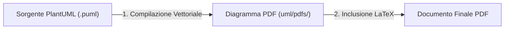
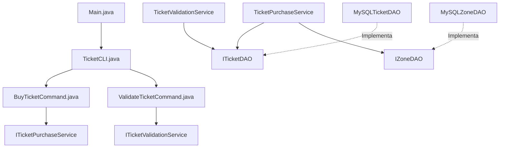

---
tags:
  - IngegneriaSoftware
---
# Guida Completa per la Discussione del Progetto (Scaletta, Architettura, SOLID, Testing e Docker)

Benvenuto in questa guida riorganizzata in modalità **discorsiva ed esplicativa**. Questo documento è pensato per essere usato sia come materiale di studio, sia come "scaletta mentale" per guidarti durante la presentazione del progetto al professore, affrontando le scelte ingegneristiche con il giusto vocabolario tecnico.

---

## Indice della Presentazione
1. **Introduzione & Flusso di Lavoro** (Come presentare l'integrazione LaTeX/UML)
2. **Architettura Generale & Struttura del Progetto** (L'organizzazione delle directory)
3. **Analisi di Dettaglio dei Layer & Rispetto dei Principi SOLID** (La parte software pura)
4. **Strategia di Testing & Tracciabilità** (Come testare e isolare i componenti)
5. **Deployment & Portabilità con Docker** (Configurazioni multi-container, healthcheck e compatibilità)
6. **Gestione del Ciclo di Vita** (ADR e Changelog)
7. **Simulazione Domande e Risposte (Q&A con il Professore)**

---

## 1. Introduzione & Flusso di Lavoro (LaTeX e PlantUML)

**Come introdurre l'argomento:**  
*"Per la stesura della documentazione abbiamo adottato un approccio professionale e riproducibile basato sul paradigma 'Docs-as-Code'. Invece di usare software grafici per disegnare i diagrammi UML e incollarli come immagini statiche, abbiamo utilizzato PlantUML, un tool basato su testo, integrato con LaTeX."*

### Il Flusso di Lavoro a 3 Step:



1.  **Definizione Testuale (`.puml`)**: I diagrammi (Casi d'uso, Classi di Dominio, Sequenza, Attività) sono descritti in formato testuale in `uml/src/`.
    *   **Vantaggio Ingegneristico:** I diagrammi possono essere tracciati su Git riga per riga, rendendo visibili le modifiche in fase di code review (impossibile con immagini PNG/JPG).
2.  **Esportazione in PDF Vettoriale**: Compiliamo i sorgenti `.puml` in PDF vettoriali (salvati in `uml/pdfs/`).
    *   **Vantaggio Ingegneristico:** Il formato vettoriale garantisce che i diagrammi mantengano una definizione infinita (non sgranano effettuando lo zoom sul documento finale).
3.  **Inclusione Nativa in LaTeX**: Nel file [documentazione.tex](file:///C:/Users/david/Documents/repos/ingsw_25-26_group-13/docs/design/src/documentazione.tex) includiamo i PDF richiamandoli per nome. Grazie a `\graphicspath` puntato su `uml/pdfs/`, LaTeX recupera automaticamente la risorsa compilata.

---

## 2. Architettura Generale & Albero del Progetto

**Come introdurre l'argomento:**  
*"Il progetto è strutturato seguendo un'Architettura Layered (a livelli) a tre strati. Questa suddivisione assicura un forte disaccoppiamento tra l'interfaccia utente (Presentation), la logica di business (Service) e i dettagli di persistenza (DAO), facilitando la manutenibilità e il testing isolato."*

### Albero delle Directory Attuale:

```text
ingsw_25-26_group-13/
├── pom.xml                  # Configurazione Maven e dipendenze (JUnit 5, MySQL JDBC)
├── Dockerfile               # Definizione dell'ambiente Java per il container
├── docker-compose.yml       # Orchestrazione multi-container (App + MySQL)
├── Guida-Progetto.md        # Questa guida per lo studio e la presentazione
├── README.md                # Istruzioni d'avvio e specifiche dei Test Case
├── sql/
│   └── init.sql             # Script SQL di inizializzazione dello schema database
├── docs/
│   ├── CHANGELOG.md         # Registro storico delle release del progetto
│   ├── decisions.md         # Registro delle Decisioni Architetturali (ADR)
│   └── design/
│       ├── pdfs/
│       │   └── documentazione.pdf   # Documento finale d'esame
│       └── src/
│           └── documentazione.tex  # Sorgente LaTeX unificato
├── uml/
│   ├── src/                 # Codice sorgente testuale dei diagrammi
│   │   ├── activity_diagram_validation.puml
│   │   ├── activity_diagramm_purchase.puml
│   │   ├── architectural_model.puml
│   │   ├── domain_classes.puml
│   │   ├── domain_model.puml
│   │   ├── sequence_purchase.puml
│   │   ├── sequence_validation.puml
│   │   └── use_case.puml
│   └── pdfs/                # Output PDF vettoriali inclusi in LaTeX
│       ├── activity_diagram_validation.pdf
│       ├── activity_diagramm_purchase.pdf
│       ├── architectural_model.pdf
│       ├── domain_classes.pdf
│       ├── domain_model.pdf
│       ├── sequence_purchase.pdf
│       ├── sequence_validation.pdf
│       └── use_case.pdf
└── src/
    ├── main/java/it/transport/manager/
    │   ├── Main.java        # Entry Point & Composition Root (Gestione Bootstrap & Fallback)
    │   ├── entity/          # LOGICA DI DOMINIO (POJO puri senza persistenza)
    │   │   ├── Ticket.java
    │   │   ├── TicketStatus.java
    │   │   ├── Wallet.java
    │   │   └── Zone.java
    │   ├── exception/       # ECCEZIONI CUSTOM (Runtime)
    │   │   ├── IllegalTicketStateException.java
    │   │   ├── InsufficientFundsException.java
    │   │   └── TicketNotFoundException.java
    │   ├── dao/             # PERSISTENZA (Data Access Object - Interfacce e implementazioni)
    │   │   ├── DBConnection.java
    │   │   ├── ITicketDAO.java
    │   │   ├── IZoneDAO.java
    │   │   ├── MySQLTicketDAO.java
    │   │   └── MySQLZoneDAO.java
    │   ├── service/         # LOGICA DI BUSINESS (Servizi divisi per SRP)
    │   │   ├── ITicketPurchaseService.java
    │   │   ├── ITicketValidationService.java
    │   │   ├── TicketPurchaseService.java
    │   │   └── TicketValidationService.java
    │   └── presentation/    # INTERFACCIA UTENTE (Command Pattern per OCP)
    │       ├── CLICommand.java
    │       ├── TicketCLI.java
    │       ├── BuyTicketCommand.java
    │       └── ValidateTicketCommand.java
    └── test/java/it/transport/manager/
        ├── presentation/
        │   └── TicketCLITest.java          # Test della CLI (Simulazione I/O tramite stream)
        └── service/
            ├── TicketPurchaseServiceTest.java  # Unit Test acquisto con Fake DAO
            └── TicketValidationServiceTest.java # Unit Test convalida con Fake DAO
```

### Schema delle Dipendenze dei Componenti:



---

## 3. Analisi Dettagliata dei Layer & SOLID

**Come introdurre l'argomento:**  
*"Nel tradurre l'architettura in codice, abbiamo applicato in maniera rigorosa i principi SOLID per assicurarci che il codice fosse modulare, estensibile e testabile. Vediamo come i singoli pacchetti riflettono questa filosofia."*

### A. Il Dominio (`entity`)
Contiene oggetti semplici (POJO) focalizzati sui dati reali, senza logica di infrastruttura o persistenza:
*   `Ticket`: Rappresenta il titolo di viaggio. Ha un ID univoco (8 caratteri generati casualmente), uno stato (`TicketStatus`), una data di emissione (`LocalDateTime`) e una data di convalida. Nota: nella v1.7.0 abbiamo rimosso il setter `setId()` per garantire l'immutabilità dell'identificativo una volta creato.
*   `TicketStatus`: Un `enum` con due stati: `TO_VALIDATE` (acquistato, non usato) e `VALIDATED` (convalidato a bordo).
*   `Zone`: La zona tariffaria (ID, Nome, Prezzo).
*   `Wallet`: Il portafoglio per il saldo utente, gestito in memoria a runtime per la CLI.

### B. Il Livello di Persistenza (`dao`)
Segue il pattern **DAO (Data Access Object)** per separare la business logic dalle query SQL:
*   `DBConnection`: Classe utility basata sul pattern **Singleton**. Gestisce la connessione fisica a MySQL recuperando le variabili d'ambiente (host, credenziali) configurate in Docker.
*   **Rispetto del DIP (Dependency Inversion Principle):** I servizi non conoscono le implementazioni concrete (`MySQLTicketDAO`), ma comunicano solo tramite le astrazioni `ITicketDAO` e `IZoneDAO`.
*   **DataSource Injection:** Nella v1.3.0 abbiamo eliminato la dipendenza statica dei DAO verso `DBConnection`. Ora i costruttori di `MySQLTicketDAO` e `MySQLZoneDAO` accettano un `javax.sql.DataSource` iniettato. Ciò permette di testare i DAO mockando la connessione, senza toccare codice statico.
*   *Gestione delle Risorse:* Tutte le query JDBC utilizzano il costrutto `try-with-resources` per garantire la chiusura automatica degli stream SQL, evitando connection leaks.

### C. La Logica di Business (`service`)
*   **Rispetto del SRP (Single Responsibility Principle):** Originariamente c'era un unico `TicketService`. Lo abbiamo diviso in `TicketPurchaseService` (acquisto, tariffe, saldo) e `TicketValidationService` (convalida del biglietto). 
    *   *Perché?* Un cambio nelle politiche tariffarie dell'acquisto non deve rischiare di rompere il modulo di convalida, che non necessita di conoscere zone o portafogli.
*   *Eccezioni:* Se il saldo è insufficiente viene lanciata `InsufficientFundsException`; se il biglietto non esiste `TicketNotFoundException`; se viene convalidato due volte `IllegalTicketStateException`.

### D. Interfaccia Utente (`presentation`)
*   **Rispetto dell'OCP (Open/Closed Principle) tramite Command Pattern:** La CLI iniziale gestiva il menu interattivo con uno `switch-case` rigido. Inserire una funzionalità significava modificare direttamente la classe `TicketCLI`.
    *   *Soluzione:* Abbiamo introdotto l'interfaccia `CLICommand` e implementato i singoli comandi `BuyTicketCommand` e `ValidateTicketCommand`. 
    *   `TicketCLI` ora è **chiusa alle modifiche ma aperta alle estensioni**: per aggiungere una voce al menu basta creare una nuova classe che implementa `CLICommand` e registrarla all'avvio in `Main.java` tramite `cli.addCommand(...)`.
*   **Decomposizione per SRP:** I comandi contengono la logica di I/O (richiesta input, stampa a console), mentre `TicketCLI` si occupa solo di renderizzare il menu e smistare (dispatching) le scelte.

### E. Composition Root (`Main.java`) & Fallback In-Memory
Il `Main.java` funge da **Composition Root**: istanzia tutti i componenti, inietta le dipendenze nei costruttori e avvia l'app.
*   **Il Meccanismo di Fallback Dinamico (Rispetto del LSP - Liskov Substitution Principle):**
    All'avvio, `Main` tenta una connessione di prova al database MySQL. 
    *   Se il database è online, istanzia i DAO JDBC (`MySQLTicketDAO`, `MySQLZoneDAO`).
    *   Se il database è offline (es. eseguito localmente senza Docker), cattura la `SQLException` e istanzia **Fake DAO in memoria** basati su collezioni Java (`HashMap` e `ArrayList`).
    *   I servizi ricevono queste istanze polimorfiche senza accorgersi della differenza: l'applicazione continua a funzionare perfettamente in modalità offline temporanea. Questo è un esempio da manuale di **Liskov Substitution Principle** e **Dependency Inversion Principle**.

---

## 4. Strategia di Testing & Tracciabilità

**Come introdurre l'argomento:**  
*"La nostra suite di test garantisce che ogni modifica al codice non introduca regressioni. Abbiamo diviso i test in Unit Test per la logica di business e Integration Test per l'interfaccia utente."*

### A. Unit Test dei Servizi (Isolamento Totale)
*   **Classi:** [TicketPurchaseServiceTest.java](file:///C:/Users/david/Documents/repos/ingsw_25-26_group-13/src/test/java/it/transport/manager/service/TicketPurchaseServiceTest.java) e [TicketValidationServiceTest.java](file:///C:/Users/david/Documents/repos/ingsw_25-26_group-13/src/test/java/it/transport/manager/service/TicketValidationServiceTest.java).
*   **Come funzionano:** Testano la logica di business senza dipendere da MySQL. Sfruttano i Fake DAO in memoria. Questo assicura che i test siano deterministici, non richiedano setup infrastrutturali e vengano eseguiti in pochi millisecondi.
*   **Casi coperti:**
    *   *Acquisto regolare* (TC1.1): verifica decremento saldo e salvataggio biglietto in stato `TO_VALIDATE`.
    *   *Acquisto fallito per credito insufficiente* (TC1.2): verifica lancio eccezione `InsufficientFundsException`.
    *   *Convalida regolare* (TC2.1): verifica transizione di stato a `VALIDATED` e inserimento della data corrente.
    *   *Convalida fallita per ID inesistente* (TC2.2): verifica lancio `TicketNotFoundException`.
    *   *Convalida fallita per doppia convalida* (TC2.3): verifica lancio `IllegalTicketStateException`.

### B. Integration Test della CLI (Simulazione I/O)
*   **Classe:** [TicketCLITest.java](file:///C:/Users/david/Documents/repos/ingsw_25-26_group-13/src/test/java/it/transport/manager/presentation/TicketCLITest.java).
*   **Tecnica Ingegneristica:** Per testare una CLI interattiva senza l'intervento umano, abbiamo mockato gli stream di input e output della JVM:
    *   Redirezioniamo `System.in` istanziando un `ByteArrayInputStream` contenente la sequenza di comandi testuali che simulano le scelte dell'utente (es. inserimento saldo, scelta zona, digitazione ID).
    *   Redirezioniamo `System.out` su un `ByteArrayOutputStream` per catturare i messaggi stampati a console dal programma e verificarne la correttezza con degli `assert`.
*   *UX:* Nella v1.7.0 è stato aggiunto `System.exit(0)` nel `Main` per assicurare che alla scelta dell'opzione "Uscita" (3) tutti i thread JDBC in background vengano terminati forzatamente, garantendo l'arresto pulito della JVM.

---

## 5. Deployment & Portabilità con Docker

**Come introdurre l'argomento:**  
*"Per garantire la massima portabilità e un ambiente riproducibile su qualsiasi macchina host, abbiamo containerizzato l'applicazione utilizzando Docker e Docker Compose, risolvendo diverse problematiche cross-platform."*

### Il Dockerfile (Ambiente App)
```dockerfile
FROM maven:3.8.8-eclipse-temurin-17 AS dev
WORKDIR /app
COPY pom.xml .
RUN mvn dependency:go-offline -B
COPY src ./src
CMD ["mvn", "clean", "compile", "exec:java", "-Dexec.mainClass=it.transport.manager.Main"]
```
*   **Ottimizzazione della Build (Layer Caching):** Copiamo prima solo il file `pom.xml` ed eseguiamo `mvn dependency:go-offline`. In questo modo le librerie Java scaricate vengono memorizzate in una cache di layer di Docker. Se modifichiamo solo il codice sorgente in `src/`, la build successiva ripartirà da quel punto saltando il download delle dipendenze, velocizzando drasticamente il deploy.

### Il Docker Compose (`docker-compose.yml`)
Configura un'infrastruttura multi-container composta dal database MySQL (`db`) e dall'applicazione Java (`app`):

1.  **Ordinamento e Sincronizzazione (Healthcheck)**:
    Il database MySQL richiede diversi secondi per inizializzarsi, creare lo schema e accettare connessioni sulla porta 3306. Se l'applicazione Java partisse in contemporanea, fallirebbe immediatamente la connessione JDBC andando in crash.
    *   *Soluzione:* Abbiamo aggiunto un `healthcheck` al servizio `db` (che effettua internamente un `mysqladmin ping`). Il servizio `app` definisce un vincolo di dipendenza avanzato:
        ```yaml
        depends_on:
          db:
            condition: service_healthy
        ```
        Questo garantisce che il container dell'app parta solo ed esclusivamente quando il server MySQL è pronto a ricevere connessioni.
2.  **Stabilità Cross-Platform (Windows/Linux)**:
    Inizialmente, la cache di Maven veniva montata puntando a percorsi locali dell'utente (bind mount su `~/.m2`). Questa configurazione creava errori di permessi e percorsi non validi su macchine Windows.
    *   *Soluzione:* Abbiamo sostituito i bind mount con **volumi Docker nominati** (`maven_cache` per la directory `/root/.m2` del container e `maven_target` per la cartella `/app/target`). Essendo gestiti direttamente da Docker Engine, questi volumi garantiscono isolamento e compatibilità cross-platform al 100%.
3.  **Iniezione dei Parametri**:
    Il container dell'applicazione riceve le credenziali di accesso al DB (`DB_HOST=db`, `DB_PORT=3306`, ecc.) direttamente come variabili d'ambiente. Il driver JDBC le intercetta dinamicamente per connettersi al container del database invece di fallire cercando `localhost`.
4.  **Esecuzione Interattiva**:
    Trattandosi di una CLI interattiva, per permettere l'inserimento dell'input all'utente da terminale all'interno del container Docker, sono state abilitate le direttive:
    ```yaml
    stdin_open: true
    tty: true
    ```
    Ciò consente di eseguire l'app in modalità interattiva con il comando:
    `docker compose run --rm app`

---

## 6. Gestione del Ciclo di Vita (ADR e Changelog)

**Come introdurre l'argomento:**  
*"Per tracciare lo storico evolutivo del progetto e le scelte architetturali effettuate, abbiamo adottato due strumenti cardine dell'ingegneria del software: il registro ADR e il Changelog formale."*

### ADR (Architectural Decision Records)
Tutte le decisioni critiche di design sono storicizzate in [decisions.md](file:///C:/Users/david/Documents/repos/ingsw_25-26_group-13/docs/decisions.md). Ogni record descrive:
*   **Contesto:** Il problema riscontrato (es. violazione di SRP in `TicketCLI`).
*   **Decisione:** La soluzione adottata (es. applicazione del Command Pattern).
*   **Conseguenze:** I vantaggi (pro) e i costi (contro, come l'aumento del numero di classi).
*   *Nota:* Questo registro documenta l'evoluzione razionale del software, spiegando perché non abbiamo adottato soluzioni statiche o monolitiche.

### Changelog
Nel file [CHANGELOG.md](file:///C:/Users/david/Documents/repos/ingsw_25-26_group-13/docs/CHANGELOG.md), strutturato secondo le linee guida internazionali di "Keep a Changelog", ogni release è catalogata (Aggiunto, Modificato, Risolto, Rimosso). Questo consente di avere una tracciabilità immediata dei bugfix e dei refactoring effettuati versione dopo versione.

---

## 7. Simulazione Domande e Risposte (Q&A)

Ecco una selezione delle domande più frequenti poste dai docenti di Ingegneria del Software per questo tipo di progetti, accompagnate dalle relative risposte argomentative:

### Q1: Perché avete deciso di dividere il `TicketService` originale?
> **Risposta:** Per rispettare il **Single Responsibility Principle (SRP)**. L'acquisto di un biglietto (che coinvolge la gestione del credito del Wallet e il listino delle Zone tariffarie) e la convalida a bordo (che richiede solo la verifica di esistenza del biglietto e la marcatura temporale) sono due processi di business indipendenti. Mantenerli nella stessa classe creava un accoppiamento non necessario: se avessimo voluto modificare le politiche dei prezzi del Wallet, avremmo dovuto rischiare di influenzare la logica di convalida. Separandoli in `TicketPurchaseService` e `TicketValidationService`, ogni classe ha ora una sola ragione per cambiare.

### Q2: Come avete applicato il Dependency Inversion Principle (DIP)?
> **Risposta:** Il DIP afferma che i moduli di alto livello non devono dipendere da moduli di basso livello, ma entrambi devono dipendere da astrazioni. Nel nostro progetto, i servizi (`TicketPurchaseService`) non istanziano né dipendono direttamente dalle classi concrete del database (`MySQLTicketDAO`). Al contrario, i servizi dipendono dalle interfacce (`ITicketDAO` e `IZoneDAO`). Le classi concrete di persistenza implementano poi queste interfacce. Inoltre, abbiamo applicato il DIP anche al database stesso iniettando un'interfaccia `DataSource` nei costruttori dei DAO MySQL, anziché farli accedere staticamente alla connessione JDBC.

### Q3: Se il database MySQL è offline, l'applicazione si avvia? Come funziona?
> **Risposta:** Sì, l'applicazione non va in crash all'avvio. Nel nostro Composition Root (`Main.java`), tentiamo una connessione iniziale a MySQL. Se questa fallisce (sollevando una `SQLException`), intercettiamo l'errore e istanziamo dinamicamente delle implementazioni **Fake in-memory** delle interfacce `ITicketDAO` e `IZoneDAO` basate su `HashMap` e `ArrayList` pre-popolate. Grazie al polimorfismo, iniettiamo questi Fake DAO nei servizi. Questo dimostra il **Liskov Substitution Principle (LSP)**: l'app si comporta in modo trasparente sostituendo la persistenza reale SQL con quella in memoria senza rompersi.

### Q4: Come avete testato l'interfaccia utente (la CLI) in JUnit?
> **Risposta:** Abbiamo effettuato un test di integrazione in [TicketCLITest.java](file:///C:/Users/david/Documents/repos/ingsw_25-26_group-13/src/test/java/it/transport/manager/presentation/TicketCLITest.java) simulando l'input/output tramite redirezione dei flussi standard della JVM. Utilizziamo `System.setIn()` per passare alla CLI un `ByteArrayInputStream` che simula la digitazione dei comandi da parte dell'utente, e `System.setOut()` per catturare le stampe a console in un `ByteArrayOutputStream`. In questo modo possiamo asserire che, inserendo determinati comandi, la console mostri i messaggi corretti di errore o successo.

### Q5: A cosa serve la direttiva `healthcheck` nel vostro `docker-compose.yml`?
> **Risposta:** MySQL necessita di tempo per avviare il proprio demone SQL ed essere pronto a ricevere connessioni. Se il container Java dell'applicazione partisse in parallelo a quello di MySQL tenterebbe la connessione JDBC fallendo immediatamente (o forzando il fallback in memoria). L'healthcheck su MySQL esegue periodicamente un `mysqladmin ping`. L'app Java, tramite `depends_on` con condizione `service_healthy`, viene forzata a rimanere in standby finché l'healthcheck di MySQL non restituisce successo. In questo modo garantiamo un avvio ordinato e senza errori di runtime.

### Q6: Perché avete usato il Command Pattern per implementare la CLI?
> **Risposta:** Per rispettare l'**Open/Closed Principle (OCP)**. Usando un approccio tradizionale con un grande `switch-case` dentro `TicketCLI`, ogni volta che si desidera aggiungere un'opzione di menu si è costretti a modificare il codice interno della CLI. Applicando il Command Pattern, ogni funzionalità (acquisto, convalida) è incapsulata in una classe a sé stante che implementa l'interfaccia `CLICommand`. La classe `TicketCLI` mantiene solo una lista polimorfica di comandi e li esegue ciclicamente. Per aggiungere un comando basta creare la nuova classe e registrarla all'avvio in `Main.java`, senza modificare una singola riga di codice all'interno di `TicketCLI`.