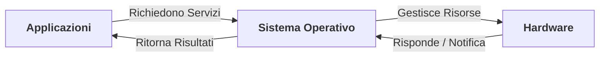
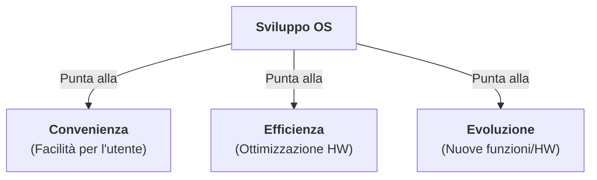
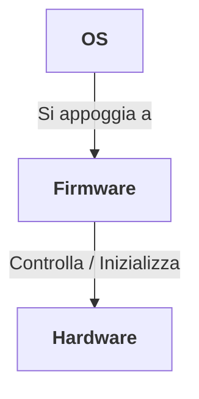
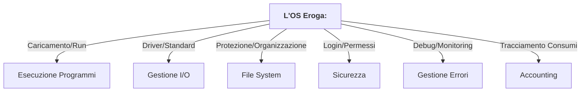
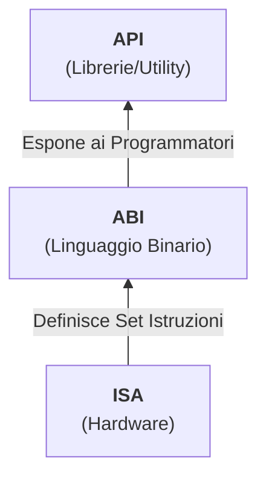
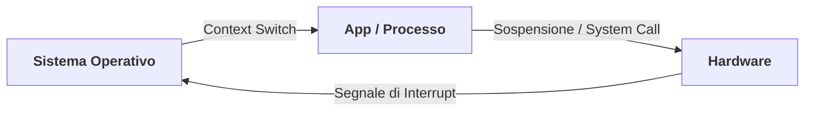
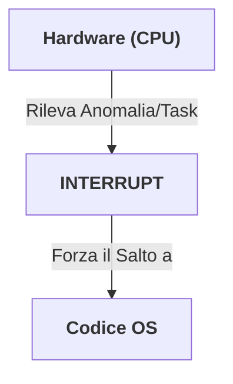
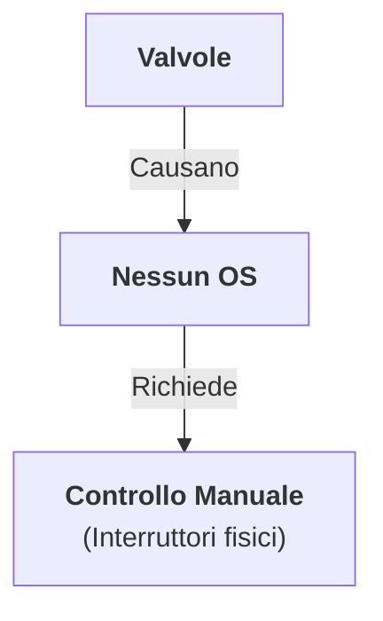
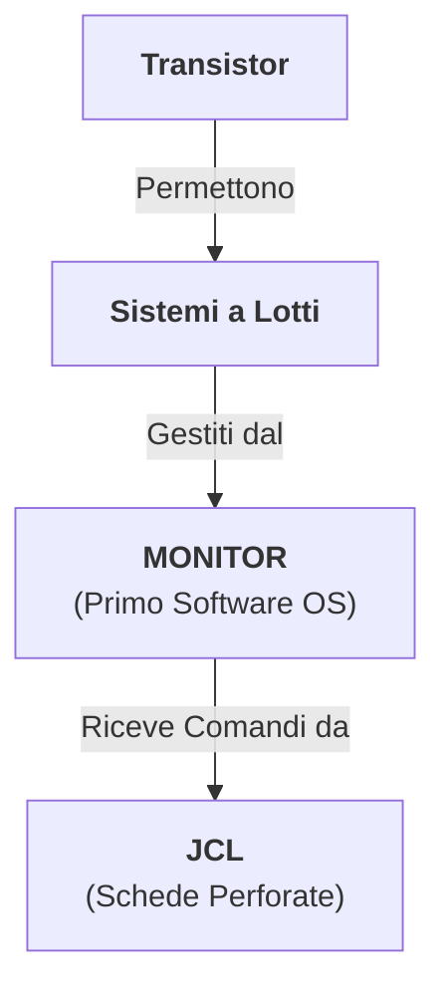

# Sistemi Operativi - Introduzione

## 1. Cos'è e quali sono i suoi compiti

### Ruolo di Interfaccia

### Obiettivi Principali

### Posizionamento Firmware

---

## 2. Sistema Di Elaborazione

### Servizi Erogati

### Gerarchia delle Interfacce

---

## 3. La Gestione delle Risorse e il Controllo della CPU

### Ciclo del Controllo CPU

### Meccanismo di Ritorno

---

## 4. L'Evoluzione dei Sistemi Operativi

### Prima Generazione (1945-1955)

### Seconda Generazione (1955-1965)

---

◀️ *Back to:* [[00_Index_OS]]
